# node

## 새 노드 연결

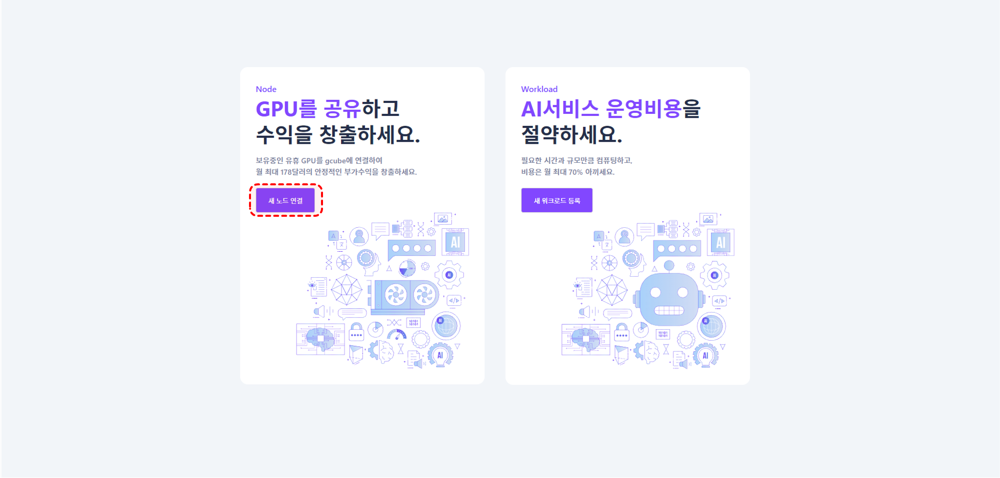

1. 로그인 후 **“새 노드 연결”** 클릭하세요.

2. 상단 노드 메뉴 클릭 → 화면중앙 **“+새 노드 연결”** 또는 아이디 우측 **“+새 노드 연결”** 클릭하세요.

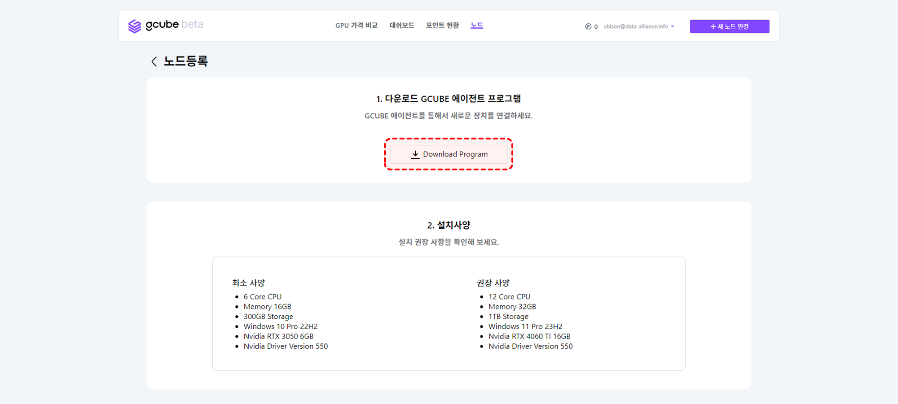

3. 에이전트 프로그램을 다운받기 위해 **“Download Program”** 버튼을 클릭하세요.

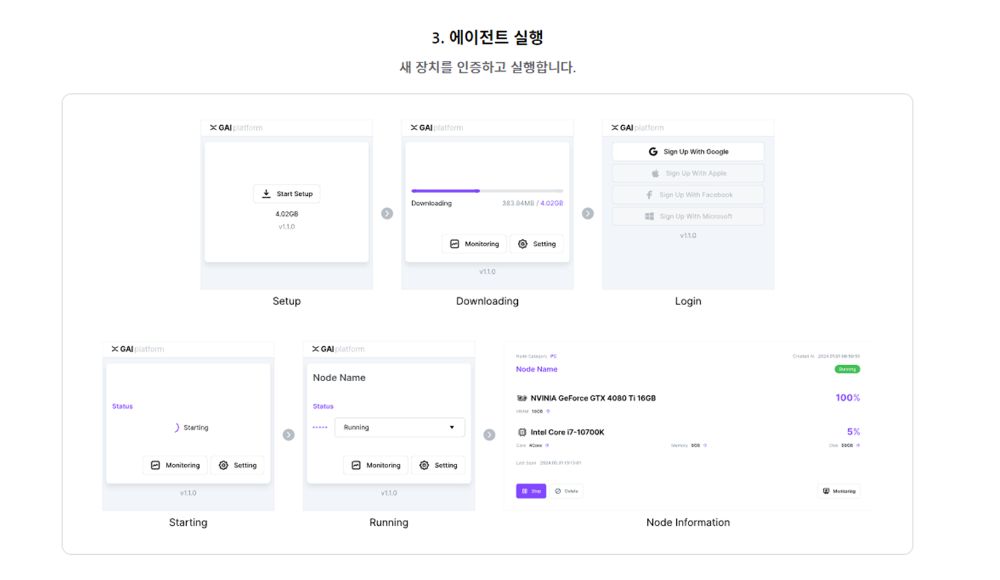

4. 에이전트를 다운로드 후 실행 뒤 에이전트 실행 메뉴의 절차 설명을 따라 설치를 진행해주세요.

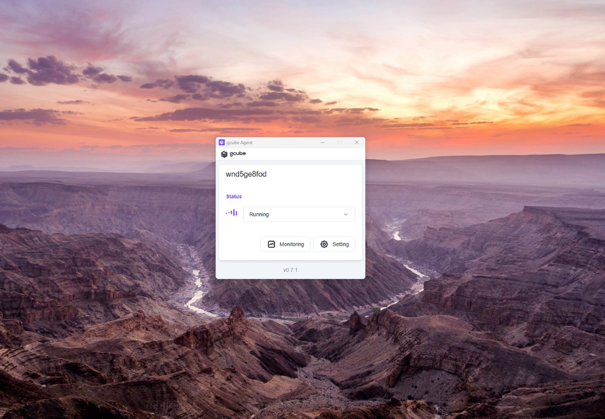

5. 설치가 완료되면 화면과 같이 자동으로 공유가 진행됩니다.

## GPU공유 중단

1. 에이전트에 중간 **“Rurning”** 부분을 클릭 → Run 과 Stop중 **“Stop”**을 클릭해주세요.

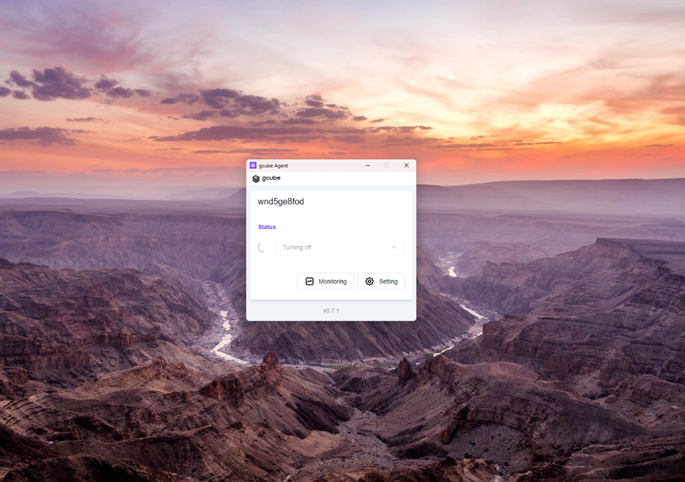

2. 위에 화면과 같이 “Turning off”가 표시 되면서 공유 중단이 진행 됩니다.

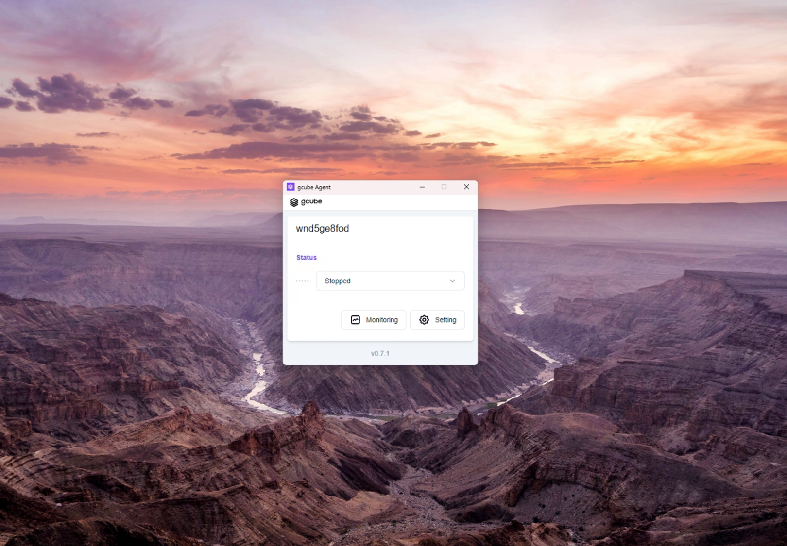

3. 공유 중단이 완료되면 “Stopped”로 표기 됩니다.

## 에이전트 Node 모니터링 확인

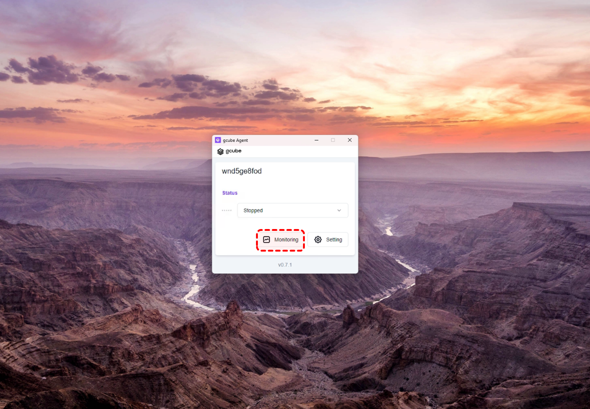

1. **“Monitoring”** 클릭 

2. Node Monitoring 화면을 통해 현재 공유 중인 Node의 GPU, VRAM, CPU, Memory, Disk 사용량과 점유율, Network Traffic등의 정보들을 확인 가능합니다.

## 에이전트 세팅

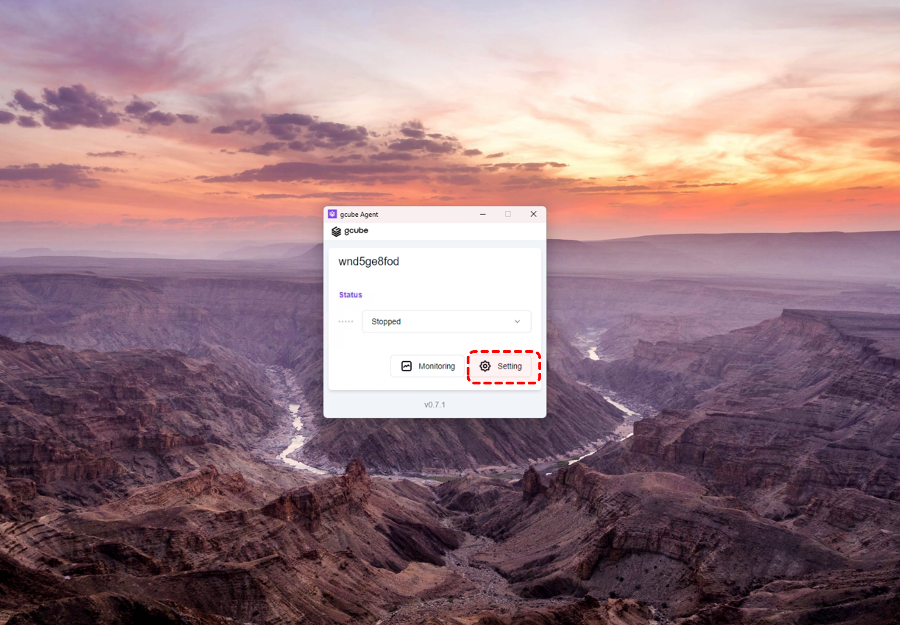

1. **“Setting”** 클릭 

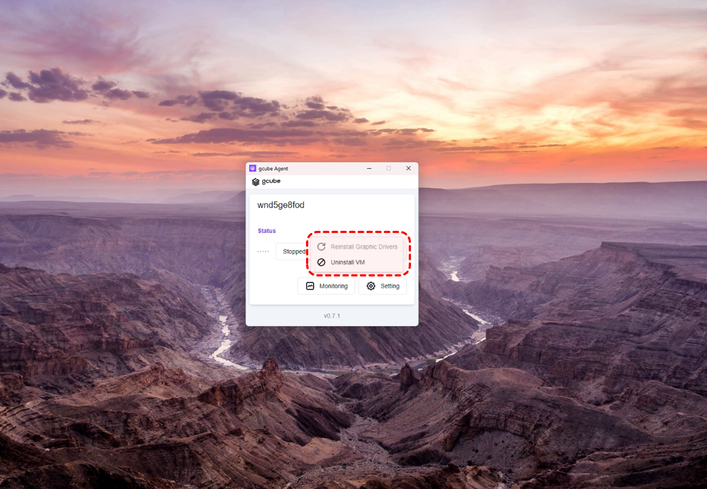

2. 그래픽 드라이버 재설치 또는 VM삭제 등의 세팅 수정이 가능합니다.

## 프로필 설정

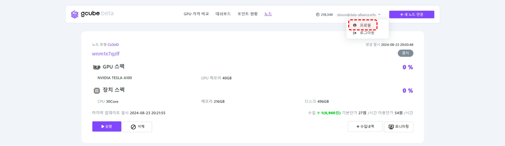

1. 아이디 옆 화살표 클릭 → **“프로필”** 클릭

2. 위에 화면과 같이 “사용자 정보”와 “사용자 인증정보” 확인이 가능합니다.

3. **“프로필 수정”** 클릭 → 프로필 정보 수정 팝업 화면에서 원하는 정보를 수정하여 **“수정”** 버튼을 클릭하면 프로필 정보 수정이 완료됩니다.

4. **“+ 새 사용자인증정보 등록” 클릭** → 사용자 인증 정보 등록 팝업 화면에서 “유형”을 선택 → “클라우드” 선택 시 클라우드사 선택, “저장소” 선택 시 저장업체 입력 후 정보 입력 → 등록 버튼 클릭 시 등록 완료

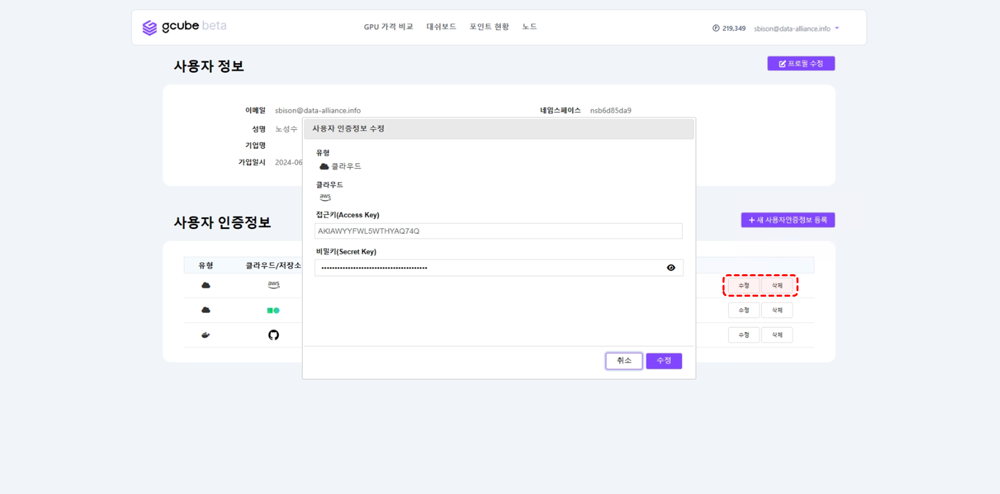

5. 사용자 인증정보 **“수정”** 버튼 클릭 → 사용자 인증정보 팝업 화면에서 관련 정보 수정하여 **“수정”** 버튼 클릭하면 사용자 인증정보 수정이 완료됩니다.

## GPU 공유 정보 확인

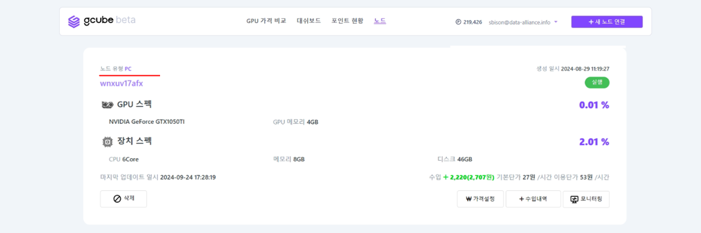

1. GPU 공유가 한 대일 경우 위의 화면과 같이 내 공유 정보를 확인 가능합니다.
2. 내 공유 유형에 따라 PC, SERVER, CLOUD로 노드 유형이 표기 됩니다. 
3. GPU 스펙, 장치 스펙, 공유율, 공유상태(실행/중지) 수입가격, 기본단가, 이용단가, 업데이트 일시등의 정보를 확인 가능합니다.

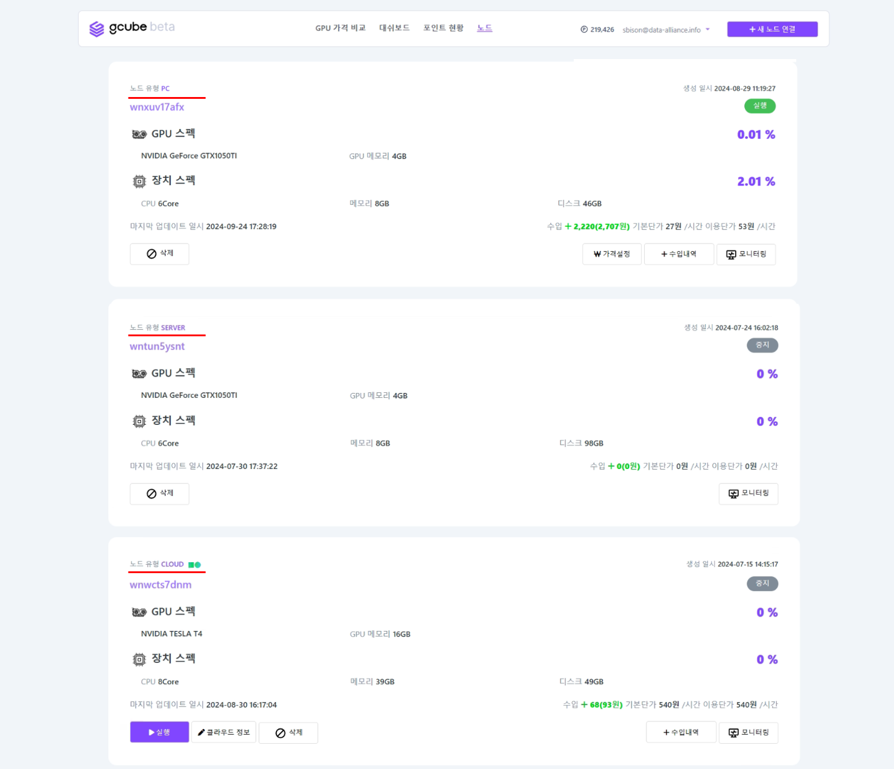

4. GPU 공유가 여러 대일 경우 위와 같은 화면으로 표시되며, 각 GPU별로 정보 확인과 기능 실행이 가능합니다.

## GPU 공유 가격설정

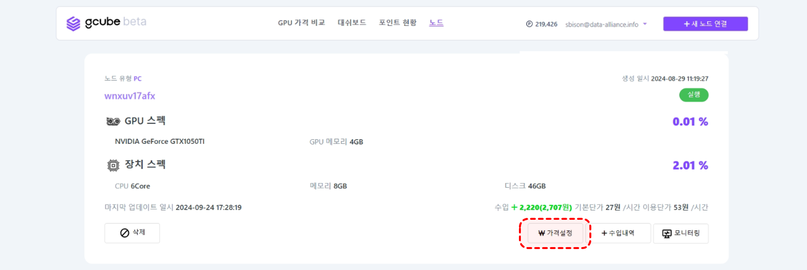

1. 공유 중인 GPU 정보 화면의 **“가격설정”** 버튼을 클릭해주세요.

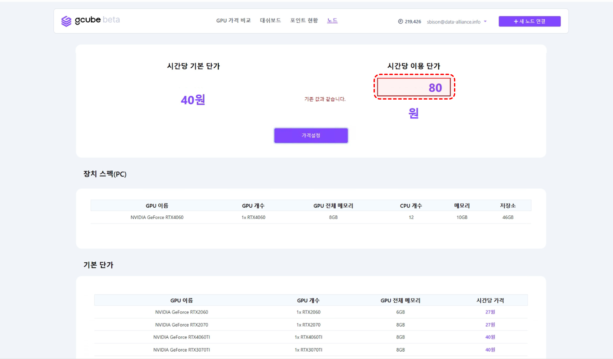

2. 위에 화면과 같이 이용 단가 수정이 가능한 화면이 나옵니다. “시간 당 이용 단가” 부분에 원하는 금액을 입력하시면 됩니다.
3. 동일한 금액 입력 시 화면과 같이 “기본 값과 같습니다.” 메세지가 표시 됩니다. 

4. 설정된 가격이 기준 금액 이상이나 이하로 입력할 경우 위에 화면과 같이 가격 기준이 메세지로 표출 되며 입력이 되지 않습니다.

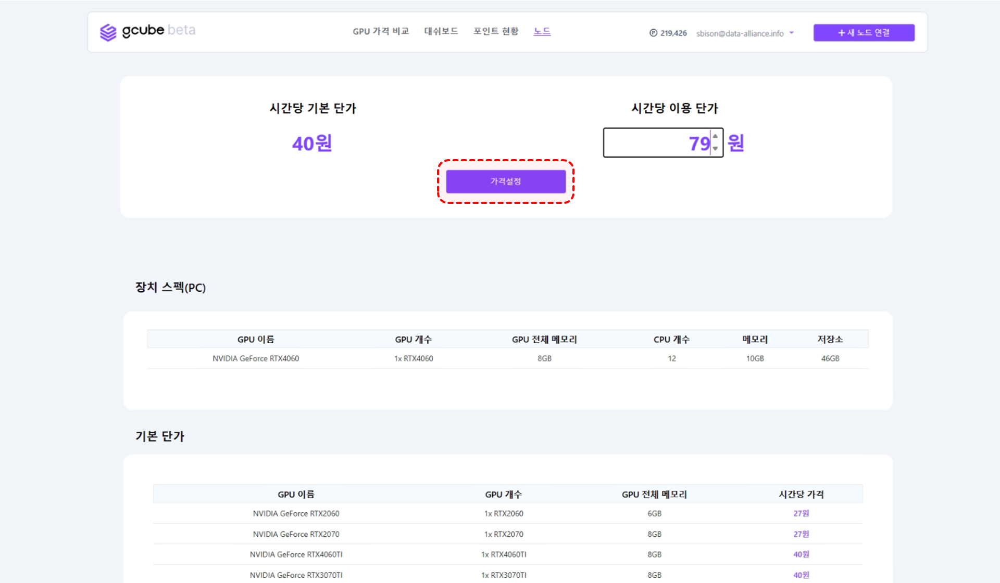

5. “시간 당 이용 단가” 부분의 금액을 원하는 금액으로 입력하고 **“가격설정”** 버튼을 클릭해주세요.

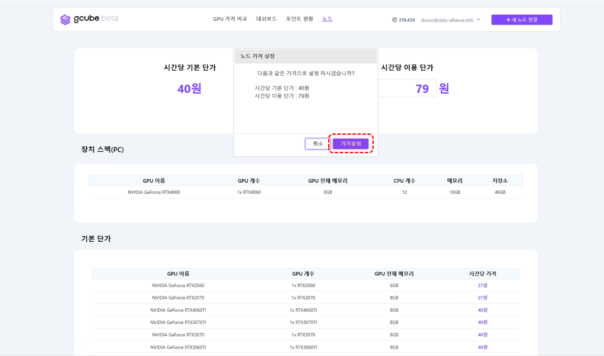

6. 정상적인 금액이 입력되면 위의 화면과 같이 팝업이 나옵니다.
7. 최종 금액을 확인하고, **“가격설정”** 버튼을 누르면 금액 수정이 완료 됩니다. 
8. 금액을 다시 수정하고 싶을 경우 **“취소”** 버튼을 누르면 이전 화면으로 돌아갑니다.

## GPU 공유 수입내역 확인

1. 공유 중인 GPU 정보 화면의 **“수입내역”** 버튼을 클릭해주세요.

2. 수입내역 리스트를 통해 날짜별로 최근내역 정보를 확인 가능합니다.
3. 세부내역 확인이 필요할 경우 우측의 “세부내역” 버튼을 클릭하세요.

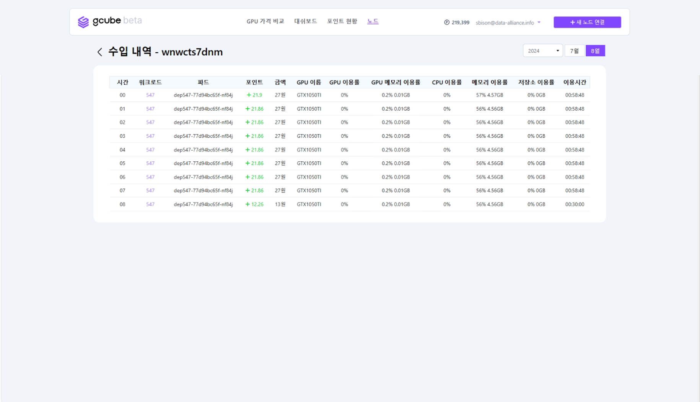

4. 위 화면과 같이 수입 새부내역 정보를 시간별로 확인할 수 있습니다.

## GPU 공유 모니터링 확인

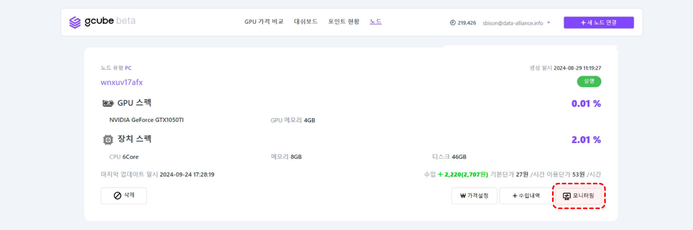

1. 공유 중인 GPU 정보 화면의 **“모니터링”** 버튼을 클릭해주세요.

2. 위 화면과 같이 노드 모니터링 전체 정보를 확인 가능합니다.

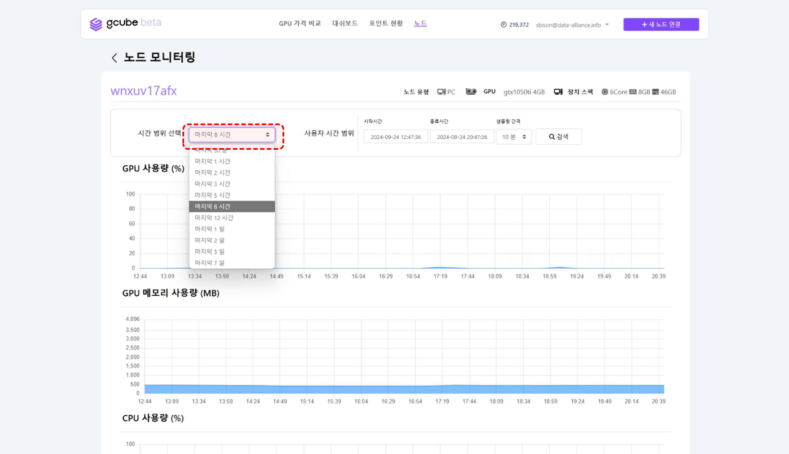

3. **“시간 범위 선택”** 클릭 시 이전 기록을 시간대별로 확인 가능합니다.

4. **“사용자 시간 범위”** 클릭 시 “시작시간”과 “종료시간”을 설정하여 원하는 시간대의 정보만 확인 가능합니다.

5. **“샘플링 간격”** 클릭 시 그래프의 시간단위 조절이 가능합니다. (기본값 10분, 최소 1분~최대 5시간 설정 가능)