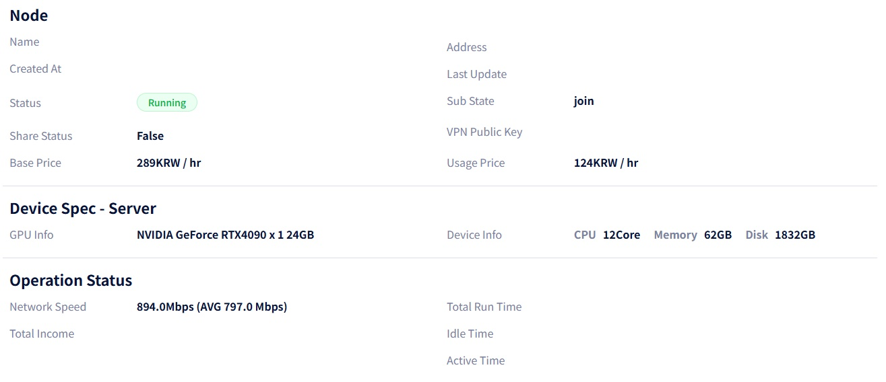

# **Troubleshooting: NVIDIA Graphics Driver Recognition Error**

 

During the node provisioning process, the node status may be marked as **"Failed."**  

This issue often occurs when the operating system is running **multiple graphic drivers simultaneously.**  

For example, this conflict is common when both the **NVIDIA discrete GPU** and an **Integrated GPU (iGPU)**—such as AMD Radeon graphics or Intel HD graphics—are active at the same time. 

|  |  |

To ensure stable Gcube node operation, you must disable the integrated GPU (iGPU) to prevent driver conflicts and ensure the agent exclusively utilizes the required NVIDIA hardware.  

To resolve driver conflicts, use the **AMD Display Driver Uninstaller (DDU)** to completely remove the iGPU drivers, then proceed with the **Gcube Agent reinstallation.**  

Other troubleshooting methods include disabling the iGPU function in the BIOS, or identifying the iGPU in the Device Manager to disable the device and uninstall its driver.  

Once the conflicting graphics drivers are removed, the issue will be resolved and the status will be displayed as shown below. 
