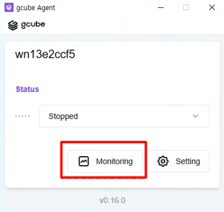
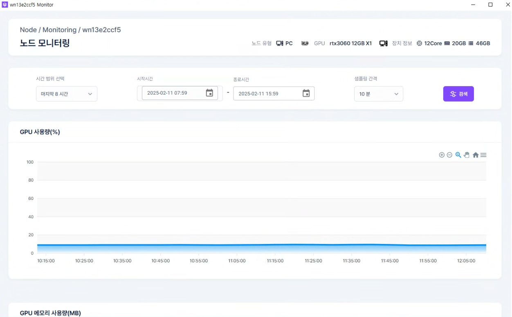

# 에이전트 모니터링 확인

에이전트 앱에서 공유 중인 노드의 실시간 리소스 현황을 확인합니다.

!!! tip
    에이전트 모니터링은 PC에 설치된 에이전트 앱 내에서 확인하는 로컬 모니터링입니다.  
    콘솔의 모니터링 기능과 별개로 동작합니다.

## 모니터링 확인 방법

1. 에이전트 프로그램에서 Monitoring 버튼을 클릭합니다.

1. Node Monitoring 화면에서 실시간 리소스 현황을 확인합니다.

## 확인 가능한 항목

| **항목** | **설명** |
| --- | --- |
| GPU 사용량 및 점유율 | 현재 GPU 연산 사용률 |
| VRAM 사용량 | GPU 메모리 사용 현황 |
| CPU 사용량 | 프로세서 사용률 |
| 메모리 사용량 | 시스템 RAM 사용 현황 |
| Disk 사용량 | 저장 공간 사용 현황 |
| Network Traffic | 수신/송신 네트워크 트래픽 |

---

[다음: 문제 해결 →](troubleshooting.ko.md){ .md-button .md-button--primary }

