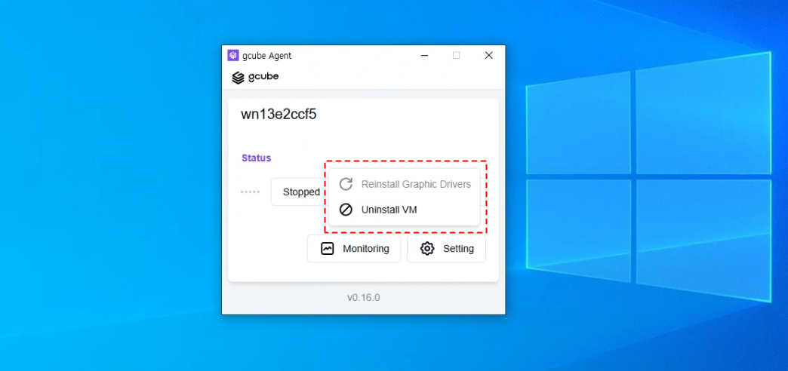

# **Agent Setup**

In the **Agent Setup**, you can update your **Graphics Drivers** and configure **VM (Virtual Machine) settings**.   

1\. Click on **"Setting."**   

2\. You can modify settings such as **reinstalling graphics drivers** or **deleting VMs**. 