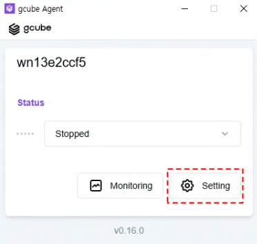

# **Agent Setup**

Manage driver updates and VM settings after installing the agent.

!!! tip
    You can change agent-related settings such as reinstalling the graphics driver and deleting VMs from the agent settings menu.

## **How to Access Agent Settings**

1. Run the agent program.
2. Click the Setting button on the agent screen. 

3. Modify the desired items on the settings screen. 

## **Configurable Items**

| **Item** | **Description** |
| --- | --- |
| Reinstall Graphics Driver | Reinstalls the NVIDIA driver when there is an issue. |
| Delete VM | Deletes the registered virtual machine (VM) information. |

!!! warning
    Deleting a VM will reset all configuration information for that VM. Make sure to confirm before deleting.

---

[Next: Start and Stop Sharing →](start-stop-sharing.en.md){ .md-button .md-button--primary }

