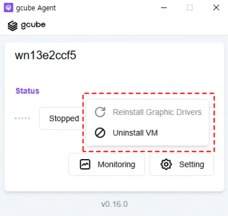

# **에이전트 설치 및 세팅**

에이전트 설치 후 드라이버 업데이트와 VM 설정을 관리합니다.

!!! tip
    에이전트 세팅 메뉴에서 그래픽 드라이버 재설치, VM 삭제 등 에이전트 관련 설정을 변경할 수 있습니다.

## **에이전트 세팅 진입 방법**

1. 에이전트 프로그램을 실행합니다.
2. 에이전트 화면에서 Setting 버튼을 클릭합니다. 

3. 세팅 화면에서 원하는 항목을 수정합니다. 

## **설정 가능한 항목**

| **항목** | **설명** |
| --- | --- |
| 그래픽 드라이버 재설치 | NVIDIA 드라이버에 문제가 있을 때 재설치합니다. |
| VM 삭제 | 등록된 가상 머신(VM) 정보를 삭제합니다. |

!!! warning
    VM을 삭제하면 해당 VM의 설정 정보가 초기화됩니다. 삭제 전 반드시 확인하세요
