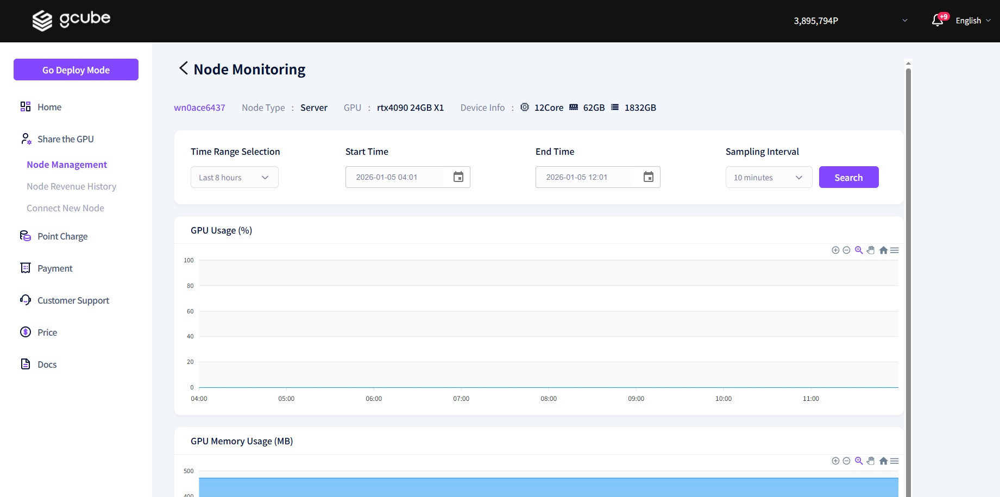

# **Check Agent Node Monitoring**

You can monitor the real-time status and performance of your GPU directly through the agent interface.   

1\. Click on **"Monitoring."**   

2\. Through the **Node Monitoring screen**, you can check real-time information and utilization rates for the following resources on your currently shared node 