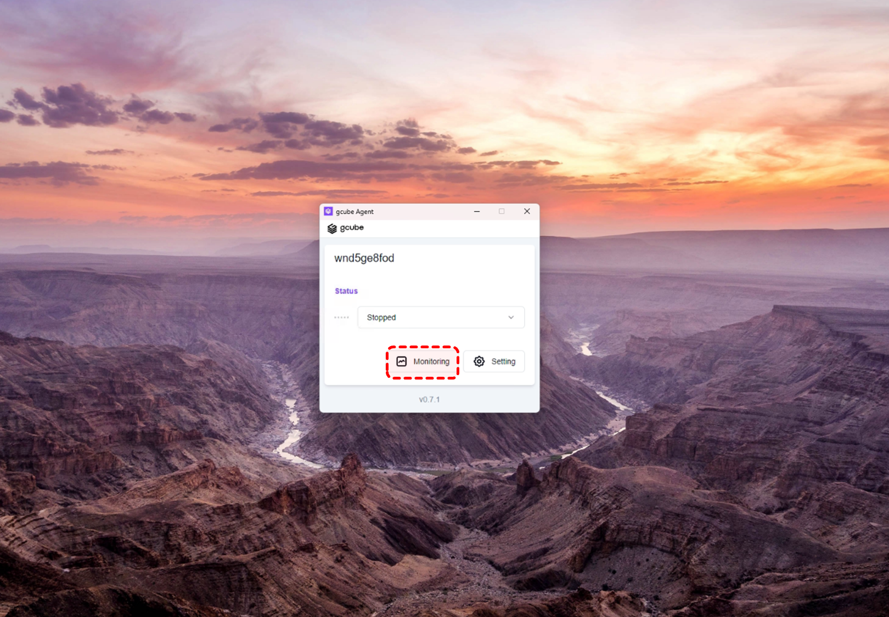
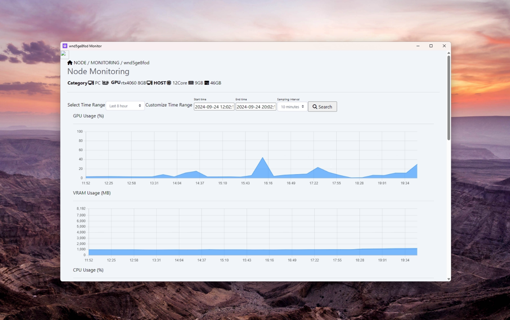

# 에이전트 Node 모니터링 확인

에이전트의 모니터링을 통해 공유 현황을 확인할 수 있습니다. 

1\. **“Monitoring”** 클릭 
  

2\. Node Monitoring 화면을 통해 현재 공유 중인 Node의 GPU, VRAM, CPU, Memory, Disk 사용량과 점유율, Network Traffic등의 정보들을 확인하실 수 있습니다.
  