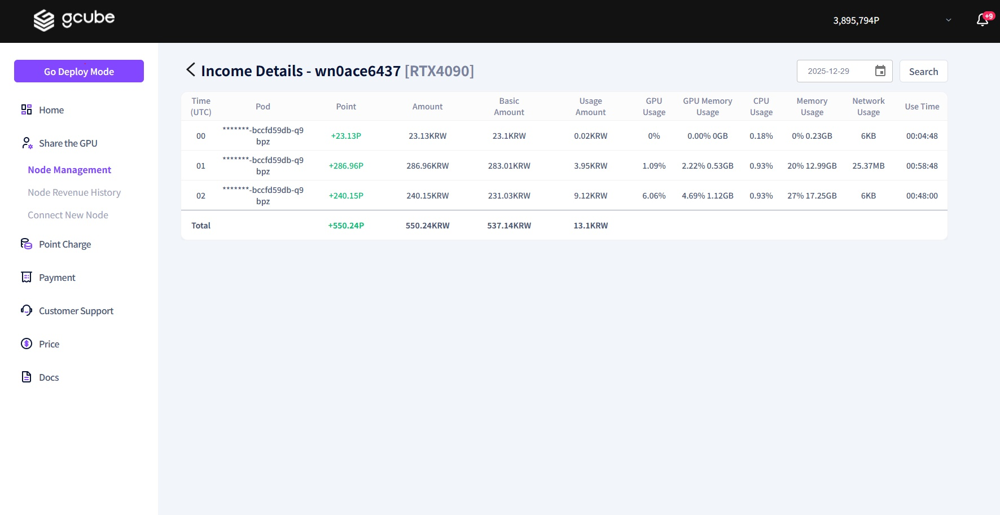

# **GPU Sharing Income Details**

You can track your earnings and monitor how much profit each GPU is generating through the detailed revenue report.   

1\. Please click the **"Usage Details"** button on the GPU sharing information screen  

2\. You can check your recent earnings by date through the **Revenue History List**. 
3\. If you need to view more specific information, click the **"Detailed View"** button on the right side.  

4\. As shown in the screen above, you can check the **detailed revenue information** broken down by the hour.