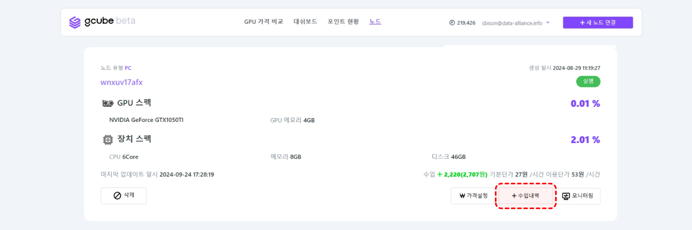
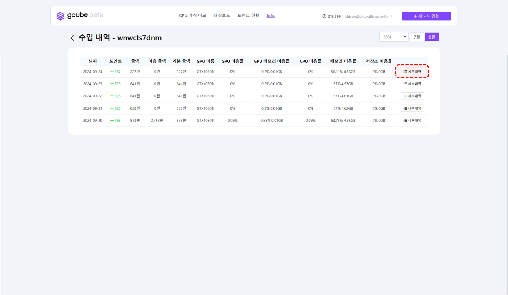
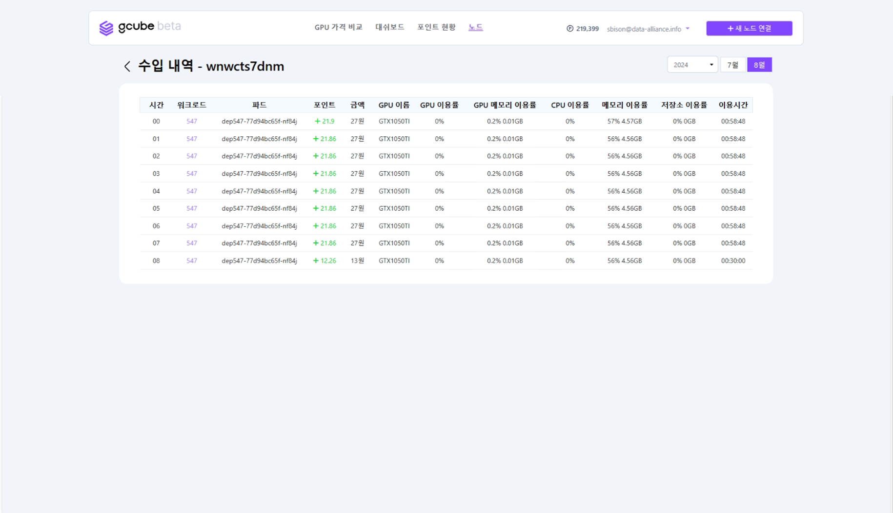

# GPU 공유 수입내역 확인

'수입내역'을 통해 GPU 공유로 발생한 수익을 확인할 수 있습니다. 

1\. 공유 중인 GPU 정보 화면의 **“수입내역”** 버튼을 클릭해주세요.
  

2\. 수입내역 리스트를 통해 날짜별로 최근내역 정보를 확인 확인하실 수 있습니다.  
3\. 세부내역 확인이 필요할 경우 우측의 “세부내역” 버튼을 클릭하세요.
  

4\. 위에 화면과 같이 수입 새부내역 정보를 시간별로 확인하실 수 있습니다.
  