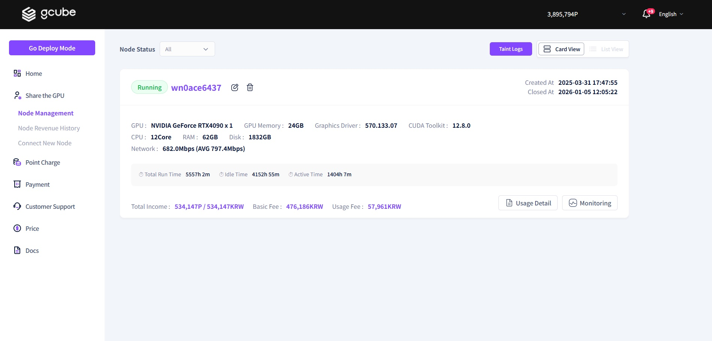
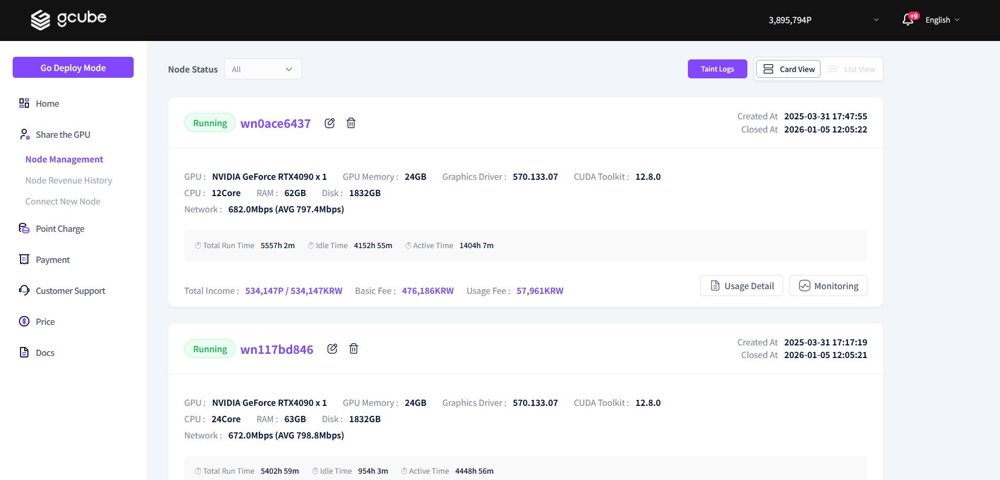
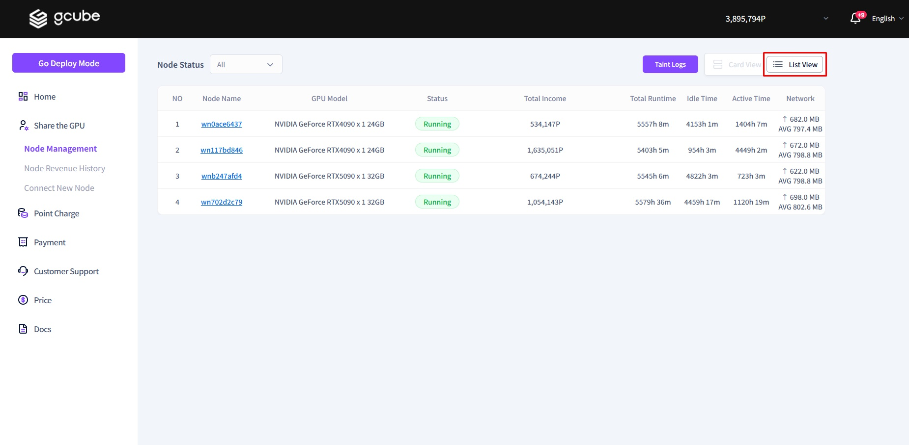

# **Check GPU Sharing Info**

On the Node screen, you can check the current status of the node you are sharing.   

1\. If you have only one GPU sharing device, you can check your sharing information as shown in the screen above.   
2\. The **execution status** and **Node Name** will be displayed. Clicking on the node name will take you to a detailed page where you can view more specific information.    
- **GPU Specs & Device Specs:** Hardware model and technical specifications.  
- **Uptime:** The total duration the node has been running.  
- **Sharing Status:** Whether the node is currently "Running" or "Stopped."  
- **Financial Data:** **Total Revenue**, **Base Fee**, and **Usage Fee**.  
- **Timestamps:** The exact date and time of the last update.    

3\. If you have **multiple GPU sharing devices**, they will be displayed as shown in the screen above. You can view the specific information and execute functions for each individual GPU.  

4\. If you have a large number of GPU sharing devices, you can use the **List View** to see a summary of all information at a glance.

