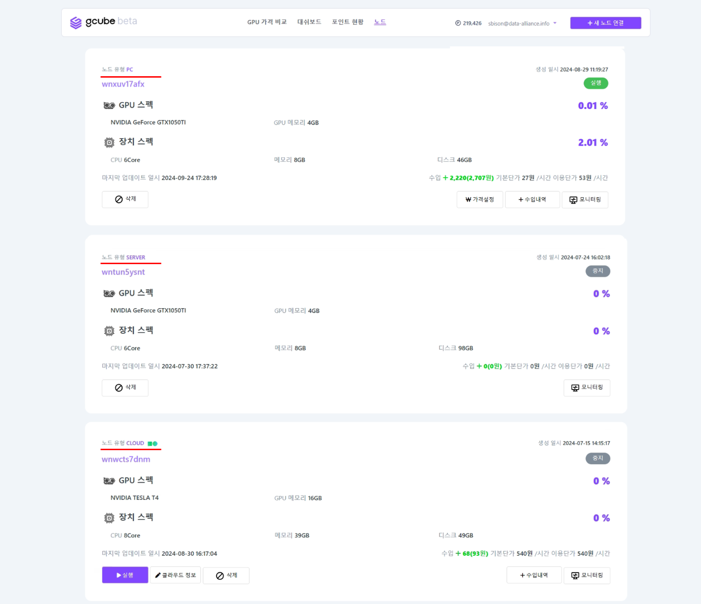

# GPU 공유 정보 확인

노드 화면에서 현재 공유중인 노드의 현황을 파악할 수 있습니다. 

1\. GPU 공유 기기가 한 대일 경우 위의 화면과 같이 내 공유 정보를 확인하실 수 있습니다. 
2\. 내 공유 유형에 따라 PC, SERVER, CLOUD로 노드 유형이 표기 됩니다.  
3\. GPU 스펙, 장치 스펙, 공유율, 공유상태(실행/중지) 수입가격, 기본단가, 이용단가, 업데이트 일시등의 정보를 확인하실 수 있습니다.
  

4\. GPU 공유 기기가 여러 대일 경우 위와 같은 화면으로 표시되며, 각 GPU별로 정보 확인과 기능 실행이 가능합니다.
  