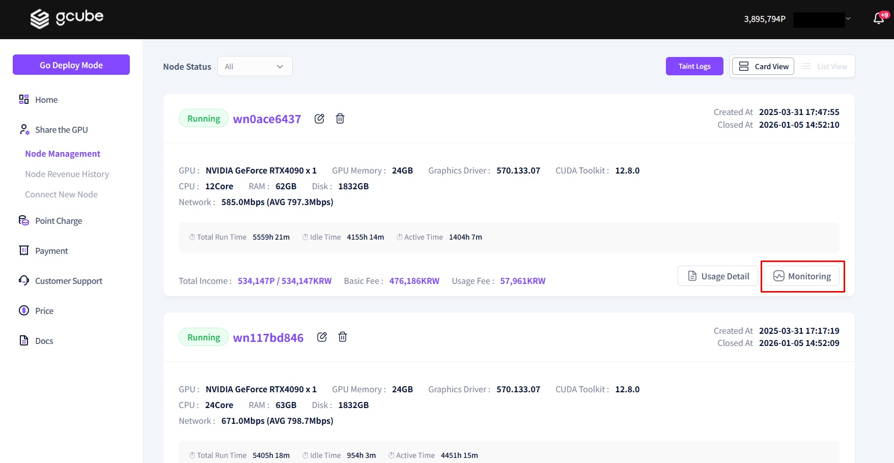
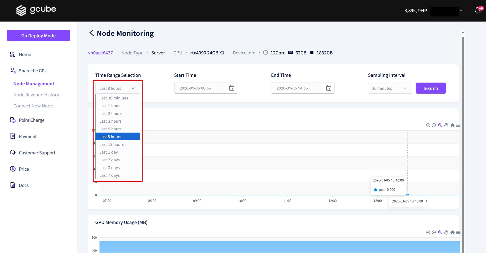
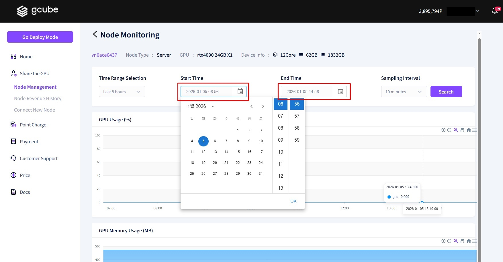

# **Check GPU Sharing Monitoring**

You can monitor the real-time status of your GPU sharing activities through the Node interface.    

1\. Please click the **"Monitoring"** button on the GPU sharing information screen.   

2\. As shown in the screen above, you can view the **complete node monitoring information**.   

3\. By clicking on **"Select Time Range"**, you can review your node's past performance history broken down by specific time periods.   

4\. By clicking on **"Custom Time Range"**, you can set a specific **"Start Time"** and **"End Time"** to view monitoring information only for your desired period.   

5\. By clicking on **"Sampling Interval"**, you can adjust the time units of the graph. (Default is 10 minutes; you can set it from a minimum of 1 minute to a maximum of 5 hours.)