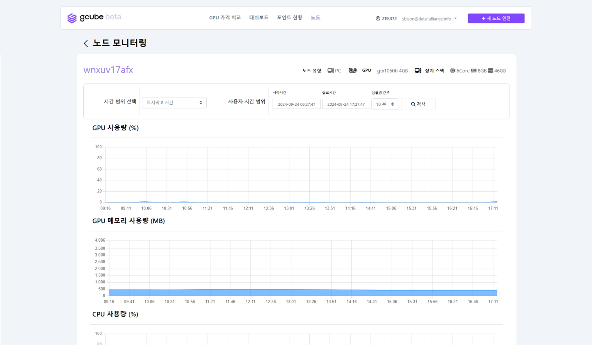
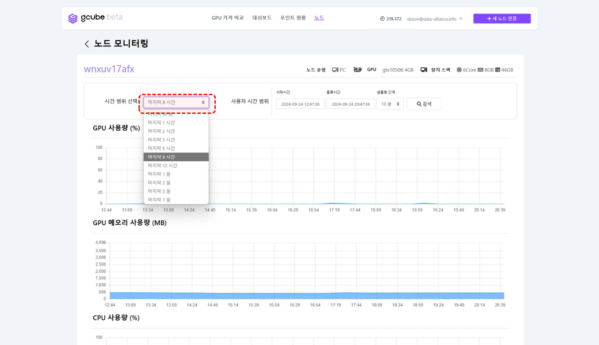
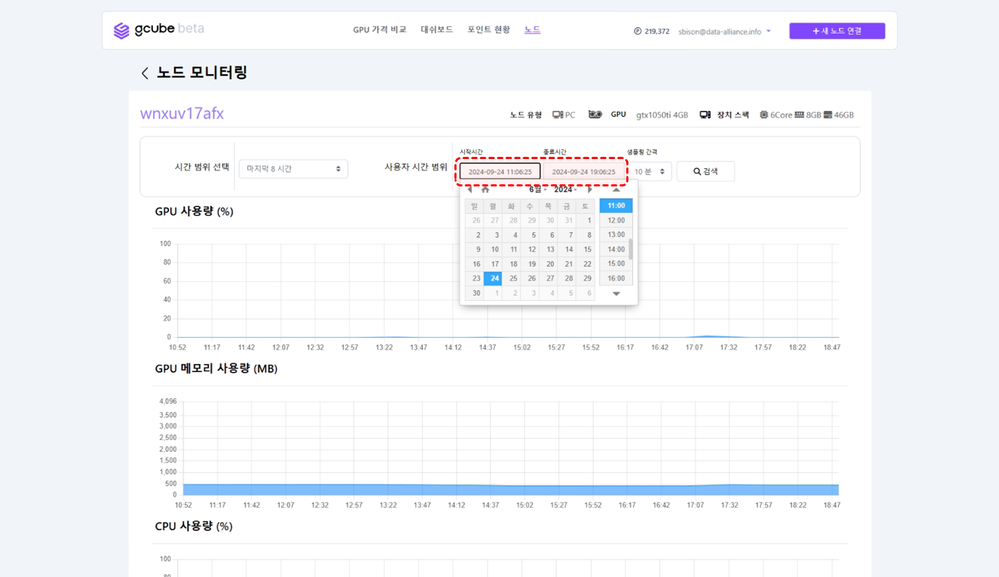
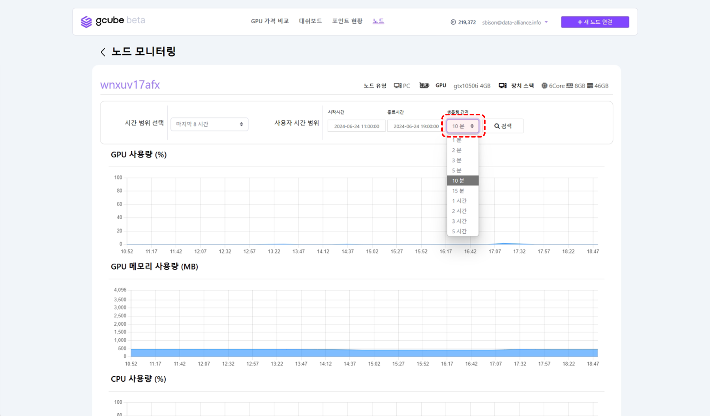

# GPU 공유 모니터링 확인

노드를 통한 GPU 공유의 현황을 확인할 수 있습니다.  

1\. 공유 중인 GPU 정보 화면의 **“모니터링”** 버튼을 클릭해주세요.   

2\. 위에 화면과 같이 노드 모니터링 전체 정보를 확인하실 수 있습니다.   

3\. **“시간 범위 선택”** 클릭 시 이전 기록을 시간대별로 확인하실 수 있습니다.   

4\. **“사용자 시간 범위”** 클릭 시 “시작시간”과 “종료시간”을 설정하여 원하는 시간대의 정보만 확인 가능합니다.   

5\. **“샘플링 간격”** 클릭 시 그래프를 시간 단위로 조절 가능합니다. (기본값 10분, 최소 1분~최대 5시간 설정 가능)   