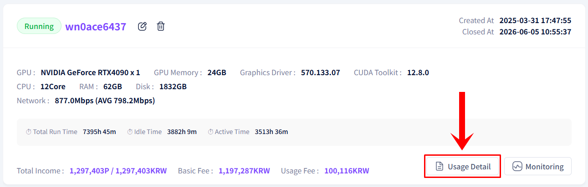
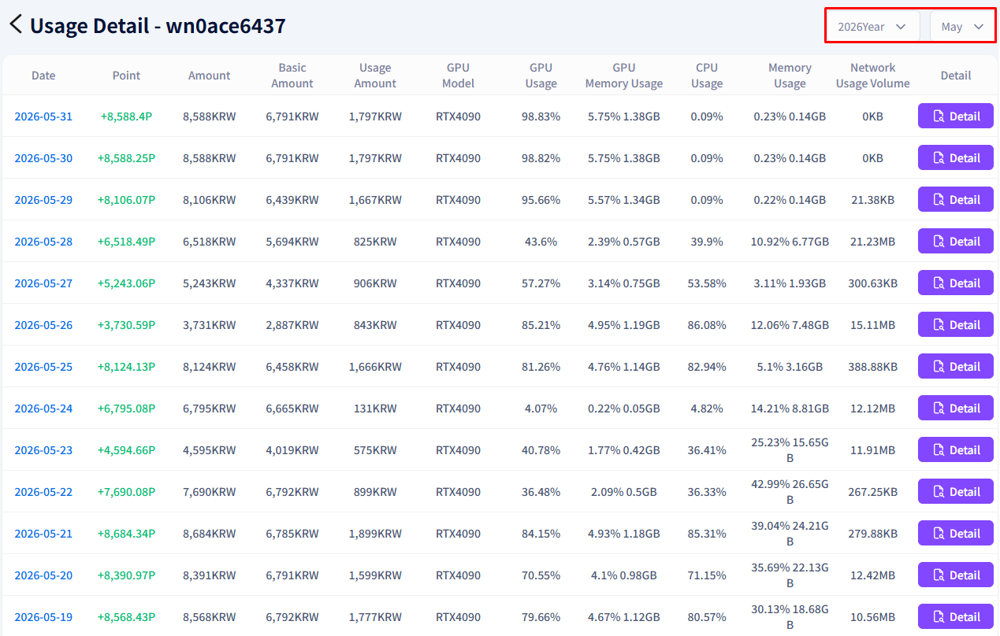
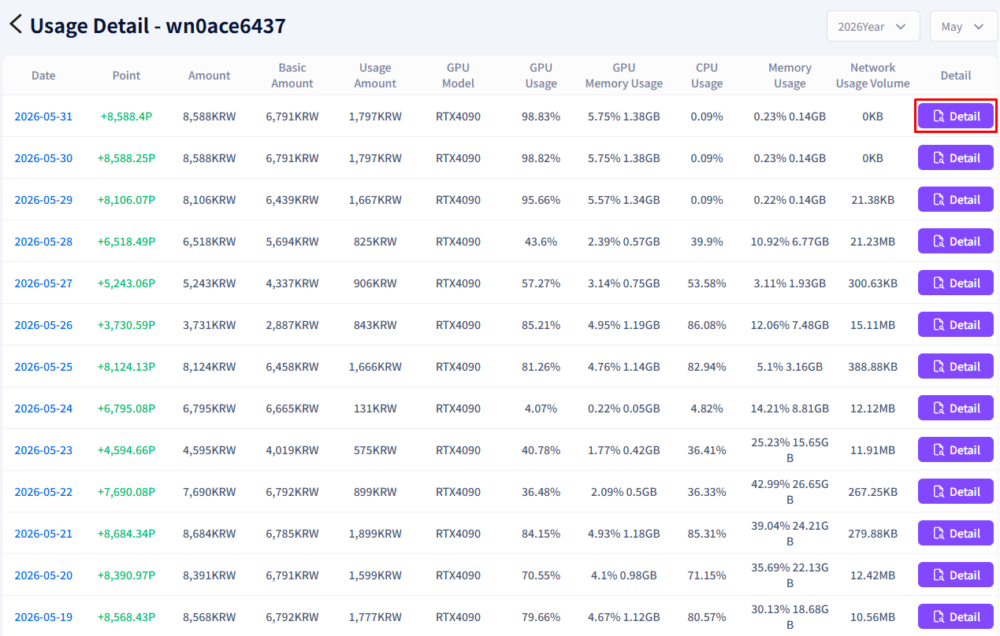
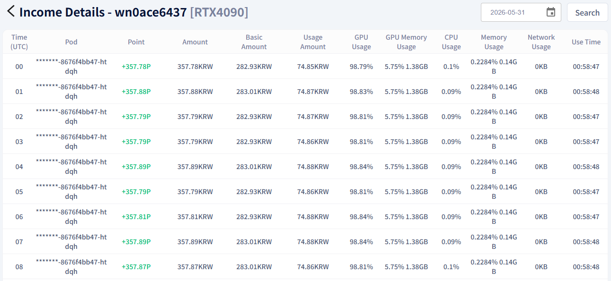

# **Check Earnings**

Check your GPU sharing earnings by date and by hour.

!!! tip
    Use the Usage Details feature to view earnings by date and check detailed records by the hour.

## **How to Check Earnings**

1. Click the Usage Details button on the shared GPU information screen.

2. Check recent earnings by date in the income history list.

3. If you need detailed records, click the Details button on the right.

4. View the hourly income breakdown.

---

[Next: Check Monitoring →](check-monitoring.en.md){ .md-button .md-button--primary }

