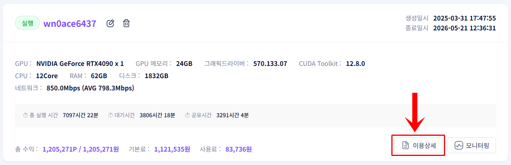
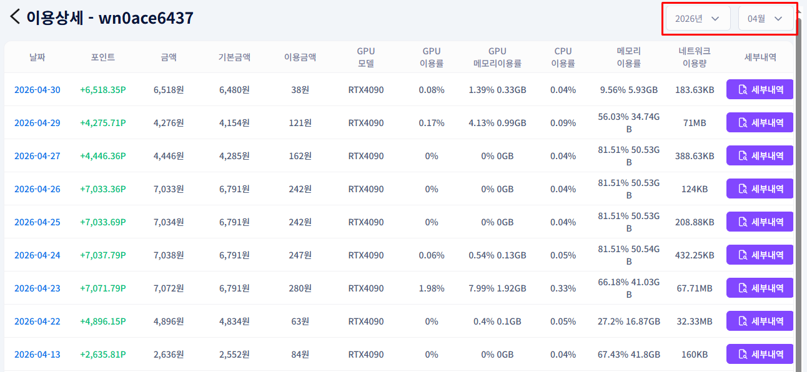
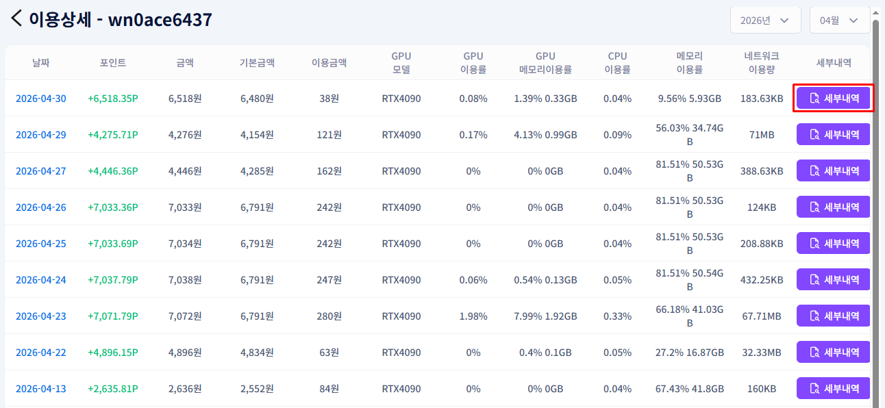
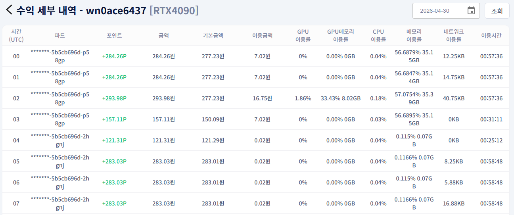

# **수익 확인**

GPU 공유로 발생한 수익 내역을 날짜별·시간별로 확인합니다.

!!! tip
    이용상세 기능을 통해 수익 내역을 날짜별로 조회하고, 세부 내역을 시간 단위로 확인할 수 있습니다.

## **수익 확인 방법**

1. 공유 중인 GPU 정보 화면에서 이용상세 버튼을 클릭합니다.

1. 수입내역 리스트에서 날짜별 최근 수익 정보를 확인합니다.

1. 세부 내역이 필요한 경우 우측의 세부내역 버튼을 클릭합니다.

1. 시간별 수입 세부내역을 확인합니다.

---

[다음: 모니터링 확인 →](check-monitoring.ko.md){ .md-button .md-button--primary }

