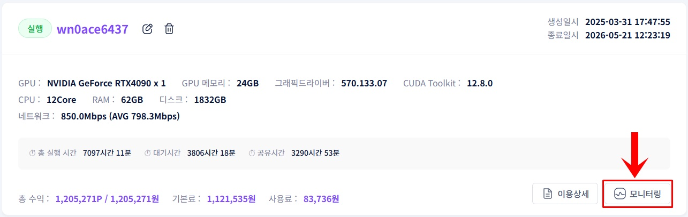
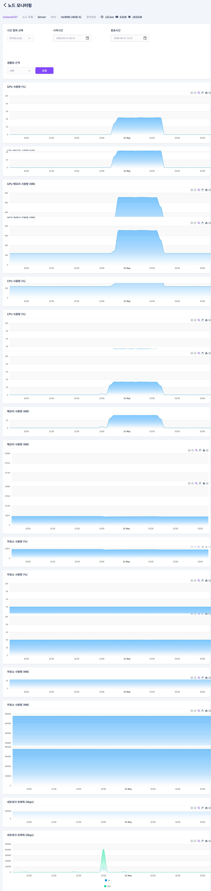
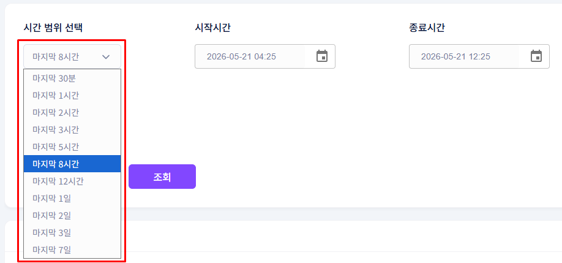
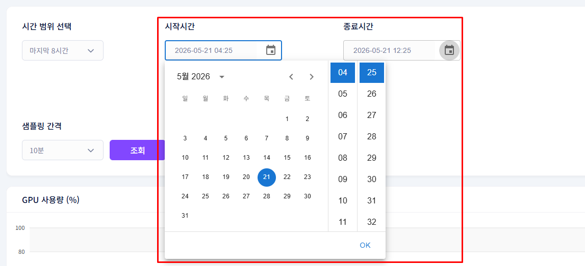

# **Check Monitoring**

View real-time performance metrics of your shared GPU in graph format.

!!! tip
    Use the monitoring feature to check GPU usage, memory, network traffic, and more in real time or over a selected time period.

## **How to Access Monitoring**

1. Click the Monitoring button on the shared GPU information screen.

2. The full node monitoring overview screen will be displayed.

## **Available Metrics**

| **Metric** | **Unit** |
| --- | --- |
| GPU Usage | % |
| VRAM Usage | MB |
| CPU Usage | % |
| Memory Usage | MB |
| Disk Usage | MB |
| Network Traffic (Inbound/Outbound) | Kbps |

## **Setting the Time Range**

1. Click the time range selector to choose from predefined time periods.

2. Select a custom time range to specify the start and end times manually.

3. Use the sampling interval button to adjust the time unit of the graph.

Default: 10 min  /  Minimum: 1 min  /  Maximum: 5 hours
