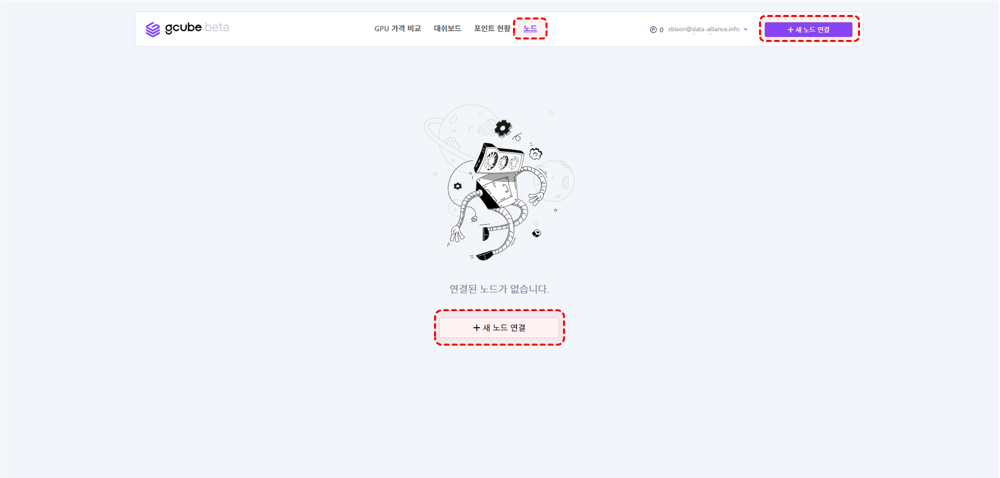
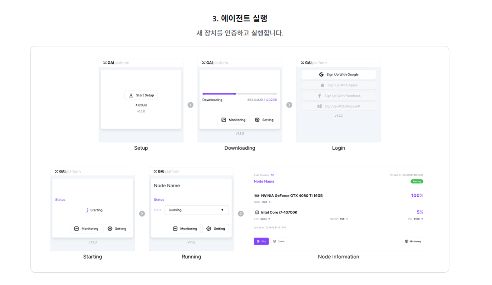
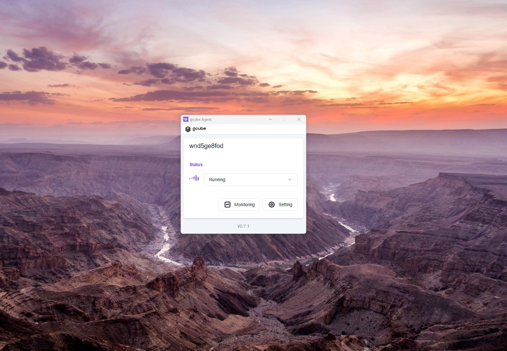

# 새 노드 연결

GPU 공유를 위해서는 새로운 노드를 연결해야 합니다.

1\. 노드 탭에서 **“새 노드 연결”** 버튼을 클릭하세요.   

2\. 에이전트 프로그램을 다운받기 위해 **“Download Program”** 버튼을 클릭하세요.   

3\. 에이전트를 다운로드 후 실행 뒤 에이전트 실행 메뉴의 절차 설명을 따라 설치를 진행해주세요.   

4\. 설치가 완료되면 화면과 같이 자동으로 공유가 진행됩니다.   