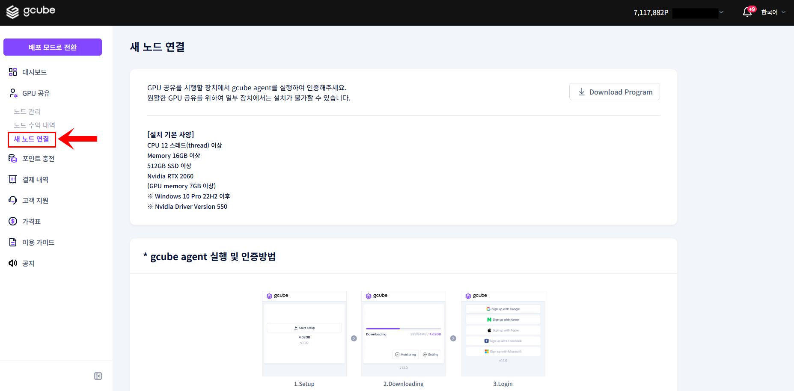
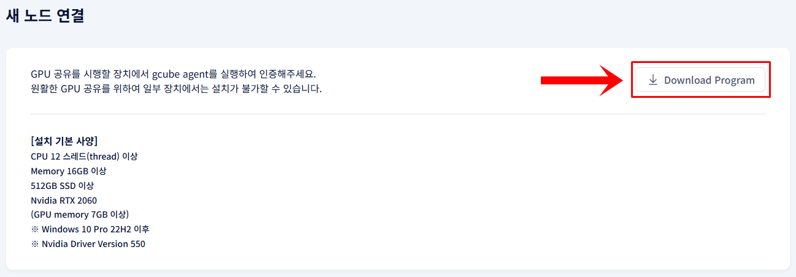
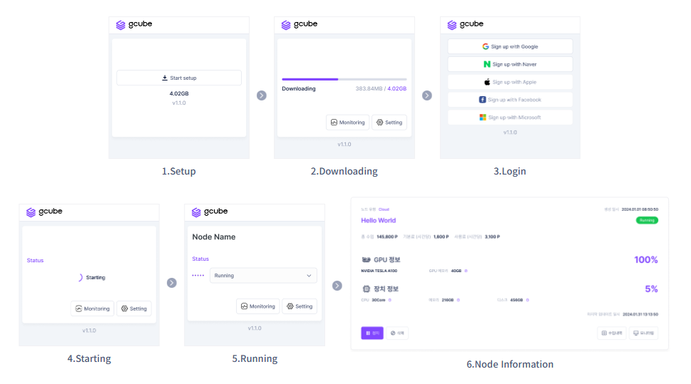

# **Connect Node**

Install the agent to connect your GPU to gcube.

!!! tip
    Once a node is connected, your GPU is registered on the gcube platform and sharing begins.

## **Before You Begin**

- A Windows PC or server with an NVIDIA GPU is required.
- The NVIDIA driver must be properly installed.
- You must be logged into your gcube account and have switched to Share Mode.

## **How to Connect**

1. Click **Connect New Node** in the left menu in Share Mode.

2. Click the **Download Program** button to download the agent program.

3. Run the downloaded installer and follow the on-screen instructions to complete the installation.

4. Once installation is complete, GPU sharing will start automatically.

!!! warning
    If the NVIDIA driver is not recognized, refer to the Troubleshooting guide.
