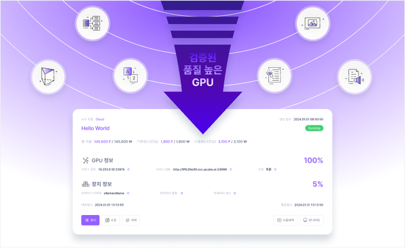

# 노드 사용자 가이드

[Home](./node-home.md)

[새 노드 연결](./connect-new-node.md)

[GPU 공유 중단](./stop-gpu-sharing.md)

[에이전트 Node 모니터링 확인](./check-agent-node-monitoring.md)

[에이전트 세팅](./agent-setup.md)

[GPU 공유 정보 확인](./check-gpu-sharing-info.md)

[GPU 공유 가격 설정](./set-gpu-sharing-pricing.md)

[GPU 공유수익 상세내역](./check-gpu-sharing-income.md)

[GPU 공유 모니터링 확인](./check-gpu-sharing-monitoring.md)

[에이전트 사용 오류 해결](./troubleshooting_agent_errors.md)

[Tier 2 Ubuntu OS 세팅 가이드](./Ubuntu-OS-setup.md)

[Tier 2 노드 공급자 세팅 가이드](./tier-2-ubuntu-setting-guide.md)

[NVIDIA 그래픽 드라이버 인식 오류](./NVIDIA-graphic-driver-error.md)