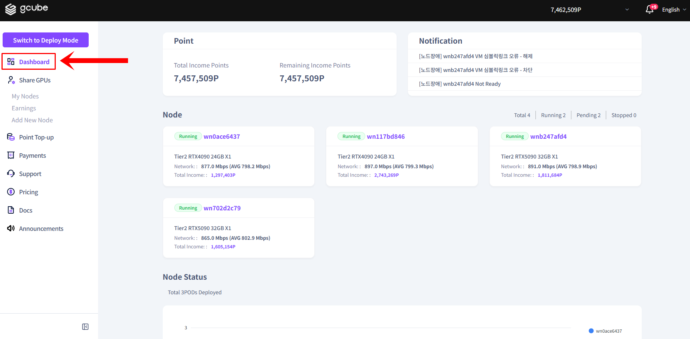
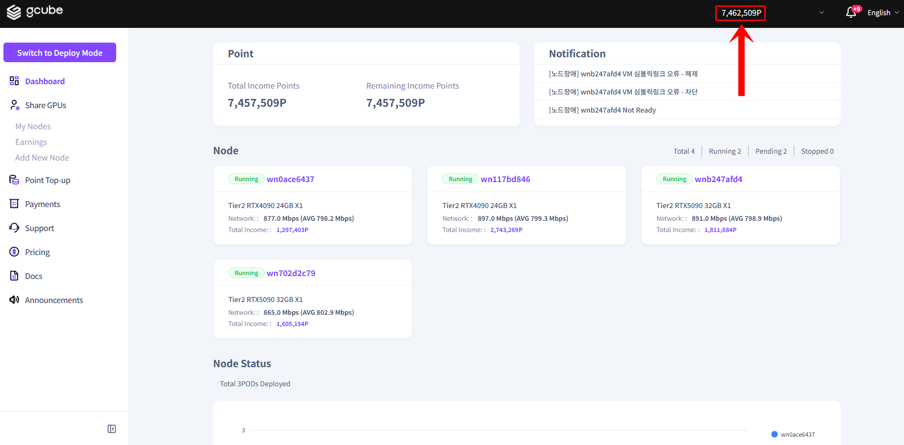
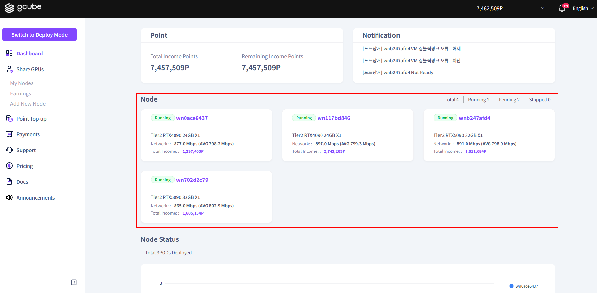

# **Node Dashboard**

**Check your earnings and node operation status at a glance**

!!! tip
    The Node Dashboard is the first screen in Share Mode.
    You can check earnings, node status, and key notifications all in one place.

## **Available Information**

| **Item** | **Description** |
| --- | --- |
| Point Status | Total earnings history and remaining points after settlement |
| Node Operation Status | Summary of active nodes (click a node name for details) |
| Key Notifications | Alerts related to node operation and platform usage |

## **How to Use the Dashboard**

1. In Share Mode, click Dashboard in the left menu.

2. Check the point status and earnings information at the top.

3. View the operation status of each node in the node list below. Click a node name to go to its detail page.

!!! warning
    If no nodes are displayed, you have not connected a node yet.
    Follow the next steps below to connect a node.

---

[Next: Connect Node →](connect-node.en.md){ .md-button .md-button--primary }

