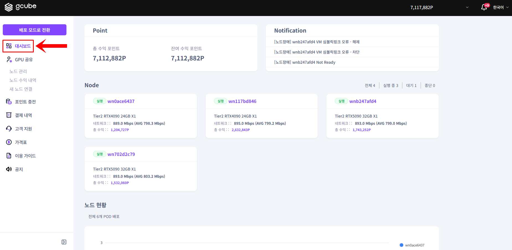
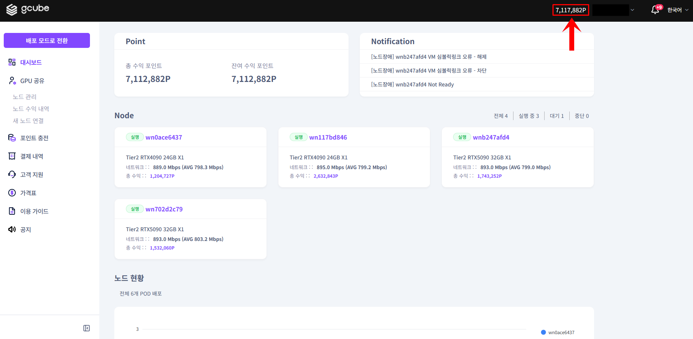
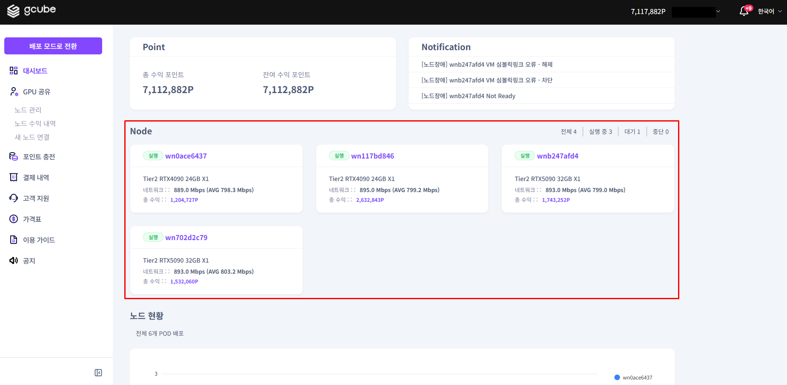

# **노드 대시보드**

**수익 현황과 노드 운영 상태를 한눈에 확인합니다**

!!! tip
    노드 대시보드는 Share Mode의 첫 화면입니다.
    수익, 노드 상태, 주요 알림을 한곳에서 확인할 수 있습니다.

## **확인할 수 있는 정보**

| **항목** | **설명** |
| --- | --- |
| 포인트 현황 | 총 수익 내역 및 정산 후 잔여 수익 포인트 |
| 노드 운영 상태 | 운영 중인 노드 요약 현황 (노드명 클릭 시 상세 이동) |
| 주요 알림 | 노드 운영 및 사이트 이용에 필요한 알림 |

## **대시보드 사용 방법**

1. Share Mode에서 좌측 메뉴의 대시보드를 클릭합니다.

2. 상단에서 포인트 현황과 수익 정보를 확인합니다.

3. 하단의 노드 목록에서 각 노드의 운영 상태를 확인합니다. 노드명을 클릭하면 상세 정보로 이동합니다.

!!! warning
    노드가 표시되지 않는 경우 아직 노드를 연결하지 않은 상태입니다.
    아래 다음 단계를 따라 노드를 연결하세요.
