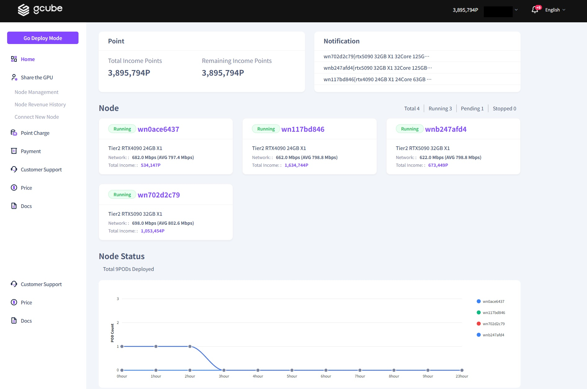

# **Home**

Navigate to the **"Home"** tab to view the overall status of your node clusters at a glance  

 

1\. Click on the **"Home"** menu in the left-hand sidebar to view your point balance, along with a summary and status of your connected nodes.   

2\. On the **Home** screen, you can check the **total revenue** generated from your operating nodes and your **remaining balance** (profit points) after settlement. Additionally, **key notifications** required for node operation and site usage are displayed here for your review.   

3\. Real-time Node Monitoring: You can view the **current operational status** of your active nodes at a glance. By clicking on a **Node Name**, you will be directed to the **Node Details** page for more in-depth information.