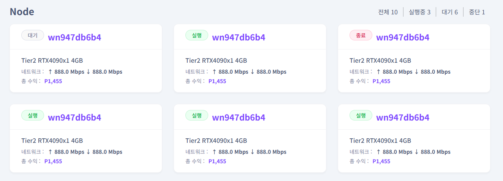

# **Home**

‘대쉬보드’ 탭으로 이동하여 노드 클러스터의 전체 현황을 확인할 수 있습니다.  

 

1\. 좌측 메뉴에서 **“Home”** 메뉴를 클릭하면 포인트 현황과 노드 간략 정보와 현황들을 확인하실 수 있습니다.   

2\. Home 에서는 운영하고 있는 노드를 통한 총 수익내역과 정산 후 잔여 수익포인트를 확인할 수 있습니다. 또한 노드 운영과 사이트 이용에 필요한 주요 알림이 표시되어 체크할 수 있습니다.   

3\. 운영중인 노드의 현재 운영 상태를 한 눈에 볼 수 있으며, 노드명 클릭 시 노드 상세정보 페이지로 이동합니다.