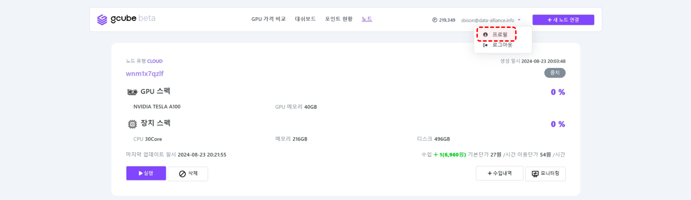
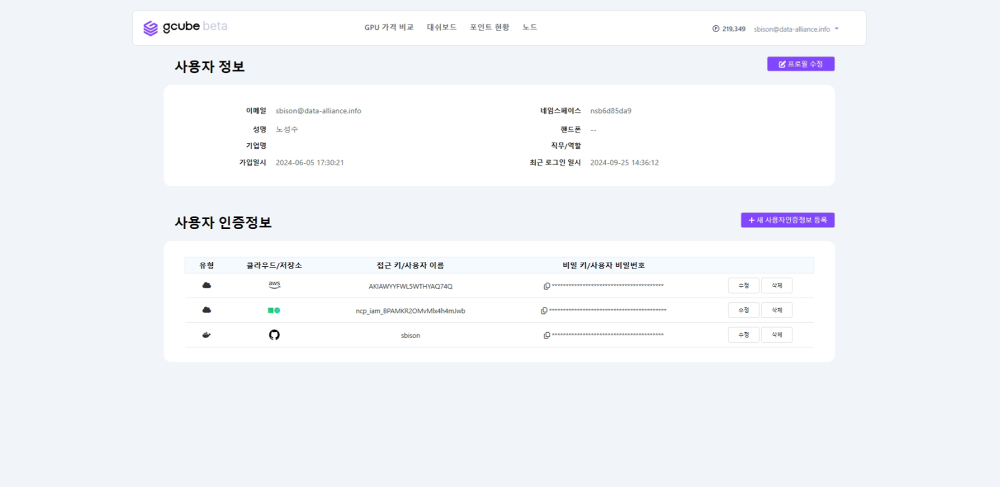
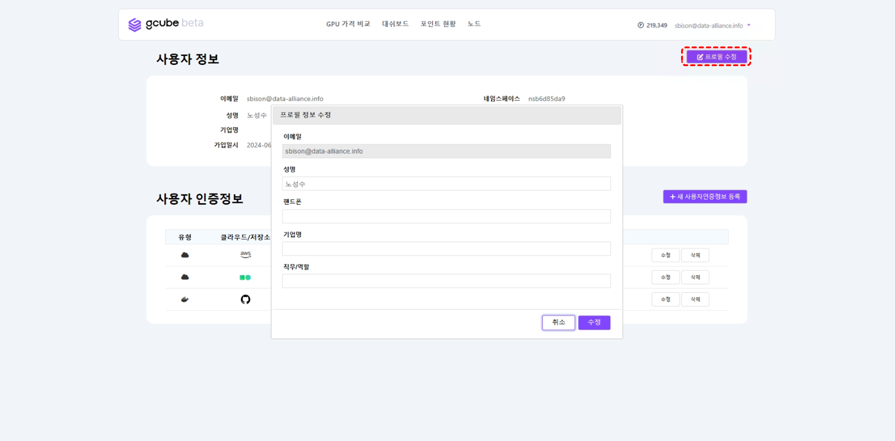
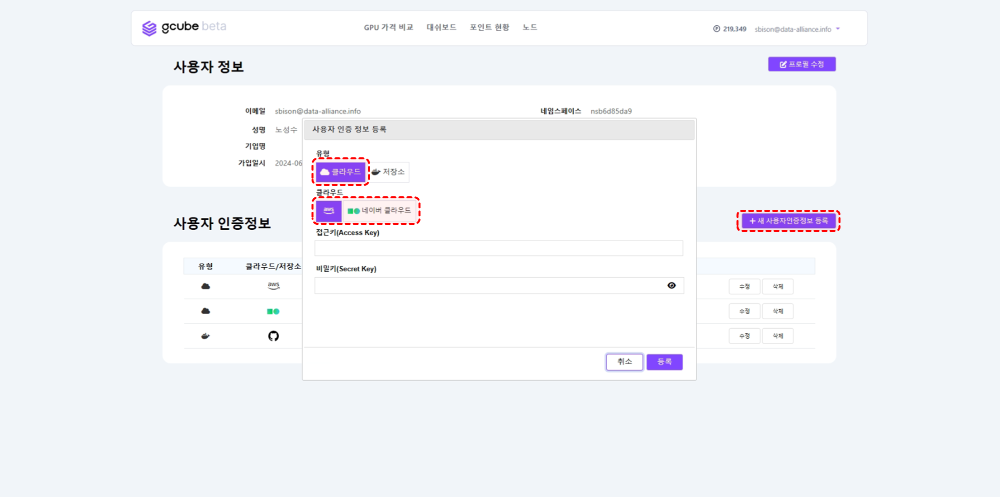
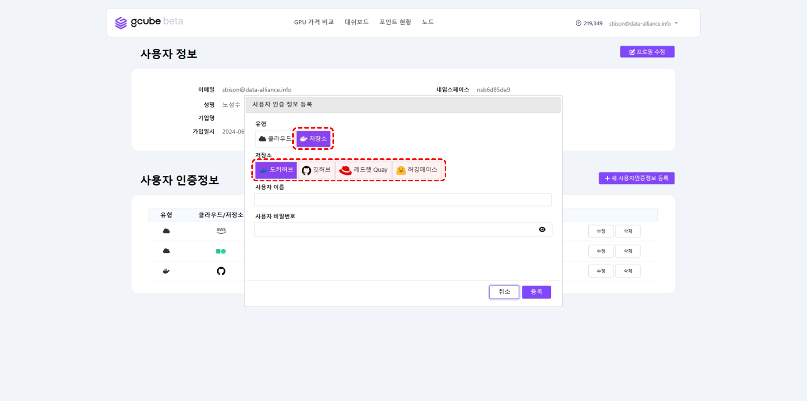
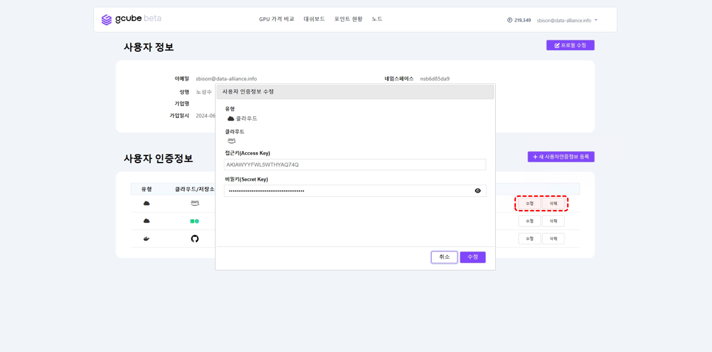

# 프로필 설정

프로필 설정은 계정의 정보를 설정할 수 있습니다. 

1\. 아이디 옆 화살표 클릭 → **“프로필”** 클릭   

2\. 위에 화면과 같이 “사용자 정보”와 “사용자 인증정보” 확인이 가능합니다.   

3\. **“프로필 수정”** 클릭 → 프로필 정보 수정 팝업 화면에서 원하는 정보를 수정하여 **“수정”** 버튼 클릭하면 프로필 정보 수정이 완료됩니다.   

4\. **“+ 새 사용자인증정보 등록”** 클릭 → 사용자 인증 정보 등록 팝업 화면에서 **“유형”**을 선택 → **“클라우드”** 선택 시 클라우드사 선택, **“저장소”** 선택 시 저장업체 입력 후 정보 입력 → **"등록"** 버튼 클릭 시 등록 완료   

5\. 사용자 인증정보 **“수정”** 버튼 클릭 → 사용자 인증정보 팝업 화면에서 관련 정보 수정하여 **“수정”** 버튼 클릭하면 사용자 인증정보 수정이 완료됩니다.   