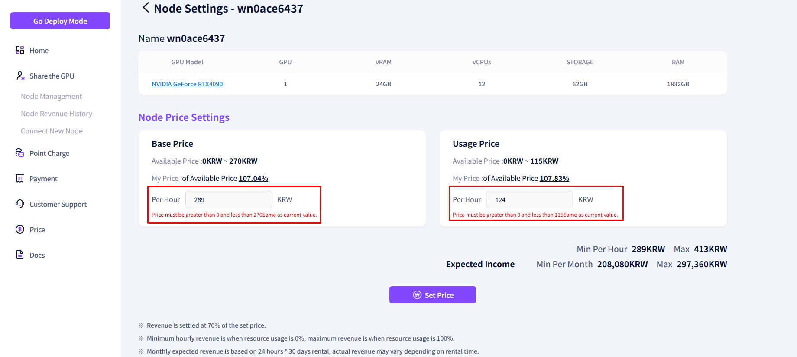
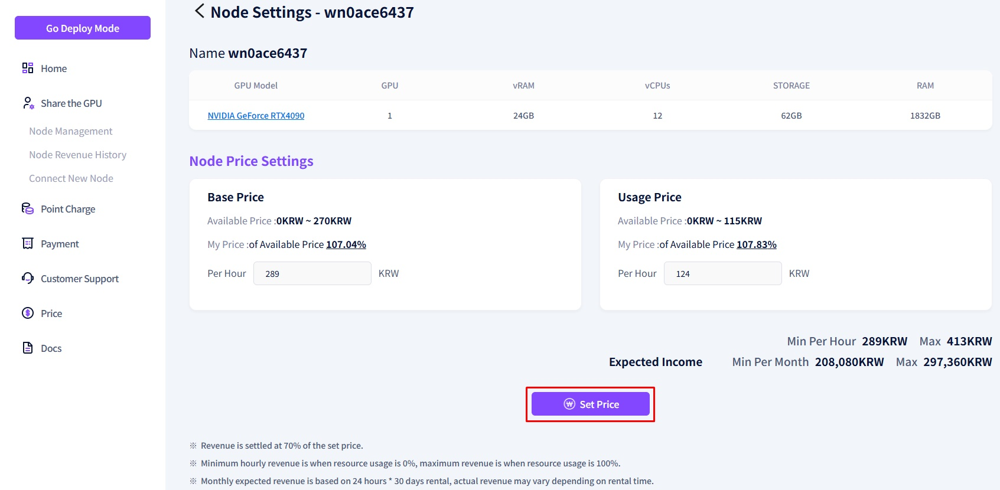

# **Set GPU Sharing Pricing**

Through the **Set GPU Sharing Pricing**, you can configure both the **Base Price** and the **Usage Unit Price**.   

1\. Please click the **"Price Setting"** button on the GPU sharing information screen.  

2\. A screen where you can modify the unit price will appear, as shown above. You can simply enter your desired amount in the **"Hourly Usage Fee"** section.   
3\. If you enter the same amount as the current setting, a message saying **"It is the same as the default value"**  will be displayed, as shown on the screen.   

4\. If you enter a price that is above the maximum limit or below the minimum threshold, a message indicating the **price criteria** will be displayed as shown in the screen above, and the input will not be accepted.  

5\. Enter the desired amount in the **"Hourly Usage Fee"** section and click the **"Set Price"** button.  

6\. Once a valid amount is entered, a popup will appear as shown in the screen above. 
7\. After a final review of the amount, click the **"Confirm"** button to complete the price modification.  
8\. If you wish to edit the amount again, click **"Cancel"** to return to the previous screen.