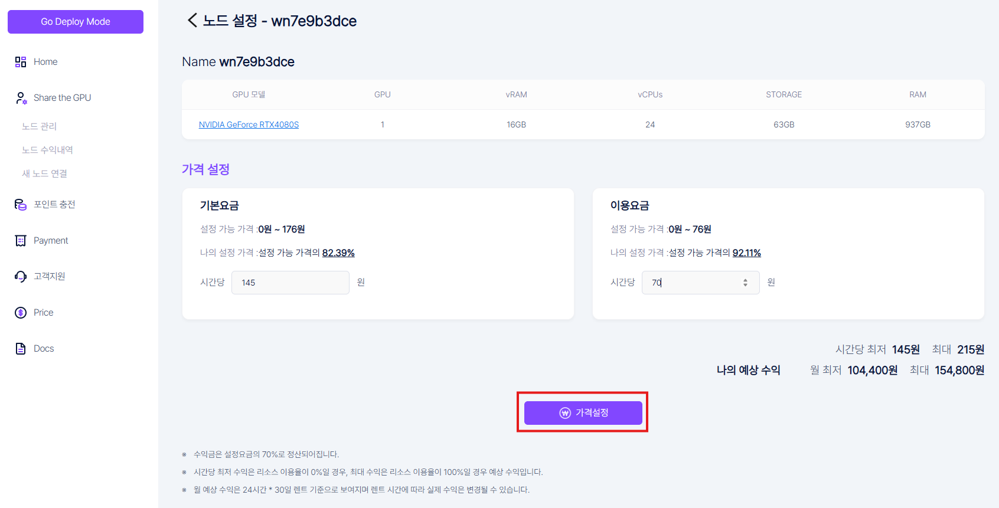
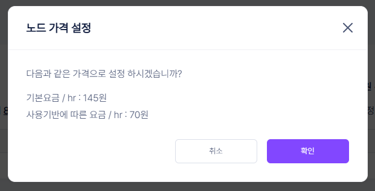

# **GPU 공유 가격 설정**

노드의 가격설정을 통해 기본가격과 이용단가를 설정할 수 있습니다.   

1\. 공유 중인 GPU 정보 화면의 **“가격설정”** 버튼을 클릭해주세요.  

2\. 위에 화면과 같이 이용 단가 수정이 가능한 화면이 나옵니다. “시간 당 이용 요금” 부분에 원하는 금액을 입력하시면 됩니다.  
3\. 동일한 금액 입력 시 화면과 같이 “기본 값과 같습니다.” 메세지가 표시 됩니다.   

4\. 설정된 가격이 기준 금액 이상이나 이하로 입력할 경우 위에 화면과 같이 가격 기준이 메세지로 표출 되며 입력이 되지 않습니다.  

5\. “시간당 이용 단가” 부분의 금액을 원하는 금액으로 입력하고 **“가격 설정”** 버튼을 클릭해주세요.  

6\. 정상적인 금액이 입력되면 위의 화면과 같이 팝업이 나옵니다. 
7\. 금액을 최종 확인하고, **“가격설정”** 버튼을 누르면 금액 수정이 완료 됩니다.  
8\. 금액을 다시 수정하고 싶을경우 **“취소”**를 누르면 이전 화면으로 돌아가서 다시 금액 수정이 가능합니다.