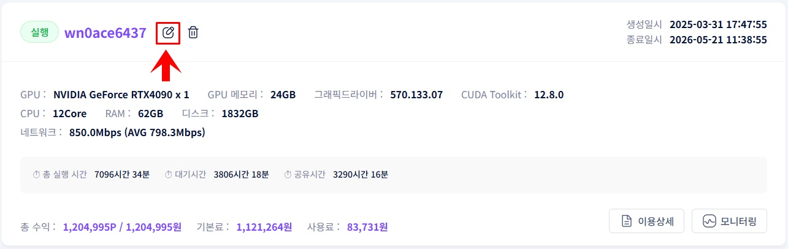
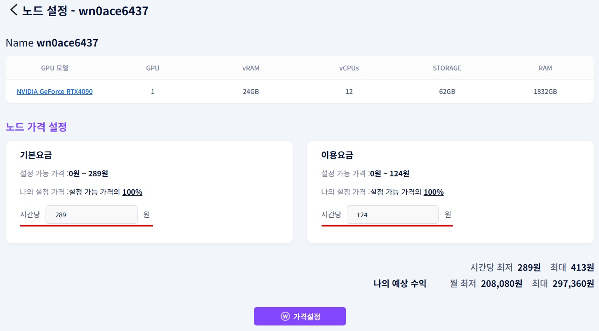
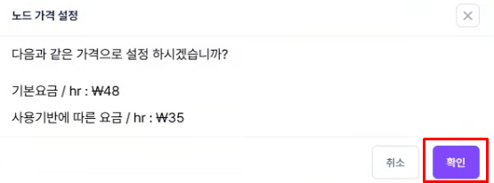

# **가격 설정**

공유 중인 GPU의 시간당 이용 요금을 설정합니다.

!!! tip
    가격 설정은 GPU별로 독립적으로 적용됩니다. 기준 금액 범위 내에서만 설정할 수 있습니다.

## **가격 설정 방법**

1. 공유 중인 GPU 정보 화면에서 **노드 가격 수정** 버튼을 클릭합니다.

1. 시간 당 이용 요금 항목에 원하는 금액을 입력합니다.

1. 가격 설정 버튼을 클릭합니다.
2. 확인 팝업에서 입력한 금액을 최종 확인 후 가격설정 버튼을 클릭하면 완료됩니다.

## **입력 시 주의사항**

| **상태** | **표시 메시지** | **조치** |
| --- | --- | --- |
| 기본값과 동일 금액 입력 | 기본 값과 같습니다. | 다른 금액 입력 |
| 기준 금액 초과 또는 미달 | 가격 기준 안내 메시지 표시 | 안내 범위 내 금액으로 재입력 |

!!! warning
    설정 금액이 기준 범위를 벗어나면 저장되지 않습니다. 
    메시지를 확인하고 범위 내 금액으로 입력하세요. 
    수정을 취소하려면 취소 버튼을 클릭하면 이전 화면으로 돌아갑니다.

---

[다음: 수익 확인 →](check-income.ko.md){ .md-button .md-button--primary }

