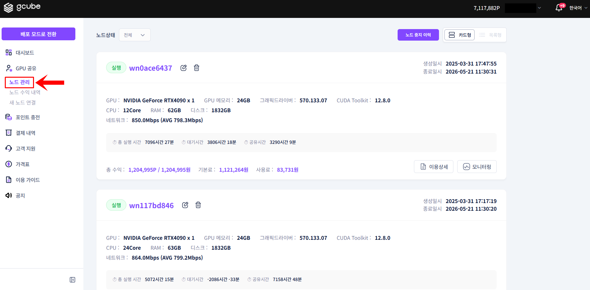
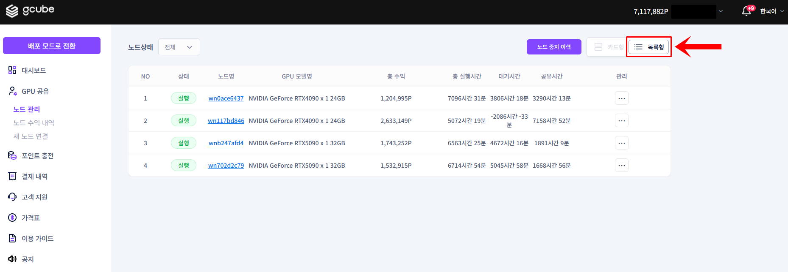

# **공유 정보 확인**

공유 중인 GPU의 스펙, 상태, 수익 정보를 확인합니다.

!!! tip
    노드 화면에서 공유 중인 GPU 기기별로 상세 정보를 한눈에 파악할 수 있습니다.

## **확인할 수 있는 정보**

| **항목** | **설명** |
| --- | --- |
| 노드명 및 실행 상태 | 현재 공유 중(실행) 또는 중지 여부 |
| GPU 스펙 | GPU 모델명, VRAM 등 하드웨어 사양 |
| 장치 스펙 | CPU, 메모리 등 시스템 사양 |
| 실행 시간 | 현재 공유 세션의 누적 실행 시간 |
| 수익 정보 | 총 수익, 기본료, 사용료 |
| 업데이트 일시 | 마지막 상태 업데이트 시각 |

## **공유 정보 확인 방법**

1. Share Mode 좌측 메뉴에서 노드 목록 화면으로 이동합니다.

2. 기기 수가 많은 경우 목록형 보기로 전환해 요약 정보를 한눈에 볼 수 있습니다.

노드명을 클릭하면 해당 노드의 상세 정보 페이지로 이동합니다.
