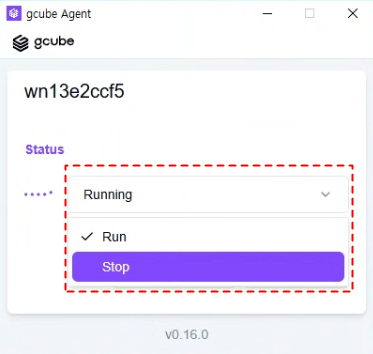
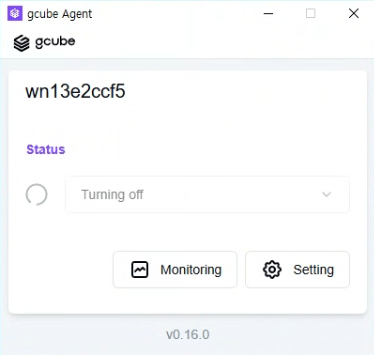
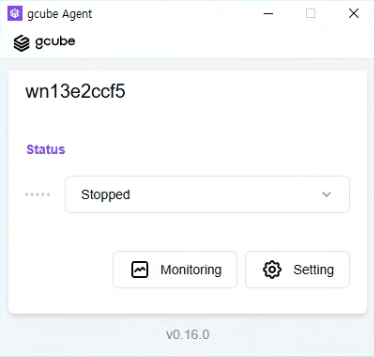

# **공유 시작 및 중단**

에이전트에서 GPU 공유를 일시 중단하거나 재시작합니다

!!! tip
    GPU 공유는 에이전트 프로그램에서 직접 시작하고 중단합니다. 
    콘솔 웹페이지가 아닌 PC에 설치된 에이전트 앱에서 진행합니다.

## **공유 중단 방법**

1. PC에서 에이전트 프로그램을 실행합니다.
2. 에이전트 중앙의 Status 항목에서 Running을 클릭합니다.

3. Run과 Stop 중 Stop을 클릭합니다.
4. Turning off 상태로 전환된 후 잠시 기다립니다.

5. Stopped로 표시되면 공유가 완전히 중단된 상태입니다.

## **공유 재시작 방법**

1. 에이전트 Status 항목에서 Stopped를 클릭합니다.
2. Run을 클릭하면 공유가 다시 시작됩니다.

!!! warning
    공유 중단 중에는 소비자가 해당 GPU를 사용할 수 없으며 수익이 발생하지 않습니다.

---

[다음: 공유 정보 확인 →](sharing-info.ko.md){ .md-button .md-button--primary }

