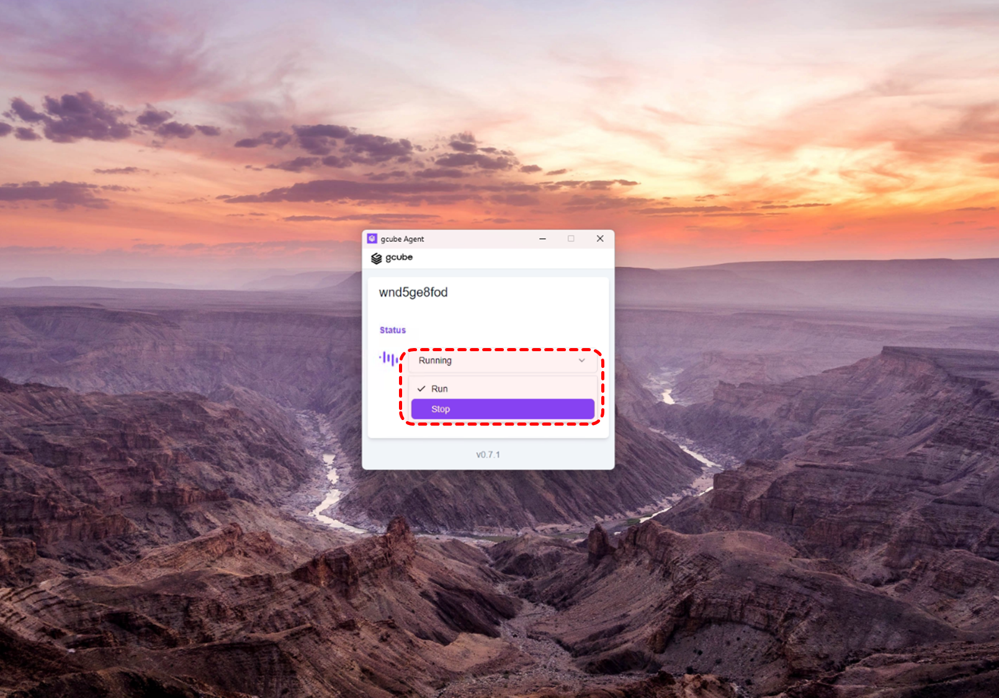
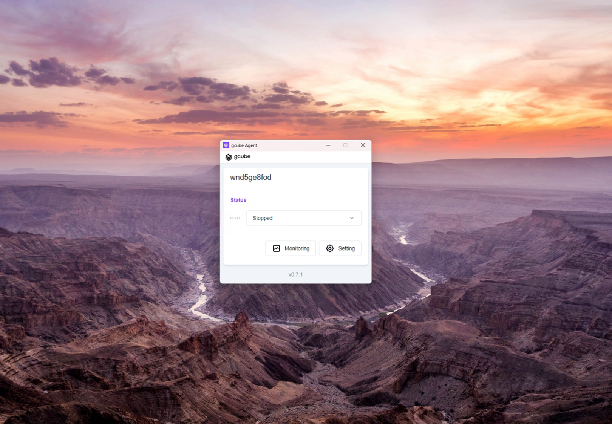

# GPU 공유 중단

에이전트를 통해 GPU 공유를 중단 할 수 있습니다. 

1\. 에이전트에 중간 **“Rurning”** 부분을 클릭 → Run 과 Stop중 **“Stop”**을 클릭해주세요.   

2\. 공유 중단 과정에서 위 화면과 같이 “Turning off” 상태로 변경됩니다.   

3\. 공유 중단이 완료되면 “Stopped”로 표시됩니다.   