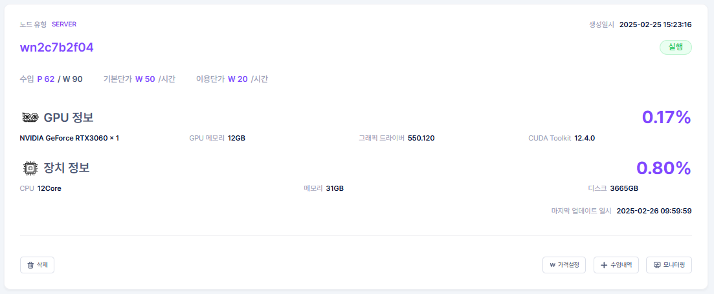

# **Tier 2 노드 공급자를 위한 우분투 세팅 가이드**

## **1. Ubuntu OS 설치**

- Ubuntu Server 22.04 LTS 이미지 파일 다운로드 및 부팅디스크 생성
    - [Ubuntu Server 22.04 LTS 다운로드](https://ubuntu.com/download/server/thank-you?version=22.04.5&architecture=amd64&lts=true)

- Ubuntu Server 22.04 LTS 실행
    
    
    

- 기본 언어 선택 (English)
    
    
    

- Installer Update 진행하지 않음
    
    
    

- 키보드 설정(Korean)
    
    
    

- Ubuntu 설치 타입 설정
    - **Ubuntu Server** 설치
    
    
    

- 설치 시 OS 네트워크는, 외부 인터넷 연결이 가능하도록 설정 (최소 100Mbps 이상 권장)
    - DHCPv4 옆 **IP주소 표시 확인** 후 이동
    
    
    

- 미러 서버 설정
    - Mirror Address에 기본 주소 대신, **http://mirror.kakao.com/ubuntu** 로 변경
    
    
    

- 스토리지 설정
    - **Custom Storage Layout** 선택
    
    
    
    - **free space** → **Add GPT Partition** 선택
    
    
    
    - OS 설치하려는 영역의 공간 **전부 사용**
    
    
    

- 프로필 설정
    - Ubuntu OS user 계정 **ID/PW** 설정
    - **※ ID/PW는 추후 Agent 설치 시 필요한 정보이므로 별도로 저장하는 것을 추천 드립니다.**
    
    
    

- Ubuntu Pro Upgrade **진행하지 않음**
    
    
    

- SSH 서버
    - OpenSSH server **설치 체크**
    - SSH KEY는 입력하지 않음
    
    
    

- 기타 서버 설정
    - 기타 서버는 **미설치**
    
    
    

- 이후 Install 진행 및 Install 완료 시 **재부팅 진행**

<br>

## **2. Nvidia 그래픽 드라이버 설치**

- Ubuntu 접속 후, Nvidia 그래픽 카드 인식을 위한 드라이버 설치
- 기존 드라이버 삭제
    
    ```jsx
    $ sudo apt-get purge nvidia*
    $ sudo apt-get autoremove
    $ sudo apt-get autoclean
    
    $ sudo dpkg -l | grep nvidia
    $ sudo apt remove --purge {위 명령어로 출력된 패키지 이름}
    ```
    

- 신규 드라이버 설치
    - 그래픽 드라이버 설치를 위한 사전 패키지 설치
    
    ```jsx
    $ sudo apt install ubuntu-drivers-common
    $ sudo add-apt-repository ppa:graphics-drivers/ppa
    $ sudo apt update
    $ sudo apt install alsa-utils -y
    ```
    

- 해당 명령어 수행 후, **recommended**로 표시되는 그래픽 드라이버 설치
    - ex : NVIDIA GeForce RTX 3060 그래픽 카드인 경우
    
    ```jsx
    $ sudo ubuntu-drivers devices
    
    == /sys/devices/pci0000:00/0000:00:03.1/0000:09:00.0 ==
    modalias : pci:v000010DEd00002504sv00001458sd0000407Bbc03sc00i00
    vendor   : NVIDIA Corporation
    model    : GA106 [GeForce RTX 3060 Lite Hash Rate]
    driver   : nvidia-driver-550-open - distro non-free
    driver   : nvidia-driver-545 - distro non-free
    driver   : nvidia-driver-535 - distro non-free
    driver   : nvidia-driver-535-server-open - distro non-free
    **driver   : nvidia-driver-550 - distro non-free recommended**
    driver   : nvidia-driver-545-open - distro non-free
    driver   : nvidia-driver-535-server - distro non-free
    driver   : nvidia-driver-535-open - distro non-free
    driver   : nvidia-driver-470 - distro non-free
    driver   : nvidia-driver-470-server - distro non-free
    driver   : xserver-xorg-video-nouveau - distro free builtin
    
    $ sudo apt install nvidia-driver-550
    
    # 공급자 본인 화면에 표시된 recommended driver를 install 하시면 됩니다.
    ```
    
- 그래픽 드라이버 설치 이후, OS 재기동
    
    ```jsx
    $ sudo reboot
    ```
    

- OS 기동 이후,  **nvidia-smi** 명령어 수행하여 그래픽 드라이버가 정상 설치되었는지 확인
    
    ```cpp
    $ nvidia-smi
    
    Tue Feb 25 09:47:42 2025       
    +-----------------------------------------------------------------------------------------+
    | NVIDIA-SMI 550.120                Driver Version: 550.120        CUDA Version: 12.4     |
    |-----------------------------------------+------------------------+----------------------+
    | GPU  Name                 Persistence-M | Bus-Id          Disp.A | Volatile Uncorr. ECC |
    | Fan  Temp   Perf          Pwr:Usage/Cap |           Memory-Usage | GPU-Util  Compute M. |
    |                                         |                        |               MIG M. |
    |=========================================+========================+======================|
    |   0  NVIDIA GeForce RTX 3060        On  |   00000000:09:00.0 Off |                  N/A |
    |  0%   42C    P8             23W /  170W |       2MiB /  12288MiB |      0%      Default |
    |                                         |                        |                  N/A |
    +-----------------------------------------+------------------------+----------------------+
                                                                                             
    +-----------------------------------------------------------------------------------------+
    | Processes:                                                                              |
    |  GPU   GI   CI        PID   Type   Process name                              GPU Memory |
    |        ID   ID                                                               Usage      |
    |=========================================================================================|
    |  No running processes found                                                             |
    +-----------------------------------------------------------------------------------------+
    ```
    

## **3. Gcube agent 설치**

- Agent 설치 전 사전 준비
    1. 공급자는 하기 항목을 gcube측에 **정보 전달**이 필요
        - [gcube.ai](http://gcube.ai/)  홈페이지 **사용자 계정 정보**
        - **Ubuntu OS user 계정 ID/PW**
        - 파일과 토큰을 받으실 **이메일 주소**
    2. gcube에서 고객님의 정보를 받은 후, 
    agent 설치 파일 및 설치 진행 시 필요한 개인 사용자 토큰 전달
    **※ 보내주신 이메일을 통해 전달해 드릴 예정입니다.**
        - gai_svr_inst (설치 파일)
        - 개인 사용자 토큰
- 이후 Ubuntu 접속 후 해당 과정 진행

- agent 설치 디렉터리 생성 및 agent 설치 파일 권한 부여
    
    ```jsx
    # 디렉토리 생성
    $ mkdir -p ~/work/gcube_instller
    
    # 해당 경로에 agent 설치파일 위치
    $ cd ~/work/gcube_installer/
    
    # agent 설치 파일 권한 부여
    $ chmod +x gai_svr_inst
    ```
    

- 기본 파일 설치
    
    ```jsx
    # 기본 파일 설치
    $ sudo ./gai_svr_inst base
    
    INFO[0000] Rnd initialized...                           
    INFO   [2025-02-25T06:11:15Z] Install Base All ...                         
    INFO   [2025-02-25T06:11:38Z] baseNetools complete.                        
    INFO   [2025-02-25T06:11:46Z] procWireGuard complete.                      
    INFO   [2025-02-25T06:11:46Z] PktPathBase: /root/packages/ubuntu22/ k8s_packages_u22_v1.28.tar.gz 
    INFO   [2025-02-25T06:12:10Z] procK8sPackage complete.                     
    ERROR  [2025-02-25T06:13:28Z] Failed to run                                 error="exit status 1"
    WARNING[2025-02-25T06:13:28Z] util.ExecCommand dpkg crio                    error="exit status 1"
    INFO   [2025-02-25T06:13:29Z] procCrio complete.                           
    INFO   [2025-02-25T06:14:31Z] procKubernetes complete.                     
    ERROR  [2025-02-25T06:14:36Z] Failed to run                                 error="exit status 100"
    WARNING[2025-02-25T06:14:36Z] ExecCommand apt install                       error="exit status 100"
    INFO   [2025-02-25T06:14:36Z] apt fix broken                               
    INFO   [2025-02-25T06:14:42Z] retry install nvidia-container-toolkit       
    INFO   [2025-02-25T06:14:52Z] procNvidiaPlugin complete.                   
    INFO   [2025-02-25T06:14:53Z] clearAutoUpdate complete.                    
    INFO   [2025-02-25T06:14:53Z] **procGaiClientInstaller complete.**  
    ```
    
    - 마지막 라인에 **‘procGaiClientInstaller complete’** 출력 시, 기본 구성 요소들의 설치가 완료 상황
    
    - 실행 화면 예시)
    
    
    

- 노드 개통 진행
    - 이후 하기 명령어를 수행하여, 노드 개통 진행
        - **ethernet nic name** : 설치 장비의 네트워크 인터페이스 이름
        - **access token** : 전달받은 개인 사용자 토큰 (토큰값 입력 시 대소문자 구분 필요)
        
        ```jsx
        # 사용중인 이더넷 인터페이스 모두 보기

        $ ifconfig -a 
        ```

        ```jsx
        # 노드 개통을 위한 명령어

        $ sudo ./gai_svr_inst --nic <ethernet nic name> reg <access token>
        ```
        
        ```jsx
        # ex) 수행 예시
        # 사용중인 외부연결 이더넷 인터페이스 이름 확인 -> (enp5s0)
        
        $ ifconfig -a
        
        docker0: flags=4099<UP,BROADCAST,MULTICAST>  mtu 1500
                inet 172.17.0.1  netmask 255.255.0.0  broadcast 172.17.255.255
                inet6 fe80::7807:f9ff:fe9c:6967  prefixlen 64  scopeid 0x20<link>
                ether 7a:07:f9:9c:69:67  txqueuelen 0  (Ethernet)
                RX packets 1779  bytes 49812 (49.8 KB)
                RX errors 0  dropped 0  overruns 0  frame 0
                TX packets 1189  bytes 130886 (130.8 KB)
                TX errors 0  dropped 0 overruns 0  carrier 0  collisions 0
        
        enp5s0: flags=4163<UP,BROADCAST,RUNNING,MULTICAST>  mtu 1500
                inet 10.39.60.65  netmask 255.255.254.0  broadcast 10.39.61.255
                inet6 fe80::642:1aff:fe94:5edd  prefixlen 64  scopeid 0x20<link>
                ether 04:42:1a:94:5e:dd  txqueuelen 1000  (Ethernet)
                RX packets 2283880  bytes 2164088878 (2.1 GB)
                RX errors 0  dropped 10  overruns 0  frame 0
                TX packets 1513085  bytes 1359887094 (1.3 GB)
                TX errors 0  dropped 0 overruns 0  carrier 0  collisions 0
                device memory 0xfc400000-fc4fffff  
        
        lo: flags=73<UP,LOOPBACK,RUNNING>  mtu 65536
                inet 127.0.0.1  netmask 255.0.0.0
                inet6 ::1  prefixlen 128  scopeid 0x10<host>
                loop  txqueuelen 1000  (Local Loopback)
                RX packets 46784  bytes 3534359 (3.5 MB)
                RX errors 0  dropped 0  overruns 0  frame 0
                TX packets 46784  bytes 3534359 (3.5 MB)
                TX errors 0  dropped 0 overruns 0  carrier 0  collisions 0
        
        wlp4s0: flags=4098<BROADCAST,MULTICAST>  mtu 1500
                *ether f4:b3:01:39:2b:91  txqueuelen 1000  (Ethernet)*
                RX packets 0  bytes 0 (0.0 B)
                RX errors 0  dropped 0  overruns 0  frame 0
                TX packets 0  bytes 0 (0.0 B)
                TX errors 0  dropped 0 overruns 0  carrier 0  collisions 0
        
        ```
        
        ```jsx
        # 이후 sudo ./gai_svr_inst --nic <ethernet nic name> reg <access token> 형식으로 노드 등록 진행

        $ sudo ./gai_svr_inst --nic enp5s0 reg eyJh...생략...X63w
        
        INFO[0000] Rnd initialized...                           
        INFO   [2025-02-25T06:23:16Z] access token : &[eyJh...X63w] enp5s0 
        INFO   [2025-02-25T06:23:16Z] MAC address                                   mac="00:00:00:00:00:00"
        INFO   [2025-02-25T06:23:16Z] mac address 000000000000                     
        DEBUG  [2025-02-25T06:23:16Z] url https://api.gcube.ai/api/node/register   
        DEBUG  [2025-02-25T06:23:16Z] body {"category":"svr","macId":"000000000000"} 
        DEBUG  [2025-02-25T06:23:16Z] res &{200 6150125230709283 eyJh...xsHS  } 
        INFO   [2025-02-25T06:23:16Z] provision code 0000000000000000              
        INFO   [2025-02-25T06:23:16Z] start provision ...                          
        DEBUG  [2025-02-25T06:23:16Z] body {"provision_code":"0000000000000000"}
        ```
        
    
    - 실행 화면 예시)
    
    
    

- 이후 [gcube.ai](http://gcube.ai) 노드 페이지에서 등록된 노드 확인 가능
    - [노드 페이지로 이동하기](https://gcube.ai/ko/provision/node/list)
    
    