# **문제 해결 (Troubleshooting)**

노드 운영 중 자주 발생하는 문제와 해결 방법을 안내합니다.

!!! tip
    문제가 해결되지 않는 경우 gcube 고객지원(support@gcube.ai)으로 문의하세요.

---

## **에이전트 관련 오류**

### **Initializing 오류 발생 시**

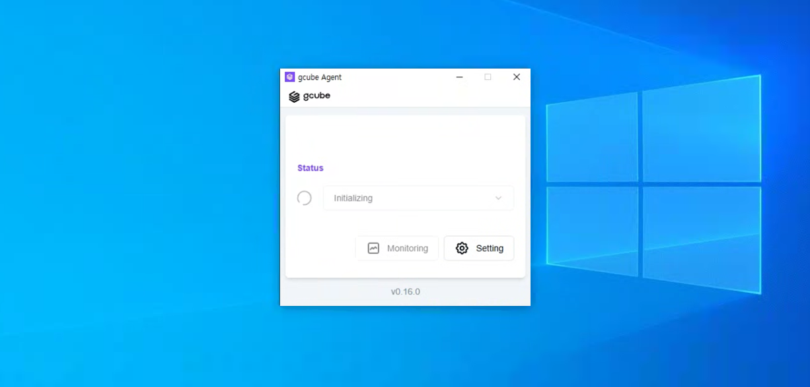

Initializing 오류가 발생하는 경우 Hyper-V 활성화 여부를 확인합니다.

---

### **Hyper-V 활성화 방법**

1. 윈도우 검색 창에 **"Windows 기능 켜기 / 끄기"** 를 검색하여 실행합니다.

    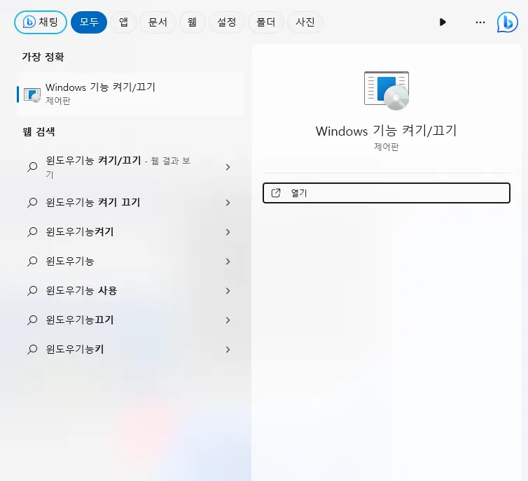

2. **"Hyper-V"** 를 찾아 체크합니다.

    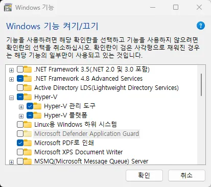

    !!! warning
        Hyper-V 기능은 기본적으로 **Windows PRO 버전**에서만 사용 가능합니다.

3. **다시 시작** 버튼을 눌러 재부팅을 진행합니다.

    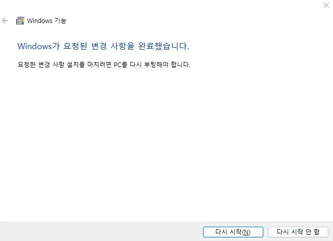

---

### **재부팅 완료 후 Hyper-V 설정**

1. 검색 창에서 **"Hyper-V 관리자"** 를 검색 후 실행합니다.

    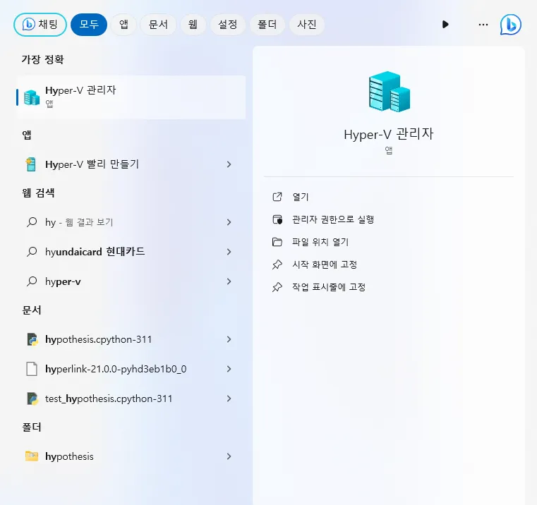

2. 본인 컴퓨터 이름에서 **마우스 우클릭 → "새로 만들기" → "가상 컴퓨터"** 순으로 클릭합니다.

    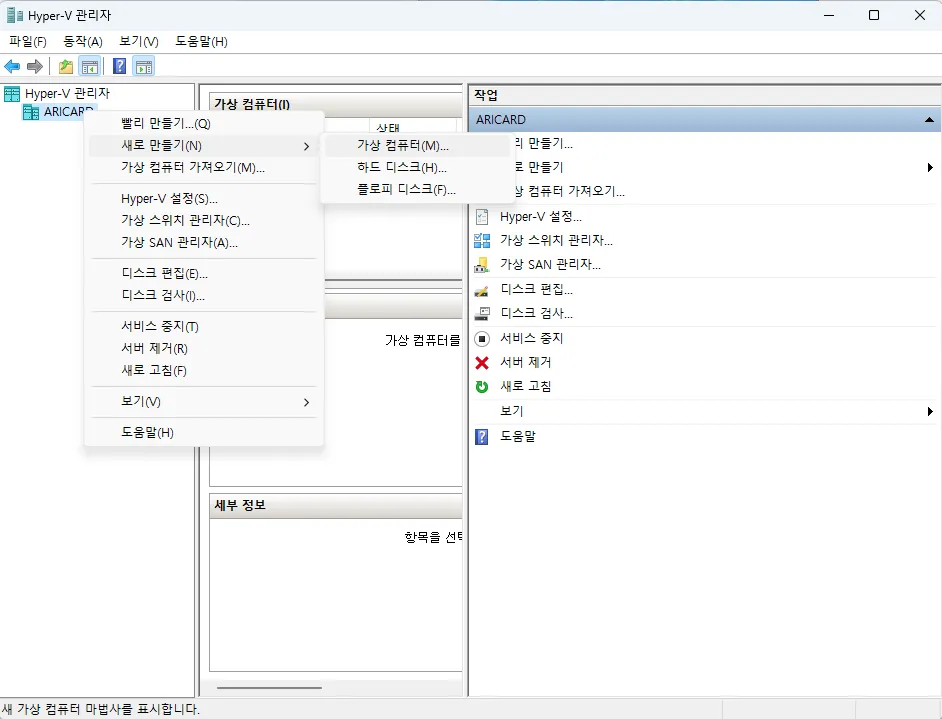

3. 가상 머신의 이름과 저장 위치를 설정하고 **다음**을 클릭합니다.

    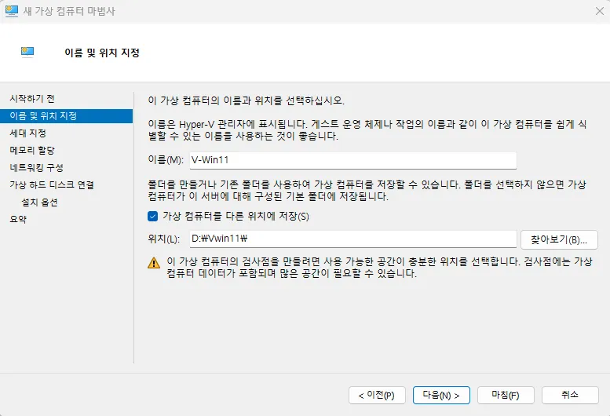

    !!! note
        가상 윈도우는 용량이 크기 때문에 여유 공간이 충분한 드라이브를 지정하는 것이 좋습니다.

4. 가상 컴퓨터 세대를 선택합니다.

    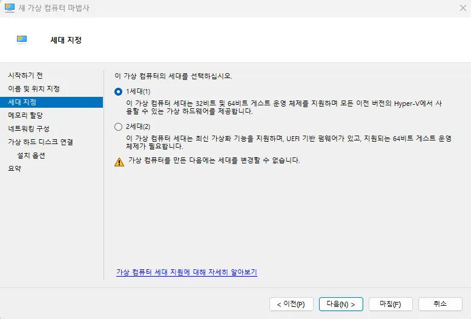

    | 세대 | 설명 |
    |---|---|
    | 1세대 | 32비트 및 64비트 Windows 설치 가능 |
    | 2세대 | 64비트 Windows만 설치 가능 |

    !!! warning
        한 번 선택한 후에는 세대를 변경할 수 없습니다. 문제가 발생한 경우 가상 머신을 삭제하고 재생성하세요.

5. 가상 컴퓨터에 할당할 메모리 용량을 설정합니다.  현재 컴퓨터의 RAM 용량과 가상 컴퓨터에서 작업하려는 업무를 고려하여 설정합니다. (1GB = 1024MB)

    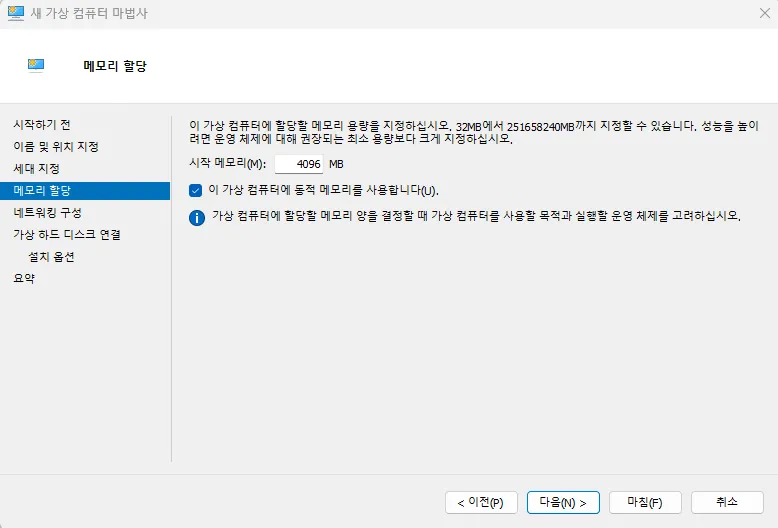

6. 가상 하드 디스크의 위치와 크기를 입력합니다.  용량은 나중에 확장이 가능하니 설치된 하드 디스크 용량을 고려하여 설정합니다.

    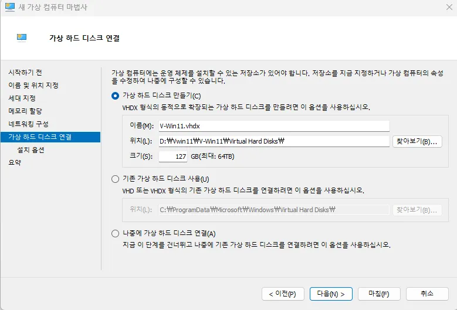

---

## **Failed to change VM state 오류 발생 시**

`Failed to change VM state (0x???????)` 오류가 나타나는 경우  BIOS에서 가상화 설정을 활성화해야 합니다. 괄호 안 오류 코드와 함께 제조사에 문의하세요.

---

### **BIOS 설정**

**전원을 켜고 `F2` 키를 빠른 속도로 여러 번 눌러 BIOS에 진입합니다.**

!!! note
    SSD가 탑재된 제품의 경우 부팅 속도가 매우 빠르므로, 전원을 켜자마자 `F2` 키를 연타로 눌러주세요.

**제조사별 BIOS 진입 방법**

| 제조사 | BIOS 진입 단축키 | 부트 순위 선택 | 사이트 |
|---|---|---|---|
| 인텔 (Intel) | F2 | F10 | [링크](https://www.intel.co.kr) |
| AMD | F2 | F10 | [링크](https://www.amd.com/ko) |
| MSI | DEL | F11 | [링크](https://kr.msi.com/support) |
| 아수스 (ASUS) | F2 or Del | ESC or F8 or F12 | [링크](https://www.asus.com/kr/support) |

### **인텔(Intel) BIOS 설정 방법**

1. 부팅 중 로고 화면이 처음 표시되면 **F2** 키를 누릅니다.
2. 기본 탭에서 **자동 부팅** 을 사용 안 함으로 변경합니다.

    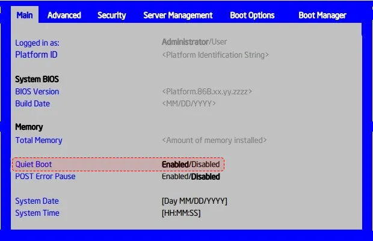

3. 최상위 탭으로 돌아가 오른쪽 화살표 키를 눌러 **저장 & 끝내기** 탭으로 이동합니다.
4. **변경 내용 저장을 선택하고 종료** 하여 변경 사항이 저장된 상태로 부팅합니다.

    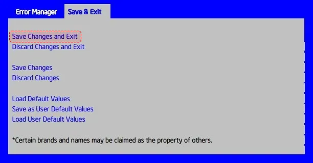

---

## **NVIDIA 드라이버 인식 오류**

### **증상**

노드 공급 중 노드 상태가 **'실패'** 로 표기되는 오류가 발생할 수 있습니다.

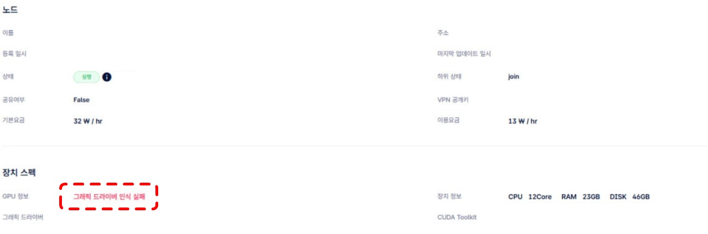

### **원인**

OS에서 그래픽 드라이버가 **2개 이상 구동** 중일 때 발생할 수 있습니다.

예: NVIDIA와 iGPU(AMD) 두 개의 그래픽 드라이버를 동시에 구동하는 경우

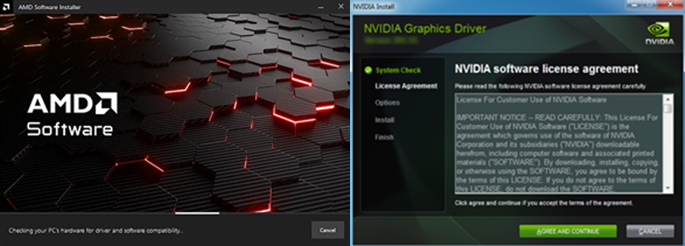 | 

gcube는 NVIDIA 그래픽 카드만 지원하므로, 이 경우 **iGPU(AMD) 드라이버를 삭제**해야 합니다.

### **해결 방법**

1. AMD 제조사 드라이버 삭제 유틸리티 **(DDU)** 를 사용해 iGPU 드라이버를 삭제합니다.
2. **gcube Agent를 재설치**합니다.

!!! note "그 외 해결 방법"
    - BIOS에서 iGPU 기능 중지
    - 장치 관리자에서 iGPU 정보 확인 후 사용 중지 및 드라이버 삭제

NVIDIA 이외의 그래픽 드라이버 제거 및 Agent 재설치 후 노드를 실행하면 아래와 같이 정상 표기됩니다.

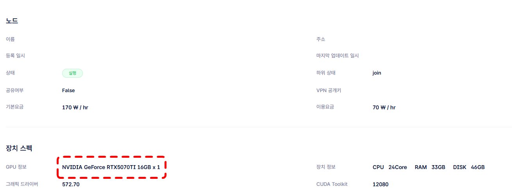

!!! warning
    문제가 지속되면 gcube 고객지원(support@gcube.ai)으로 문의하세요.

---

[AI 모델 실행하기 →](../platform-guide/ollama-api.ko.md){ .md-button .md-button--primary }
[워크로드 사용하기 →](../workload/workload-dashboard.ko.md){ .md-button }

