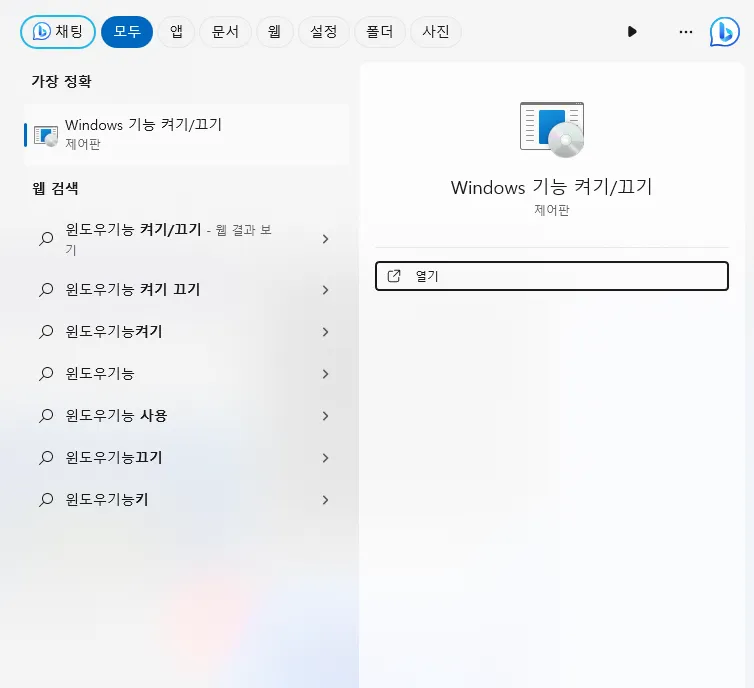
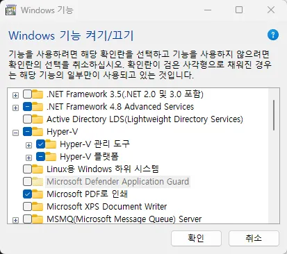
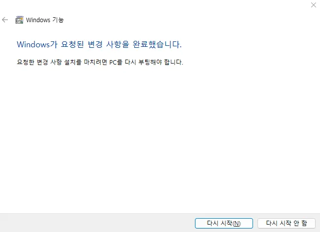
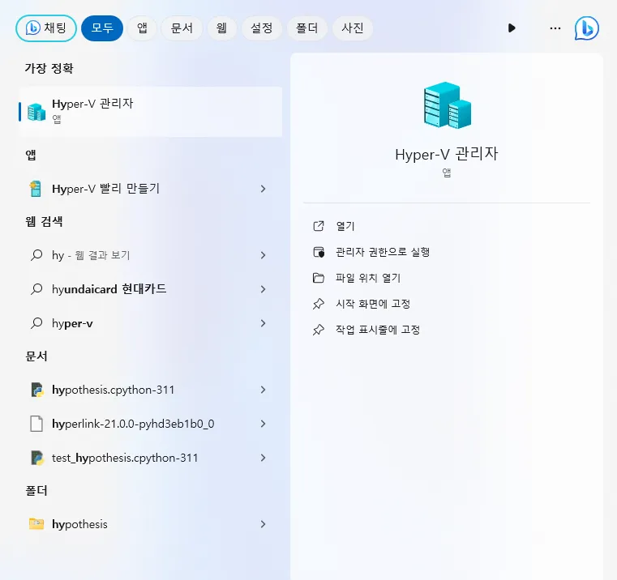
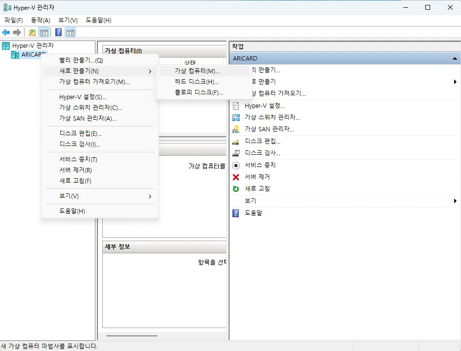
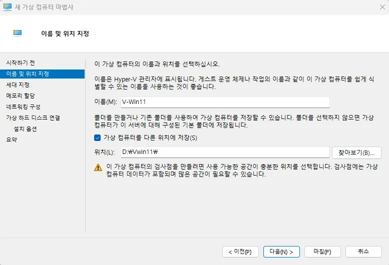
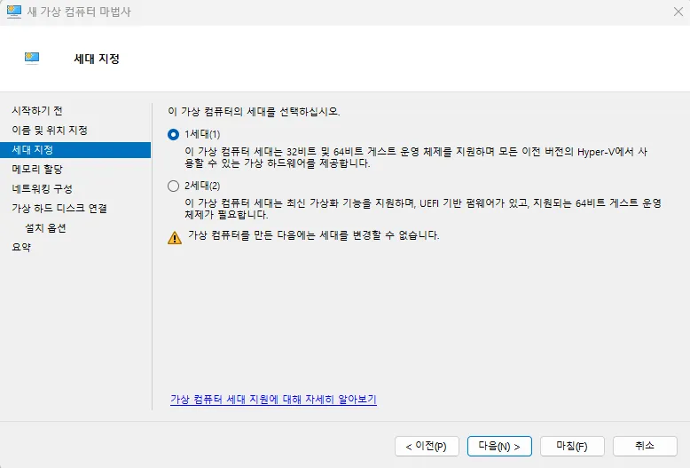
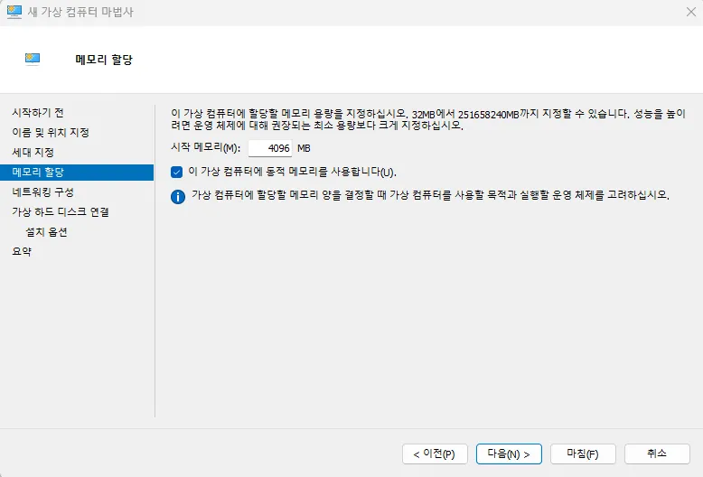
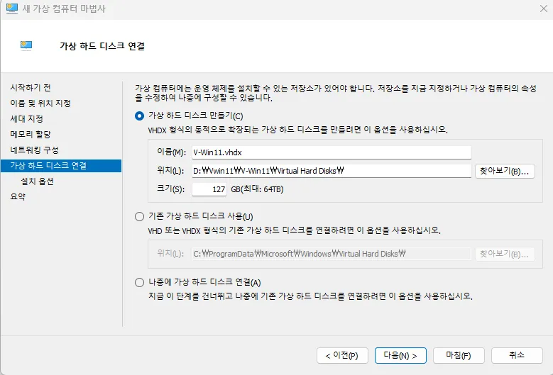
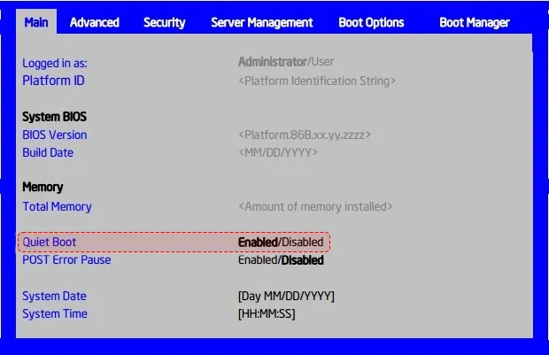

# **Troubleshooting Agent Errors**

If an "Initializing" error occurs, you should check if Hyper-V is enabled on your system. 

## **How to Enable Hyper-V**

1\. Search for and run **"Turn Windows features on or off"** in the Windows search bar.   

2\. Find **"Hyper-V"** in the list and check the box.

※ **Please note:** The Hyper-V feature is natively available only on **Windows Pro** (Professional) and Enterprise versions.   

3\. Click **Restart** to reboot your system.   

## **Hyper-V Configuration After Reboot**

1\. Search for **"Hyper-V Manager"** in the search bar and run the application.   

2\. Right-click on your **computer name**, then select **"New"** > **"Virtual Machine"**.   

3\. Set the **Name** and **Storage Location** for the virtual machine, then click **Next**.

※ **Note:** Since virtual Windows machines take up a significant amount of storage, it is recommended to designate a drive with **sufficient free space**.   

4\. Select the **Generation** of the virtual machine. While **Generation 1** supports 32-bit versions of Windows, **Generation 2** supports only 64-bit versions of Windows.

※ **Note:** You cannot change the generation once it has been selected. If an issue occurs, you must delete the virtual machine and create a new one.   

5\. Set the amount of **memory (RAM)** to allocate to the virtual machine. Choose a value based on your physical RAM capacity and the tasks you plan to perform within the virtual environment. (1GB = 1024MB)   

6\. Next, enter the **location and size** of the virtual hard disk. Since the capacity can be expanded later, please set it based on your available physical hard disk space. 

※ **Example:** In this case, the laptop's disk was assigned as the D drive, and approximately half of its capacity was allocated.   

## **If the "Failed to change VM state" message appears, it means the initialization has failed.**

## **BIOS Settings**

How to Enter the BIOS

Turn on the power and immediately press the **[F2]** key repeatedly at high speed.

※ **Note:** On systems equipped with an SSD, the boot speed is extremely fast. Please start tapping the **[F2]** key immediately after pressing the power button.

BIOS Entry Methods by Manufacturer

| Manufacturer | BIOS Entry Key | Selecting Boot Priority Key | Site Links |
| --- | --- | --- | --- |
| Intel | F2 | F10 | [Link](https://www.intel.co.kr/content/www/kr/ko/homepage.html) |
| AMD | F2 | F10 | [Link](https://www.amd.com/ko/search.html) |
| MSI | DEL | F11 | [Link](https://kr.msi.com/support) |
| ASUS | F2 or Del | ESC or F8 or F12 | [Link](https://www.asus.com/kr/support/contact/troubleshooting/) |

※ The following instructions describe the BIOS setup process for **Intel systems**. Steps may vary depending on the manufacturer. For detailed assistance, if you encounter the Failed to change VM state (0x???????)error, please contact the manufacturer's support center with the specific **error code** shown in the parentheses.

### How to Enter Intel BIOS

1\. Press the **[F2]** key as soon as the logo screen first appears during the boot process.  
2\. In the **Main** (or Basic) tab, change **Fast Boot** to **Disabled**.   

3\. Return to the top-level menu. Press the **right arrow key** until the **Save & Exit** tab is displayed. 
4\. Select **Save Changes and Exit** (or **Save Changes and Reset**) to reboot the system with your changes applied.