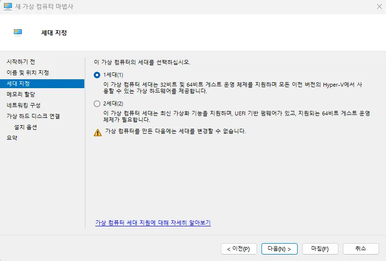

# 에이전트 사용 오류 해결

Initializing 오류 발생 시, Hyper-V 활성화를 확인할 수 있습니다.  

## Hyper-V 활성화 방법

1\. 윈도우 검색 창에 **“Windows 기능 켜기 / 끄기”**를 검색하여 실행합니다.   

2\. “Hyper-V”를 찾아 체크해 줍니다.

※ HYPER-V 기능은 기본적으로 윈도우 PRO 버전에서만 사용이 가능합니다.   

3\. 다시 시작을 눌러 재부팅을 진행합니다.   

## 재부팅 완료 후 Hyper-V 설정

1\. 검색 창에서 “Hyper-V 관리자”를 검색 후 실행합니다.   

2\. 본인 컴퓨터 이름에서 **마우스 우클릭 후, “새로 만들기” > “가상 컴퓨터 “**순으로 클릭합니다.   

3\. 다음으로 가상 머신의 이름과, 저장 위치를 설정하고 다음을 클릭합니다. 

※ 가상 윈도우는 용량이 크기때문에 여유 공간이 충분한 드라이브를 지정하는 것이 좋습니다.   

4\. 가상 컴퓨터 세대를 선택합니다. 1세대 가상 컴퓨터는 32비트 버전의 윈도우를 설치할 수 있으나, 2세대 가상 컴퓨터의 경우 64비트 버전의 윈도우만 설치가 가능합니다. 

※ 한 번 선택한 후에는 세대를 변경할 수가 없습니다. 문제가 발생한 경우 가상 머신을 삭제하고 재생성하세요.   

5\. 가상 컴퓨터에 할당할 메모리 용량을 설정합니다. 현재 컴퓨터의 RAM 용량과 가상 컴퓨터에서 작업하려는 업무를 고려하여 설정해 줍니다. (1GB=1024MB)   

6\. 다음으로 가상 하드 디스크의 위치와 크기를 입력합니다. 용량은 나중에 확장이 가능하니 설치된 하드 디스크 용량을 고려하여 설정하시기 바랍니다. 

※ 예시는 노트북 디스크를 D드라이브로 할당하고, 절반 정도를 지정하였습니다.   

## Failed to change VM state 메세지가 출력되며 초기화에 실패할 시

## BIOS 설정

바이오스(BIOS) 진입하는 방법

**전원을 켜고  [F2] 키를 빠른 속도로 여러 번 눌러주세요.**

※ SSD 가 탑재된 제품의 경우 부팅 속도가 매우 빨라 시스템 전원을 켜자마자 키보드 [F2] 를 연타로 눌러주세요.

제조사별 진입 방법

| 제조사 | BIOS 진입 단축키 | 부트 순위 선택 | 사이트 링크 |
| --- | --- | --- | --- |
| 인텔(Intel) | F2 | F10 | [링크](https://www.intel.co.kr/content/www/kr/ko/homepage.html) |
| AMD | F2 | F10 | [링크](https://www.amd.com/ko/search.html) |
| MSI | DEL | F11 | [링크](https://kr.msi.com/support) |
| 아수스(ASUS) | F2 or Del | ESC or F8 or F12 | [링크](https://www.asus.com/kr/support/contact/troubleshooting/) |

※ 인텔의 경우 BIOS 설정 방법입니다. 각 제조사 별로 다를 수 있습니다. 자세한 방법은 `Failed to change VM state (0x???????)`라는 오류가 나타나는 경우 괄호 안 오류 코드와 함께 제조사에 문의해주세요.

### 인텔(Intel) 바이오스(BIOS) 진입하는 방법

1\. 부팅 중에 로고 화면이 처음 표시 되면 **F2** 키를 누릅니다.  
2\. 기본 탭에서 **자동 부팅**을 사용 안 함으로 변경 합니다.   

3\. 최상위 탭으로 다시 돌아갑니다. **저장 & 끝내기** 탭이 표시 될 때까지 오른쪽 화살표 키를 클릭합니다. 
4\. **변경 내용 저장을 선택하고 종료** 하여 변경 사항이 저장된 시스템을 부팅합니다.