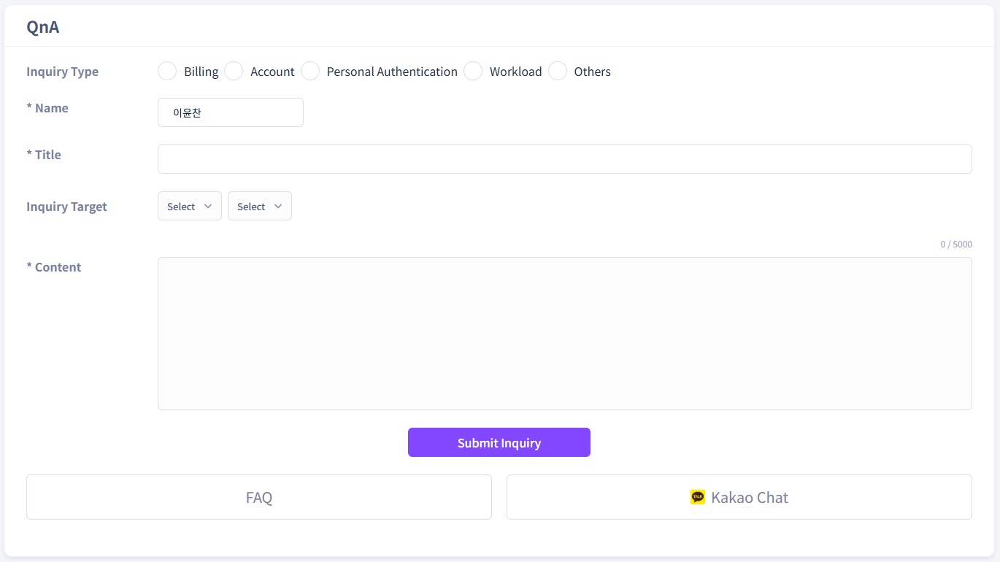

# **QnA User Guide**

If you have any inquiries regarding the use of workloads or nodes, you can find answers through **Customer Support**  

## **Accessing the QnA Page**

Click on “Customer Support” located in the left sidebar menu. 
This service is available in both **Deploy Mode** and **Share Mode**.  

## **QnA FAQ Overview**

1\. FAQ categories are displayed on the QnA page 
2\. There are 6 categories: “All,” “GPU Rent,” “Payment,” “Technology,” “Account,” and “GPU Share.”  
The **top 3** frequently asked questions(FAQs) are displayed for each category.  
    

    
3\. If you cannot find the information you need in the FAQ, you can submit an inquiry by writing your own QnA.  
By selecting an Inquiry Type and, if necessary, specifying the Node or Workload in question, you can receive a more detailed response.  
Inquiries are received via email, and the answers will also be sent to your account's registered email address.  
At the bottom of the page, you will find links for the "Detailed FAQ" and the "KakaoTalk Channel."  
You can browse a more comprehensive FAQ list or use the KakaoTalk Channel for real-time inquiries.
    
