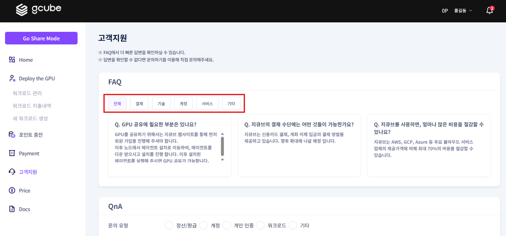

# **QnA 사용 가이드 v1.2**

워크로드, 노드 사용 시 문의가 있는 경우 고객지원을 이용하여 궁금한 내용을 확인할 수 있습니다.  

## QnA 페이지 입장

좌측메뉴의 에 위치한 “고객 지원”을 클릭합니다. Deploy mode, Share mode 동일하게 이용 가능합니다.  
**[워크로드]**

## QnA FAQ 설명

1\. QnA 페이지에서 FAQ 카테고리들이 표시됩니다. 
2\. 카테고리는 “전체”, “결제”, “기술”, “계정”, “서비스”, “기타” 총 6가지 있습니다.  
각 카테고리에 자주 묻는 질문들이 3개씩 표시됩니다.  
    

    
3\. FAQ에 필요한 내용이 없는 경우 직접 QnA을 작성하여 질문을 문의할 수 있습니다. 
문의 유형을 선택하고 필요한 경우 운영중인 node 나 Workload 대상을 선택하여 문의하면 보다 상세한 답변을 받을 수 있습니다.  
문의는 이메일로 접수되며, 답변이 또한 계정의 이메일로 발송되어집니다.  
아래에는 “FAQ 링크”와 “카카오 채널 링크”가 있습니다. 보다 자세한 FAQ 목록을 확인하고 , 카카오채널을 통해 실시간 문의를 이용할 수 있습니다.  
    
