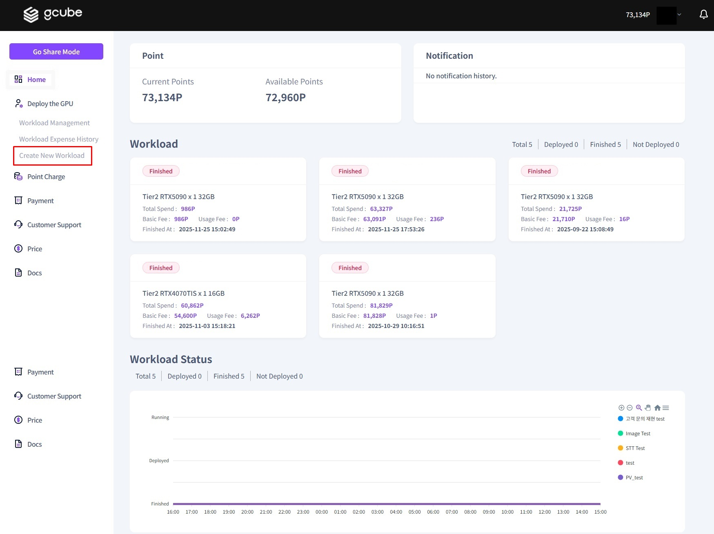
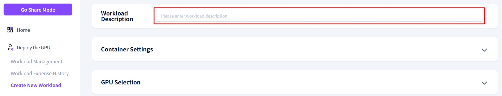
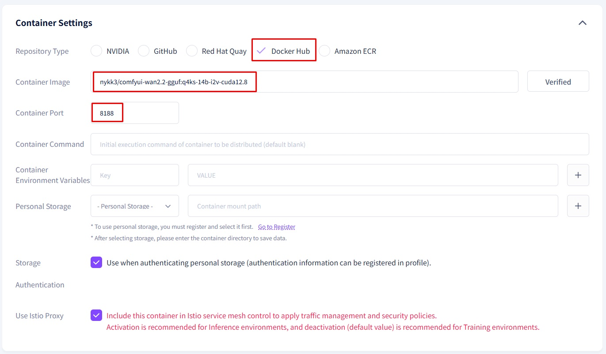
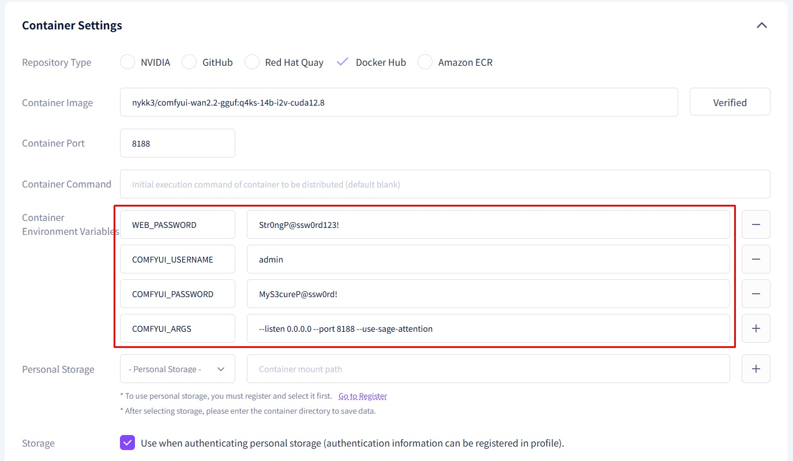
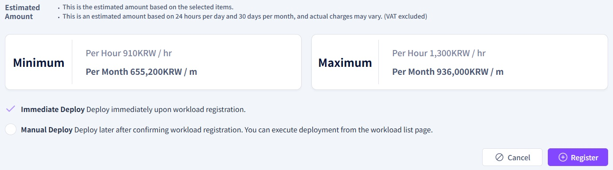

# **Wan2.2 User Guide**

**The prerequisites are as follows:**

**1. gcube Sign-up**
 
First, please proceed with the sign-up process on the Gcube official website[[gcube 홈페이지](https://www.gcube.ai/ko/index)]. 
You can sign up using your Microsoft or Google account. 

**2. Refill Points(Recharge Points)**

After logging into Gcube, you must refill your points to run the models.
[[Point Refill](https://gcube.ai/ko/demand/point/charge)] Please proceed with the recharge on the Point Refill Page.

---

# **What is Wan2.2?**

This document provides a comprehensive guide to Wan2.2, an AI model designed to automatically transform images into videos (Image-to-Video)

For detailed information regarding its operational principles or technical inquiries, please visit the Hugging Face link below. Comprehensive details about the Docker image can be found at the subsequent link

- **Hugging Face (Technical Details):**https://huggingface.co/QuantStack/Wan2.2-I2V-A14B-GGUF
- **Docker Hub (Image Documentation):**https://hub.docker.com/r/nykk3/comfyui-wan2.2-gguf

---

# **Creating a Workload**

Once you have completed all the prerequisites, let's proceed with creating a workload.

1\. Log in to the **Gcube Official Website** and navigate to the Workload main page.

2\. Click on “Create New Workload” in the left sidebar

3\. Enter your desired workload title in the Description field

4\. **Container Repository Type**: Select Docker Hub

5\. **Container Image**: Enter **[nykk3/comfyui-wan2.2-gguf:q4ks-14b-i2v-cuda12.8]** and click **"Verify Image"**.   
Once verified, enter **[ 8188 ]** in the Container Port field 

6\. Under Container Settings, enter the [Container Environment Variables]

| **Key** | **Value** |
| --- | --- |
| WEB_PASSWORD | Str0ngP@ssw0rd123! |
| COMFYUI_USERNAME | admin |
| COMFYUI_PASSWORD | MyS3cureP@ssw0rd! |
| COMFYUI_ARGS | --listen 0.0.0.0 --port 8188 --use-sage-attention |

**※ Note: You may set the PASSWORD freely, but it must be at least 12 characters long.**  

7\. **Select the GPU** you wish to use. (Note: As this model requires significant VRAM, we strongly recommend using the RTX 5090.)  

8\. Check the **Immediate Deployment** box and click the Register button to finalize  

9\.Once the workload is created, click the **Service URL** to experience the Wan 2.2 model yourself. 

※ Note: It takes approximately 3 to 5 minutes for the workload to be fully created after deployment. (This may vary depending on the GPU specifications.)

  

 the screen above appears when clicking the Service URL, it means the system is not yet ready.  
 Please try clicking the Service URL again after 2 to 3 minutes.

10\. If it runs normally, click the Workflow icon (folder shape) in the left sidebar and select the Wan 2.2 model. The following screen will be displayed.

# How to Use Wan2.2

Once Wan2.2 is running correctly, you can transform images into videos through various settings.   
This guide provides a simple explanation of the video generation process

### **Step 1. Upload Image**

Upload the image you wish to transform into a video

### **Step 2. Video Settings**

Configure the video's pixel width, height, duration, and the number of videos to generate

※ Recommendations and Cautions for Video Settings:.  
1. Wan2.2 recommends video resolutions of 480p [854 x 480] and 720p [1280 x 720]. 
2. Higher resolutions and longer durations will result in significantly longer processing times. 
3. Video duration is indicated by the number of frames. The final length is determined by combining the frame count with the FPS.  
    Example: [Length: 121 frames] / [FPS: 24] = Approx. 5 seconds

### **(Optional) Prompt Settings**

You can guide the AI by entering prompts to include or exclude specific elements.  
(Korean is supported.) Since this is an optional feature, you may proceed with the default settings.  
The Negative Prompt field is pre-filled with elements that could adversely affect the video conversion.  

### **Step 4. Execute Image-to-Video Conversion**

Click the Execute (or Run) button at the bottom of the screen to start the conversion.  
Depending on your settings, this process may take from 10 minutes to up to 1 hour and 30 minutes.  

### **Step 5. Verify Results**

Perform a final check to see if the conversion meets your expectations.  
You can also save the video if needed.

