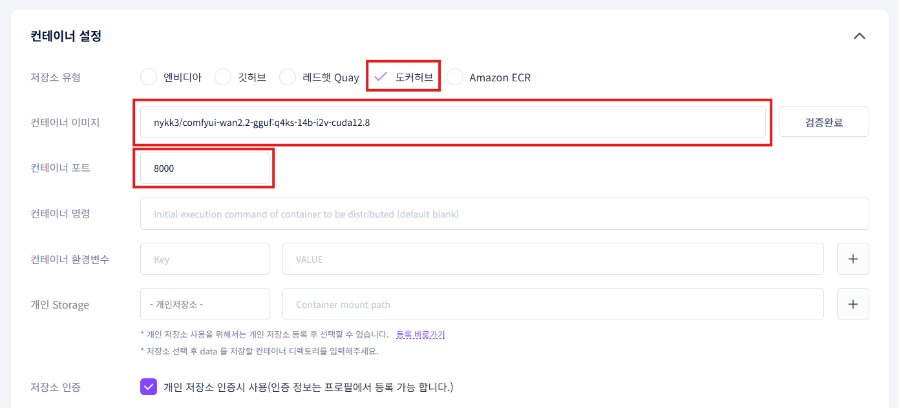

# **Wan2.2 사용 가이드**

**사전 준비 사항은 다음과 같습니다:**

**1. gcube 회원가입**

먼저 [[gcube 홈페이지](https://www.gcube.ai/ko/index)]에서 회원가입을 진행해주세요.
회원 가입은 Microsoft 또는 Google로 가능합니다. 

**2. 포인트 충전**

gcube 로그인 후, 포인트를 충전하셔야 모델 실행이 가능합니다.
[[포인트 충전 페이지](https://gcube.ai/ko/demand/point/charge)]에서 충전을 진행해주세요.

---

# **Wan2.2는 어떤 AI 모델인가?**

해당 문서는 이미지에서 비디오로 자동 변환해주는 AI 모델 가이드에 대한 문서입니다. 

자세한 작동 원리 또는 기술적인 문의는 아래 Huggingface에서 가능하며 
도커 이미지에 관한 상세 설명은 그 아래 링크에서 확인 가능합니다.

https://huggingface.co/QuantStack/Wan2.2-I2V-A14B-GGUF

https://hub.docker.com/r/nykk3/comfyui-wan2.2-gguf

---

# **워크로드 생성하기**

사전 준비를 모두 마치셨다면 이제 워크로드에서 생성해보도록 하겠습니다. 

**1. gcube:지큐브** **홈페이지**에 로그인한 다음, 워크로드 메인 페이지로 들어가 줍니다.

**2. 좌측 > 새 워크로드 생성** 클릭

**3. 설명란**에 원하는 워크로드 제목을 입력

**3. 컨테이너 저장소 유형**: 도커 허브 선택

**4. 컨테이너 이미지**: **[ nykk3/comfyui-wan2.2-gguf:q4ks-14b-i2v-cuda12.8 ]** 입력 후 **이미지 검증** 클릭 / **검증 완료** 후 컨테이너 포트에 **[8188]** 입력 ****

**5. 사용하고 싶은 GPU** 선택 (※ 많은 VRAM을 요구하기에 **RTX 5090을 적극 추천**)

**6.** 옵션 항목에서 **[컨테이너 환경 변수]**를 입력

| **Key** | **Value** |
| --- | --- |
| WEB_PASSWORD | Str0ngP@ssw0rd123! |
| COMFYUI_USERNAME | admin |
| COMFYUI_PASSWORD | MyS3cureP@ssw0rd! |
| COMFYUI_ARGS | --listen 0.0.0.0 --port 8188 --use-sage-attention |

※ 비밀번호(PASSWORD)는 원하시면 12자 이상으로 자유롭게 설정하셔도 됩니다.

**7. 즉시배포** 체크 / 마지막으로 **등록** 버튼 클릭

**8.** 워크로드 생성이 완료되면, 서비스 URL을 클릭하여 **Wan 2.2 모델을 직접 체험**해볼 수 있습니다.

※ 워크로드는 배포 후, 완전 생성까지 **약 3~5분 정도** 소요됩니다. (GPU 사양에 따라 차이 있음)

서비스 URL에서 위와 같은 화면이 나온다면 아직 준비되지 않았다는 것을 의미합니다.

2~3분 뒤에 서비스 URL을 다시 클릭하시면 됩니다.

**9.** 정상적으로 실행된다면 왼쪽 사이드바에서 워크플로(파일 모양)에서 Wan2.2 모델을 누르면 아래와 같은 화면이 표시됩니다.

# Wan2.2 사용 방법

Wan2.2가 정상적으로 실행되었다면 여러가지 설정을 통해 이미지를 비디오로 치환할 수 있습니다.

이번 가이드에서는 간단히 비디오를 생성하는 방법에 대해서 설명하겠습니다.

### **Step 1. 이미지 업로드**

비디오로 치환하고자하는 이미지를 업로드 합니다.

### **Step 2. 비디오 설정**

비디오의 픽셀 너비와 높이, 영상 길이, 영상 생성 개수를 설정합니다.

※ 비디오 설정에 관한 몇 가지 권장 및 주의 사항들입니다.
1. Wan2.2는 비디오 해상도 **480P[854 x 480]**와 **720P[1280 x 720]**를 권장하고 있습니다. 
2. 해상도가 높을수록, 영상 길이가 길어질수록 비디오 생성에 시간이 오래 걸립니다.
3. 영상 길이는 프레임 수로 표기됩니다. FPS와 합쳐 영상 길이가 결정됩니다. 
ex) [길이: 121 프레임] **/** [FPS: 24] **= 약 5초**
4.

### **Step 3. (옵션) 프롬프트 설정**

프롬프트 입력을 통해 AI에게 추가하고 싶은 요소나 빼고 싶은 요소를 유도하도록 설정할 수 있습니다. (한글 지원) 
해당 부분은 어디까지나 부가적인 역할이기에 기본 세팅 그대로 진행하셔도 무방합니다. 
(Negative Prompt)에는 비디오 변환에 악영향을 끼칠 부분들이 사전에 입력되어 있습니다. 

### **Step 4. image-2-video 변환 실행**

화면 하단의 실행을 클릭해 변환을 시작합니다.
설정에 따라 짧게는 10분에서 최대 한시간 반정도의 시간이 걸릴 수 있습니다.

### **Step 5. 결과물 확인**

원하는대로 변환이 되었는지 최종 확인을 진행합니다. 
필요에 따라 저장도 진행할 수 있습니다. 

