# **Ollama User Guide - External API Version**

## **Before You Begin**

The following items must be ready before following this guide.

| Item | Description |
| --- | --- |
| gcube account | Sign up at [gcube.ai](https://gcube.ai/) |
| Credit balance | GPU usage costs apply on the gcube platform (billed hourly) |

---

## **Overview**

### **What is Ollama?**

Ollama is a platform that lets you download and run open-source AI language models in a local environment.
This guide walks you through running Ollama on gcube's cloud GPU environment and using the DeepSeek model via Chatbox WebUI.

Representative AI models available in Ollama:

| Model | Developer | Features |
| --- | --- | --- |
| Llama 3 | Meta | Excellent natural language processing |
| Phi 3 | Microsoft Research | Strong reasoning and language understanding |
| Mistral | Mistral AI | Optimized for various language tasks |
| Gemma 2 | Google | Strong at natural language processing and generation |
| CodeGemma | Google | Specialized in code generation and completion |

---

## **Step 0 — Create and Log In to gcube Account**

### **0-1. Sign Up**

Go to [https://gcube.ai](https://gcube.ai/) and click the **"Sign Up"** button in the upper right.
Complete email verification to create your account.

### **0-2. Log In**

After signing up, log in on the same page.

### **0-3. Check Credits**

gcube charges based on GPU usage time. Check your credit balance on the dashboard before use.

!!! warning "Billing Notice"
    Workloads are **billed hourly from the time of deployment until stopped**. Always stop the workload after use.
    Refer to [Workload - Stop Workload](../workload/stop-workload.md) for instructions.

---

## **Step 1 — Register Workload on gcube**

### **1-1. Access Workload Page**

Go to [https://gcube.ai/ko/demand/workload/list](https://gcube.ai/ko/demand/workload/list).

① Register a new workload or ② select an existing one to modify.


---

### **1-2. Enter Description**

Enter the **workload name**.

```
Example: ollama
```


---

### **1-3. Container Settings**

Enter the following in order.

| Item | Value |
| --- | --- |
| Registry Type | Docker Hub |
| Container Image | `ollama/ollama:latest` |
| Container Port | `11434` |

!!! tip
    After entering the container image, click **Validate Image** next to it.
    Once validation is complete, the container port (`11434`) will be filled in automatically.

    Official image reference: [https://hub.docker.com/r/ollama/ollama](https://hub.docker.com/r/ollama/ollama)


---

### **1-4. Environment Variable Settings**

Enter the following two environment variables. Both are required.

| Key | Value | Description |
| --- | --- | --- |
| `OLLAMA_HOST` | `0.0.0.0` | Allow access from all network interfaces (required for external WebUI connection) |
| `OLLAMA_ORIGINS` | `*` | Disable CORS restrictions to allow API calls from external clients such as Chatbox |

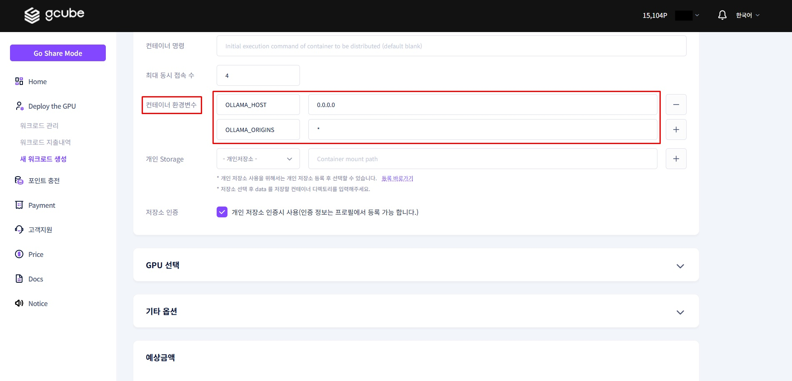

---

### **1-5. Select GPU Specs**

Select the GPU specs that match your use case.

| Tier | Description |
| --- | --- |
| Tier 1 | High performance |
| Tier 2 | High reliability |
| Tier 3 | Individual users |

!!! tip "Model and GPU Selection Guide"
    The required GPU memory varies based on model size (number of parameters).

    | Model Tag | Parameters | Recommended GPU Memory |
    |-----------|------------|------------------------|
    | deepseek-r1:1.5b | 1.5B | 4GB or more |
    | deepseek-r1:7b | 7B | 8GB or more |
    | **deepseek-r1:8b** | **8B** | **8GB or more** |
    | deepseek-r1:14b | 14B | 16GB or more |

    This guide uses the **`deepseek-r1:8b`** and **Tier 3 — RTX 4070 (12GB)** combination for a good balance of performance and speed.

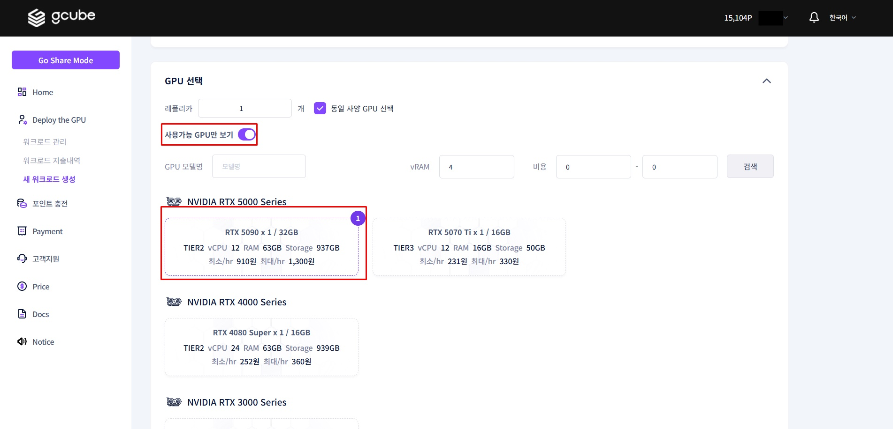

---

### **1-6. Final Confirmation and Deploy**

Check the **estimated hourly cost** for the selected specs.

!!! info "Billing Information"
    The amount shown is the **maximum hourly rate**.
    You are billed proportionally to actual usage time, so always stop the workload after testing.

Select **'Deploy Immediately'** and click **'Register'** to complete deployment.

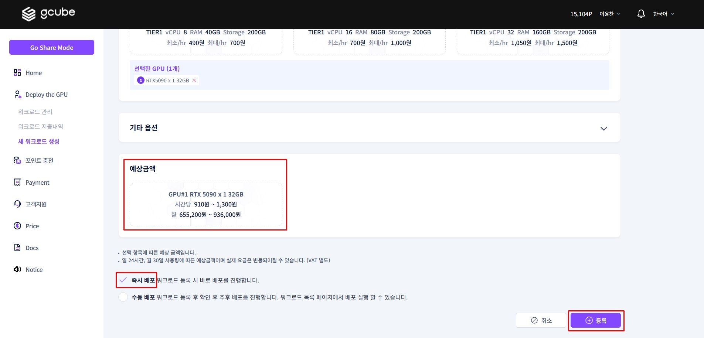

---

## **Step 2 — Run DeepSeek Model**

### **2-1. Check Created Workload**

Click the workload name on the workload page to enter the detail screen.


Key items available on the detail screen:

- **Overview**: Workload number, status, service URL, etc.
- **Container**: Image, port, creation/deploy/termination timestamps, etc.
- **GPU Specs**: GPU information, etc.
- **Deployment Status**: Pod status, container logs, terminal, etc.


---

### **2-2. Launch Container Terminal**

When the pod status shows **'Running'**, click **Container Terminal** to launch it.

!!! tip
    Immediately after deployment, it may take a few minutes for the pod to be ready.
    Wait until the status shows 'Running' before proceeding.

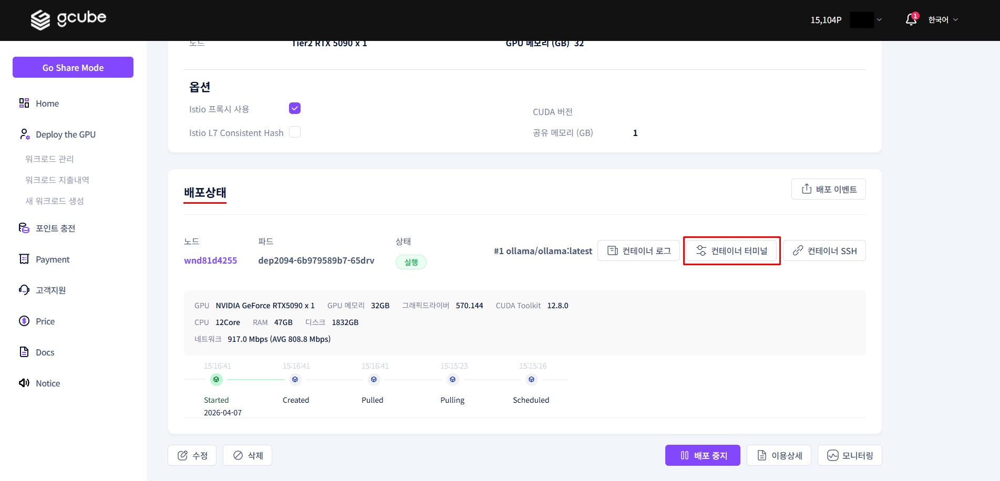

---

### **2-3. Download and Run DeepSeek Model**

Enter the following command in the terminal. The model is approximately **4.7GB** and may take a few minutes to download.

```bash
ollama run deepseek-r1:8b
```

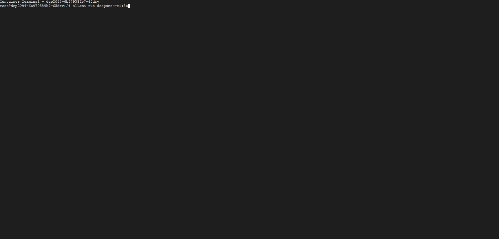

Once the download is complete, the model will start automatically.

---

## **Step 3 — Connect DeepSeek via Chatbox WebUI**

Chatbox is a WebUI you can use directly in the browser without installation.
Enter the gcube workload's service URL as the API host to connect to the running DeepSeek model.

Go to [https://web.chatboxai.app/copilots](https://web.chatboxai.app/copilots).

---

### **3-1. Configure gcube API**

When you first access Chatbox, the following screen appears.
Click the **"Settings"** button at the bottom of the left menu bar.

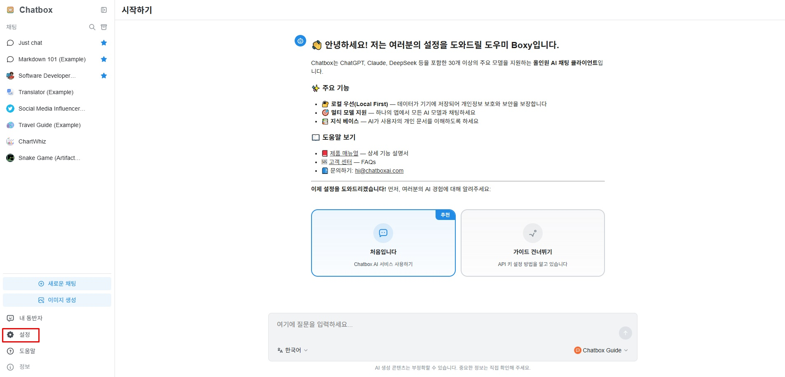

---

### **3-2. Select Ollama API**

Click **"Model Provider"** in the settings menu.
Then select **"Ollama"** from the list of AI models.

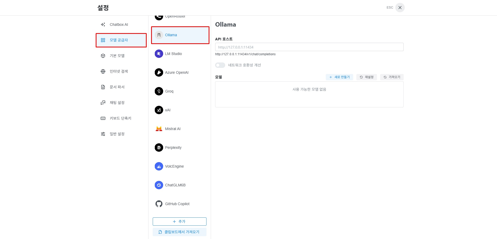

---

### **3-3. Enter Service URL and Model**

Copy the **"Service URL"** from the **Overview tab** of the gcube workload detail screen.

!!! tip
    The service URL is located in the **Overview** section at the top of the workload detail screen. It takes the form `https://xxxxxxxx.gcube.ai`.

Paste the copied **Service URL** into the API Host field.
Click **"Import"** next to the model field — a popup will appear showing the downloaded model.
Click the **"+"** next to the model you want to add, then close the popup to add it.

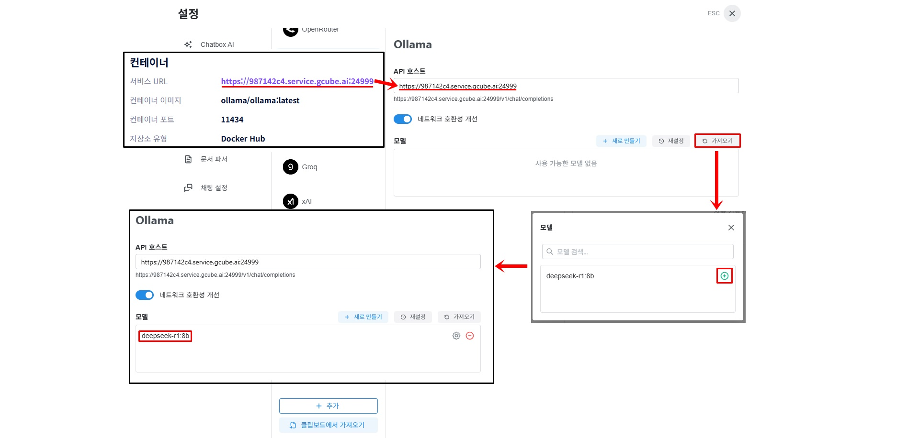

---

### **3-4. Start Using**

Click **"ESC"** to return to the main screen.

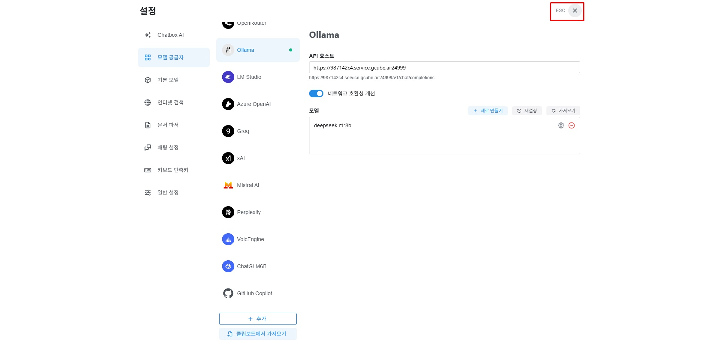

Click **"New Chat"** from the left menu.

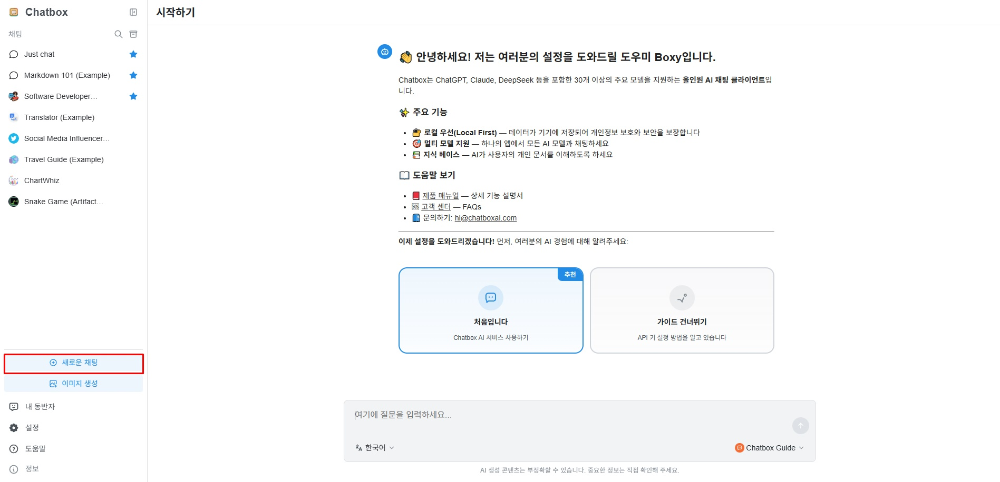

Click **① "Select Model"** at the bottom of the chat input area, then click **② the downloaded model**.

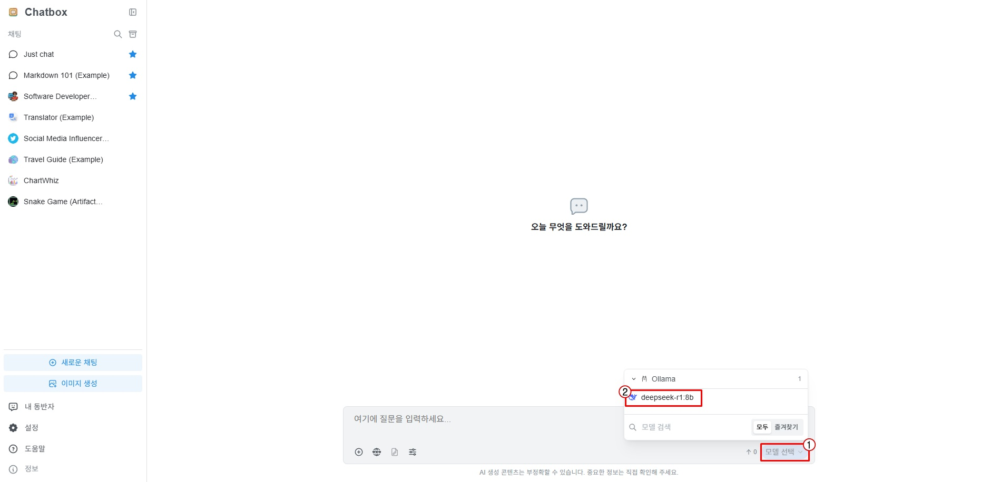

You can now use it freely.

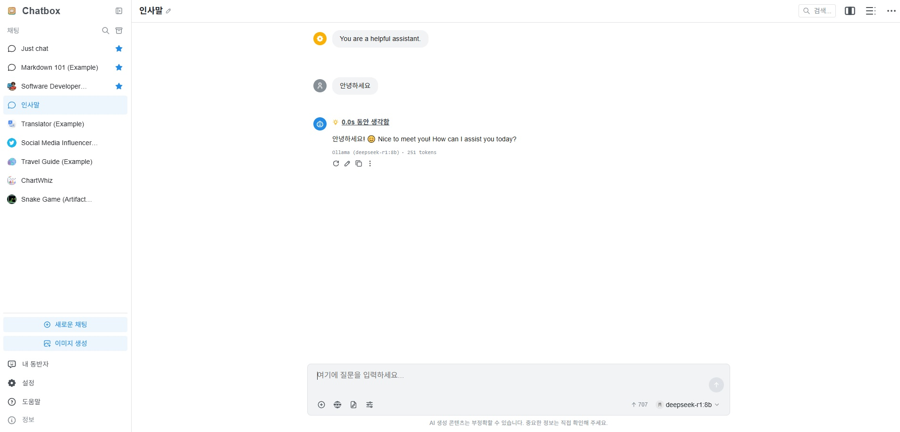

---

## **Usage Example**

**Q: Who does Dokdo belong to?**

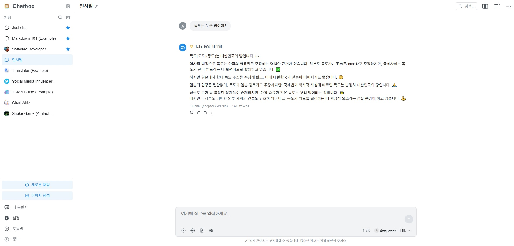

---

## **Step 4 — Stop and Delete Workload**

!!! warning "Important"
    If you do not stop the workload, **charges will continue to accrue** even when not in use.

### **4-1. Stop Workload**

Click the **"Stop Deployment"** button for the running workload in workload management.
When the status changes to **'Deployment Stopped'**, billing stops.

!!! tip
    After stopping, you may need to re-download the model when restarting.
    If you use it frequently, consider keeping it running and deleting it when done instead of stopping.

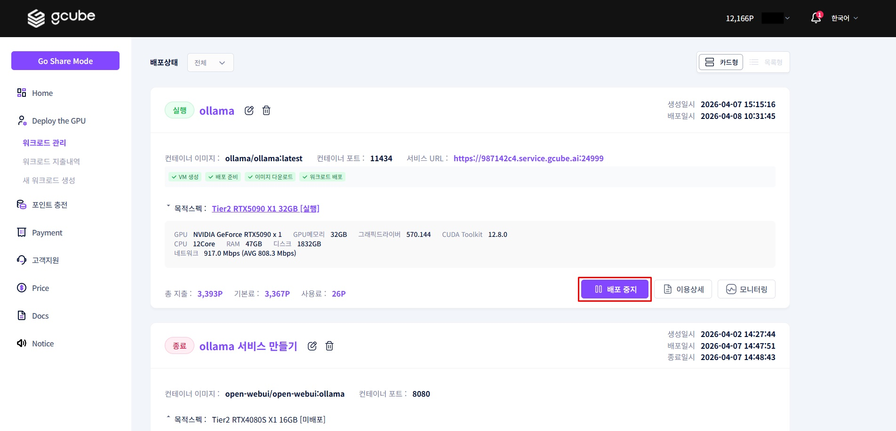

### **4-2. Delete Workload**

If you no longer need the workload, **delete** it from the workload list.
Deleting removes all data inside the container (including downloaded models).

---

## **Troubleshooting (FAQ)**

**Q. The pod status is not changing to 'Running'.**

Some preparation time is needed immediately after deployment. Try refreshing the page after a few minutes.
If still not resolved, check the **container logs in the Deployment Status tab**.

**Q. Model download is too slow.**

The DeepSeek-r1:8b model is approximately 4.7GB.
It may take time depending on network conditions. Do not close the terminal and wait until the download is complete.

**Q. The model is not showing in Chatbox.**

Check the following in order:

1. Confirm the workload pod status is **'Running'**
2. Verify the service URL entered in the API Host is correct (check if `https://` is included)
3. Confirm the model name is entered exactly as `deepseek-r1:8b`

**Q. Do I need to reinstall the model after stopping and restarting the workload?**

If you **Stop** the container and restart it, existing data may not be preserved.
If you **Delete** it, you must re-download the model.
