# **Ollama 사용 가이드 - DeepSeek 버전**

## **0. 개요**

- **Ollama 란?**
    - LLM을 실행하고 관리할 수 있도록 지원하는 플랫폼
    - 로컬환경 에서 오픈소스 언어 모델을 다운 받고 사용해 볼 수 있음
    - 대표적인 언어 모델은 다음과 같다
        - Llama3
            - Meta에서 개발한 최신 언어 모델로, 자연어 처리 성능이 우수
        - Phi 3
            - Microsoft Research에서 개발한 모델로, 뛰어난 추론 및 언어 이해 능력 보유
        - Mistral
            - 다양한 언어 작업에 최적화된 모델로, 고성능을 자랑함
        - Gemma 2
            - Google에서 개발한 모델로, 자연어 처리 및 생성 작업에 강점
        - CodeGemma
            - 코드 생성 및 완성에 특화된 모델로, 다양한 프로그래밍 작업을 지원
    - 오픈된 언어모델을 사용해보거나, 커스텀 모델 생성 및 배포등등 사용자 친화적인 인터페이스를 통한 언어 모델 실행 및 관리를 ollama를 이용해 사용할 수 있음

## **1. Gcube 플랫폼 워크로드 서비스 등록 절차**

- **워크로드 생성 및 배포**
    - [gcube.ai](http://gcube.ai/) 접속 및 [워크로드 페이지](https://gcube.ai/ko/demand/workload/list/) 이동
    - 해당 페이지에서 새 워크로드를 등록하거나 기존에 등록된 워크로드를 수정하여 정보 입력
        
        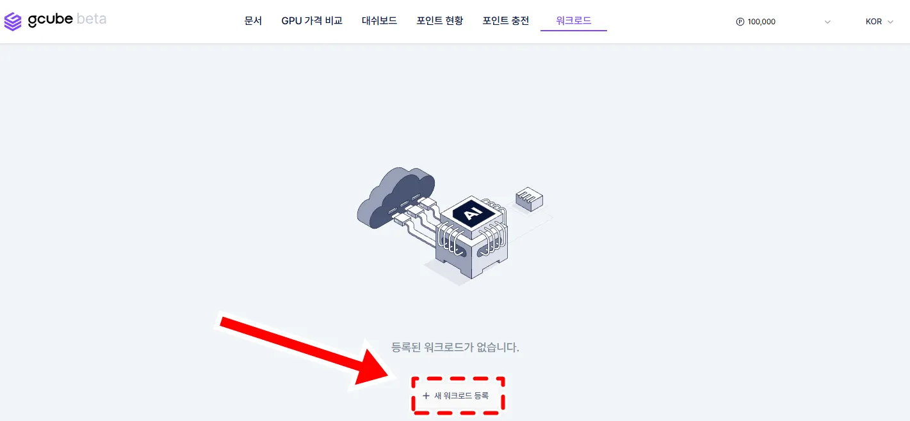
        

- **설명 개요**
    - 워크로드 이름 작성
        - ex : ollama

- **컨테이너 개요**
    - 저장소 유형 선택 및 컨테이너 이미지 선택
        - 도커허브에 ollama 에서 제공하는 공식 이미지가 있으므로 해당 이미지 사용
            - 참조 url : https://hub.docker.com/r/ollama/ollama
        - 저장소 유형 : 도커허브
        - 컨테이너 이미지 : ollama/ollama:latest
        - 컨테이너 이미지 레이어의 메타데이터(ExposedPorts)를 확인하여 컨테이너 포트가 자동으로 작성된다 (ollama 의 경우 11434)
            
            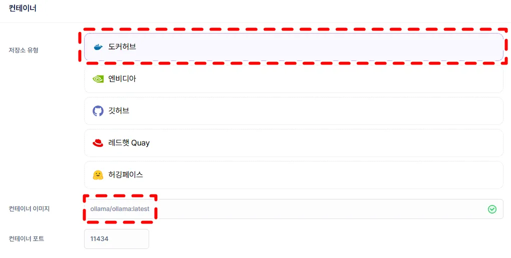
            

- **목적스펙 개요**
    - 사용하고자 하는 스펙을 정한다
        - Tier1 : 고성능
        - Tier2 : 고신뢰성
        - Tier3 : 개인 사용자들
        - GPU 메모리 : 가용 GPU 필터링
            - 본 예제에서는 Tier3 RTX3060 을 선택

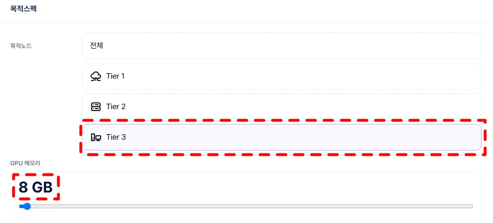

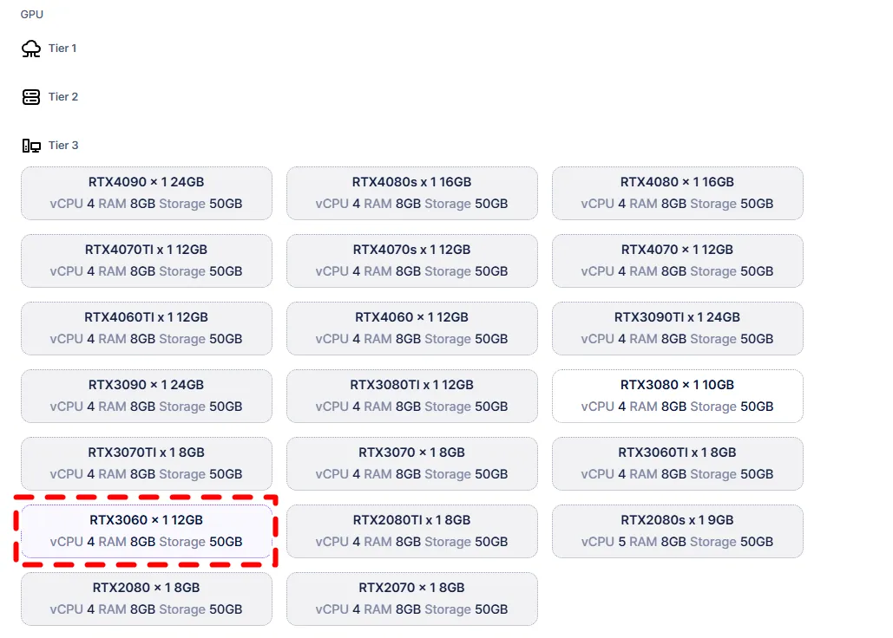

- **옵션 개요 (optional)**
    - 컨테이너 명령
        - Dockerfile 의 CMD 항목 (컨테이너 실행 시 시작될 명령어)
            - 형식 : CMD ["executable", "param1", "param2"] / CMD [“echo“, “Hello, world!“]
    - 컨테이너 환경변수
        - Dockerfile 의 ENV 항목 (컨테이너 내부에서 사용할 환경변수)
            - 형식 : ENV <KEY> <VALUE> / ENV DEF_PORT 9999
    - 레플리카
        - 컨테이너의 인스턴스가 서로 다른 노드에서 동시에 실행되는 개수
        - 목적
            - 애플리케이션의 신뢰성과 처리량 향상
            - 특정 노드에 문제 발생해도 서비스 유지
            - 대기 시간을 줄이고 개발자 경험 향상
            - L7 Consistent Hashing 기법
                - 요청을 키(key) 기반으로 특정 백엔드로 라우팅
                - 해시 알고리즘을 사용하여 트래픽을 일관되게 분배
                - 노드나 서버가 추가되거나 제거될 때에도 최소한의 요청만 다른 서버로 이동되도록 보장
    - CUDA
        - 버전 선택
    - 공유 메모리
        - 리눅스 시스템에서 제공하는 공유 메모리 영역 (/dev/shm)
        - 프로세스 간 데이터 공유를 위해 설계된 영역 (대규모 데이터 처리를 위한 고속 임시 스토리지)

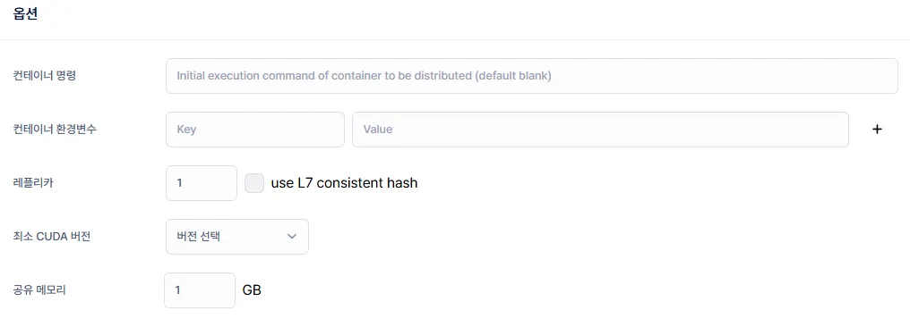

- **총 예상금액 개요**
    - 선택한 스펙의 최대 시간당 가격 정보
    - 내용 확인 후 등록 진행
        - ‘즉시배포’ 선택 시 등록 및 배포 진행

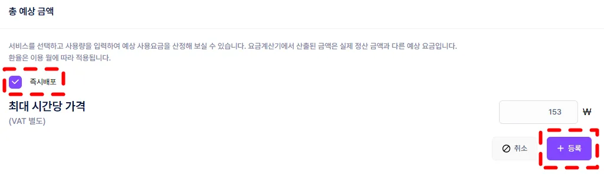

## **2. Gcube 플랫폼 워크로드 서비스 사용 방법**

- **생성된 워크로드 확인**
    - 워크로드 페이지(https://gcube.ai/ko/demand/workload/list )에서 생성한 워크로드 이름 클릭 시, 워크로드 세부 정보 진입 가능

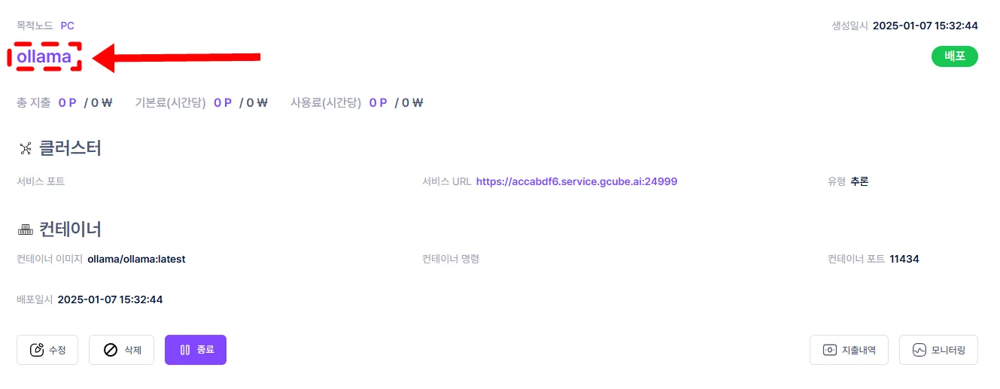

- **워크로드 세부 정보 개요**
    - 개요 : 워크로드 번호, 설명, 유형, 상태, 서비스 URL 정보 등
    - 컨테이너 : 컨테이너 이미지, 컨테이너 포트, 저장소 유형, 생성일시, 배포일시, 종료일시 정보 등
    - 목적스펙 : 목적노드, GPU 메모리, GPU 정보 등
    - 옵션 : 컨테이너 명령, 컨테이너 환경변수, 레플리카, 최소 CUDA 버전, 공유 메모리 정보 등
    - 배포상태 : 컨테이너 배포 이벤트, 노드, 파드, 파드 상태, 컨테이너 로그, 컨테이너 터미널, 컨테이너 SSH 정보 등

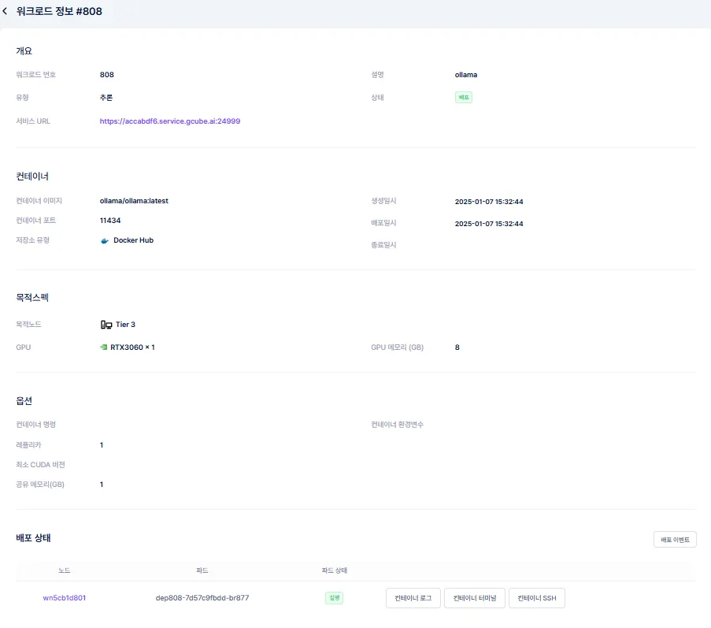

- **파드상태가 ‘실행’ 인 경우**
    - '컨테이너 SSH' 클릭하여 공인IP 조회 및 접속정보 등록
        - 정보 등록 시 SSH 접속 관련 정보 확인

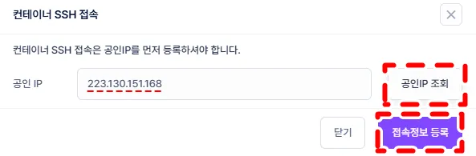

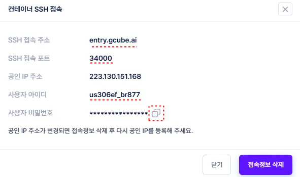

- **터미널 프로그램 (ex: putty) 실행 후 위에서 확인한 SSH 접속 정보 입력하여 컨테이너 접속**
    - IP, Port, 사용자 아이디, 사용자 비밀번호 등

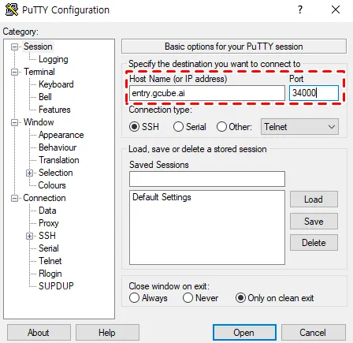

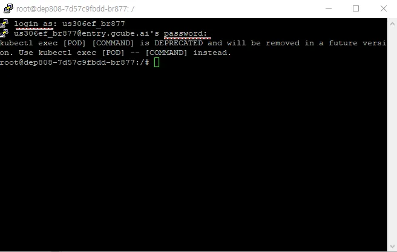

- **해당 CLI 에서 하기 커맨드 입력하여 deepseek 언어 모델 다운 및 실행 (약 4.7GB)**
    - ollama run deepseek-r1:8b
    
    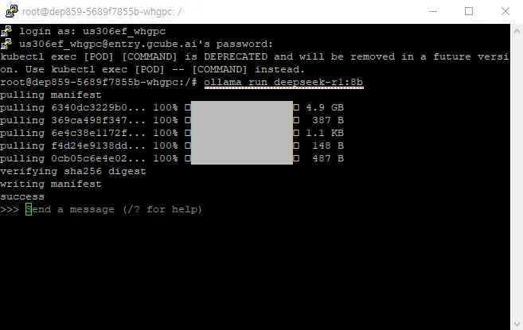
    
- **이후 DeepSeek 모델로, ChatGPT 처럼 AI 추론 서비스를 사용할 수 있음**
    - ex)

Q : How to make pizza?

A :

<think>

</think>

Making pizza can be a fun and rewarding process! Here's a basic guide to
making your own pizza at home:

 **Pizza dough:**

1. **Activate yeast**: In a small bowl, mix 1 teaspoon of sugar with 1 cup
of warm water (around 110°F). Sprinkle in the active dry yeast, cover, and
let it sit for 5-10 minutes until it becomes frothy.
2. **Mix dough**: In a large bowl, combine 2 cups of all-purpose flour,
salt, and olive oil. Add the yeast mixture and mix until the dough forms a
sticky ball.
3. **Knead dough**: knead the dough on a floured surface for about 8-10
minutes until it becomes smooth and elastic.

**Assembling the pizza:**

1. **Prepare sauce**: Make your favorite tomato sauce or pesto as the
base.
2. **Build the pizza**: Roll out the dough to your desired thickness
(thinner for crispy crust, thicker for a chewy texture). Transfer to a
baking sheet or pizza stone.
3. **Add toppings**: Add your preferred toppings, such as cheese,
vegetables, or meats, leaving space for the edges.

**Baking:**

1. **Preheat oven**: Preheat your oven to the highest temperature (around
500-550°F) for about 10-15 minutes.
2. **Cook pizza**: Place the prepared pizza on a baking sheet or directly
on the pizza stone. Cook for 10-15 minutes, or until the crust is golden
and cheese is bubbly.

**Tips:**

- For a crispy crust, brush the dough with olive oil before baking.
- Add toppings in even amounts to avoid overcrowding the pizza.
- Use a pizza peel or cardboard to slide the pizza off the stone.

Enjoy your homemade pizza!

ex2)  

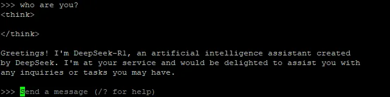