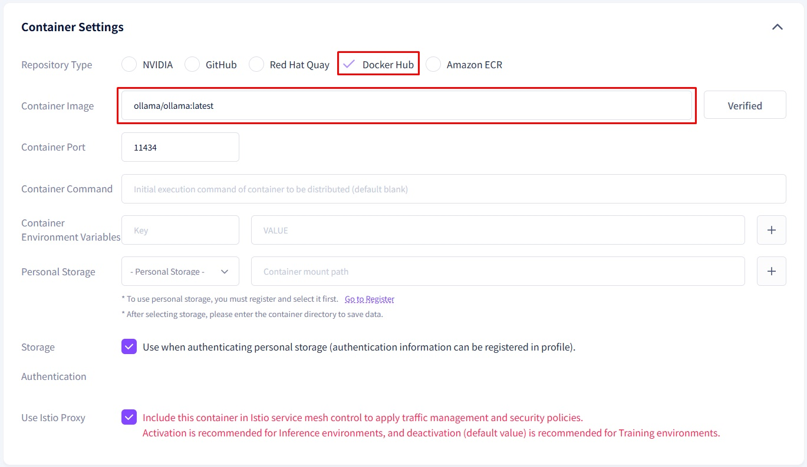
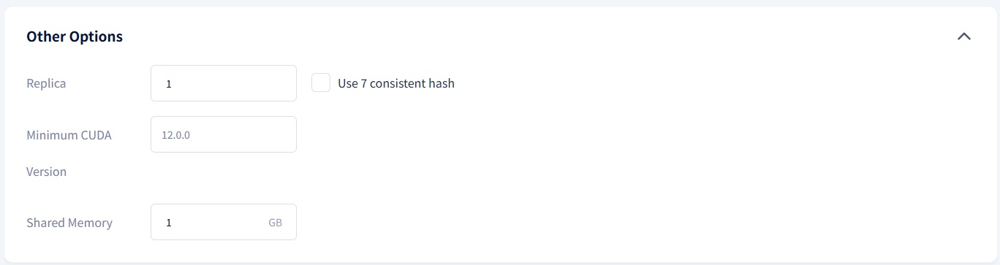
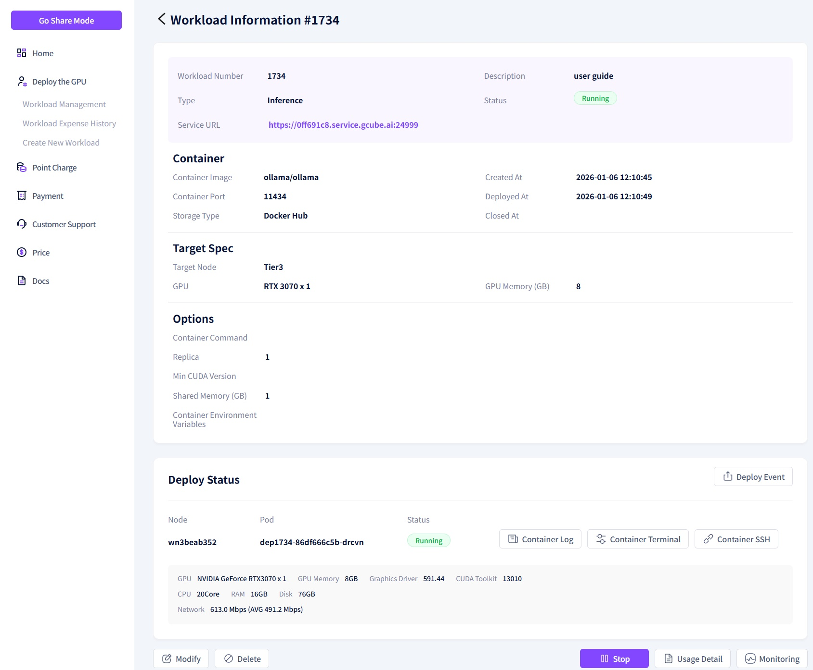
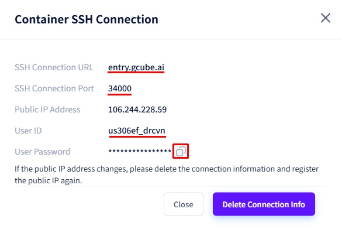

# **Ollama User Guide - llama3**

## **0. Overview**

- **What is Ollama?**
    - A platform designed to execute and manage LLMs (Large Language Models)
    - Enables users to download and test open-source language models in a local environment
    - Key supported language models include:
        - Llama3
            - The latest language model developed by Meta, featuring superior natural language processing performance
        - Phi 3
            - Developed by Microsoft Research, this model possesses exceptional reasoning and language understanding capabilities
        - Mistral
            - Optimized for various linguistic tasks, boasting high-performance efficiency
        - Gemma 2
            - Developed by Google, showing strength in natural language processing and generation tasks
        - CodeGemma
            - Specialized in code generation and completion, supporting a wide range of programming tasks
    - Users can run and manage open-source or custom models via a user-friendly interface using Ollama, including model creation and deployment

## **1. gcube Platform Workload Service Registration Process**

- **Workload Creation and Deployment**
    - Access [gcube.ai](http://gcube.ai/) and navigate to the Workload page ( https://gcube.ai/ko/demand/workload/list )
    - Register a new workload or modify an existing one by entering the required information on the page.
        

        
        
- **Description Overview**
    - Enter the workload name
        - ex : ollama

- **Container Overview**
    - Select the storage type and container image
        - Use the official image provided by Ollama on Docker Hub
            - Reference URL : https://hub.docker.com/r/ollama/ollama
        - Storage Type: Docker Hub
        - Container Image: ollama/ollama:latest
        - Container ports are automatically populated by checking the metadata (ExposedPorts) of the container image layer. (For Ollama, the port is 11434)
            

            

- **GPU Selection Overview**
    - Select the desired performance specification
        - Tier1 : High Performance
        - Tier2 : High Reliability
        - Tier3 : Individual Users
        - GPU Memory: Filter available GPUs
            - In this example, select **Tier 3 RTX 3070**

- **Option Overview (optional)**
    - Container Command
        - Corresponds to the CMD instruction in a Dockerfile (the command to be executed when the container starts)
            - Format : CMD ["executable", "param1", "param2"] / CMD [“echo“, “Hello, world!“]
    - Container Environment Variables
        - Corresponds to the ENV instruction in a Dockerfile (environment variables to be used inside the container)
            - 형식 : ENV <KEY> <VALUE> / ENV DEF_PORT 9999
    - Replicas
        - The number of container instances running simultaneously across different nodes
        - Purpose:
            - Enhances application reliability and throughput
            - Ensures service continuity even if a specific node fails
            - Reduces latency and improves the developer experience
            - L7 Consistent Hashing Technique:
                - Routes requests to specific backends based on a key
                - Uses a hashing algorithm to distribute traffic consistently
                - Guarantees that only a minimum number of requests are shifted to other servers when nodes or servers are added or removed
    - CUDA
        - Select the CUDA version
    - Shared Memory
        - Refers to the shared memory area (/dev/shm) provided by Linux systems
        - An area designed for inter-process data sharing (acts as high-speed temporary storage for large-scale data processing)

- **Estimated Cost Overview**
    - Displays the maximum hourly price information based on the selected specifications
    - Proceed with registration after reviewing the details
        - If ‘Instant Deployment’ is selected, registration and deployment will proceed immediately

## **2. How to Use gcube Platform Workload Services**

- **Checking Created Workloads**
    - On the Workload page(https://gcube.ai/ko/demand/workload/list ), click on the Workload Name to enter the Workload Details page

- **Workload Details Overview**
    - General: Workload ID, description, type, status, Service URL, etc.
    - Container: Container image, container port, storage type, creation date/time, deployment date/time, termination date/time, etc.
    - Target Specification: Target node, GPU memory, GPU information, etc.
    - Options: Container command, container environment variables, replicas, minimum CUDA version, shared memory information, etc.
    - Deployment Status: Container deployment events, node information, pod details, pod status, container logs, container terminal, container SSH access, etc.

- **When Pod Status is ‘Running’**
    - Click ‘Container SSH’ to view the Public IP and register access credentials
        - Verify SSH access information during the credential registration process.

- **Connect to the container by entering the SSH access information confirmed above into a terminal program (e.g., PuTTY)**
    - Enter the IP address, Port, User ID, and Password

- **Enter the following command in the CLI to download and run the Llama 3 language model (approx. 4.7GB):**
    -  ollama run llama3

- **Afterward, utilize Llama 3 for AI inference services similar to ChatGPT.**
    - ex)

Q : How to make pizza?

A :
Ingredients:

- 2 cups of warm water
- 1 tablespoon of sugar
- 2 teaspoons of active dry yeast
- 3 1/2 cups of all-purpose flour
- 1 teaspoon of salt
- 2 tablespoons of olive oil
- Pizza sauce (homemade or store-bought)
- Shredded mozzarella cheese (and any other toppings you like!)
- Fresh basil leaves, chopped (optional)

Instructions:

1. **Make the dough:** In a large mixing bowl, combine the warm water, sugar, and yeast. Let it sit for 5-10
minutes until the yeast is activated and foamy.
2. Add the flour, salt, and olive oil to the bowl. Mix until a shaggy dough forms.
3. **Knead the dough:** Turn the dough out onto a floured surface and knead for 5-10 minutes, until the dough
becomes smooth and elastic.
4. **Let it rise:** Place the dough in a lightly oiled bowl, cover it with plastic wrap or a damp cloth, and
let it rise in a warm place for about an hour, or until it has doubled in size.
5. **Punch down the dough:** Gently punch down the dough to release any air bubbles.
6. **Shape the crust:** Use your hands to shape the dough into your desired pizza crust shape (e.g., circle,
rectangle, etc.).
7. **Roll out the crust:** Roll out the crust to your desired thickness (about 1/4 inch is a good starting
point).
8. **Preheat the oven:** Preheat your oven to 425°F (220°C) with a baking sheet or pizza stone inside.
9. **Add sauce and toppings:** Spread a thin layer of pizza sauce over the crust, leaving a small border
around the edges. Add your desired toppings, such as shredded mozzarella cheese, pepperoni slices, mushrooms,
bell peppers, olives, etc.
10. **Bake the pizza:** Place the pizza on the preheated baking sheet or stone and bake for 12-15 minutes, or
until the crust is golden brown and the cheese is melted and bubbly.
11. **Add fresh basil (optional):** Sprinkle some chopped fresh basil leaves over the top of the pizza for a
pop of color and flavor.
12. **Enjoy your pizza:** Remove the pizza from the oven and let it cool for a few minutes before slicing and
serving.

Tips and Variations:

- Use a pizza peel or piece of parchment paper to transfer the dough to the preheated baking sheet or stone
if you don't have a pizza stone.
- Try different topping combinations, such as Hawaiian-style with ham and pineapple, or Mediterranean-style
with feta cheese and olives.
- Experiment with various crust flavors by adding herbs, spices, or garlic powder to the dough before
kneading.
- Make mini pizzas using individual portions of dough and toppings for a fun appetizer or snack.

Remember, making pizza is all about having fun and being creative! Don't be afraid to try new things and
experiment with different flavors and combinations. Happy baking!

ex2)

