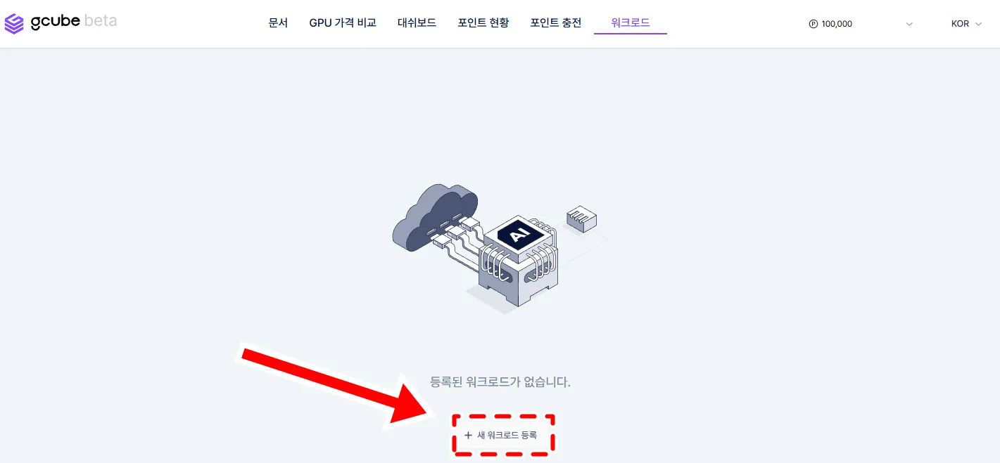
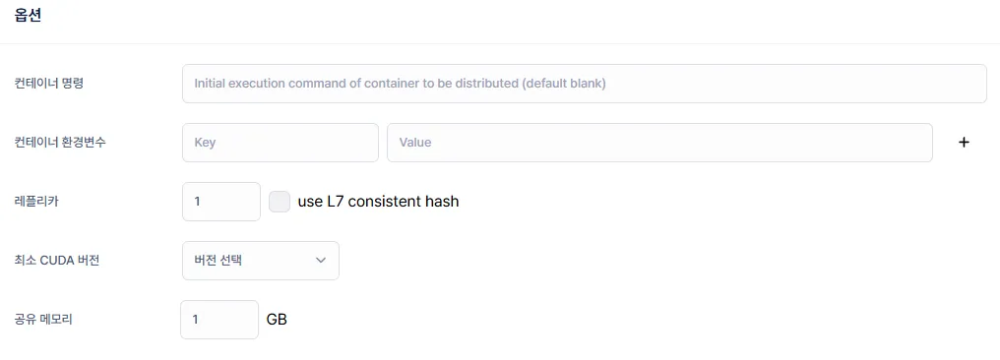
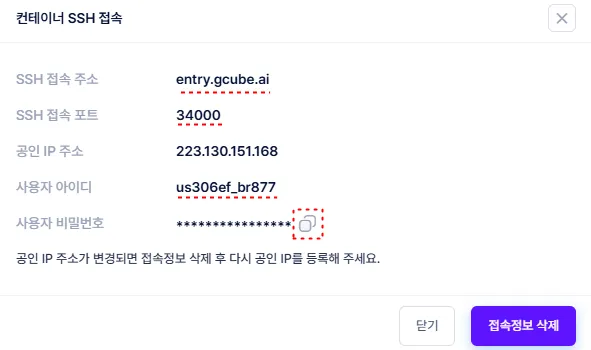
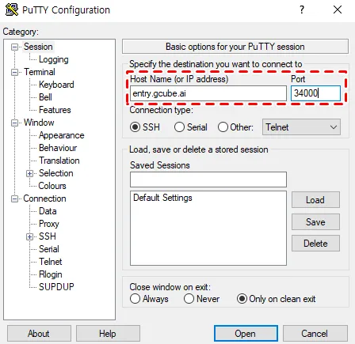
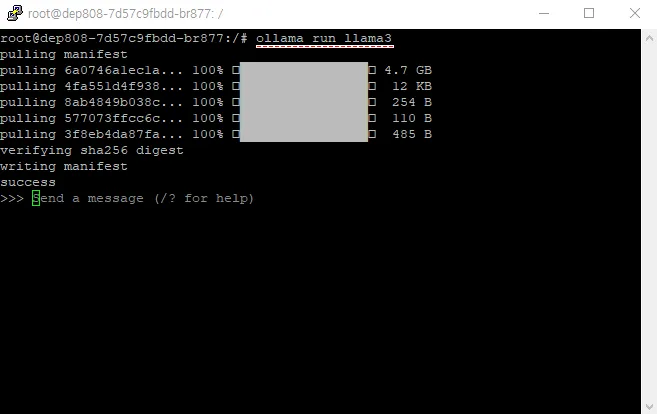

## **0. 개요**

- **Ollama 란?**
    - LLM을 실행하고 관리할 수 있도록 지원하는 플랫폼
    - 로컬환경 에서 오픈소스 언어 모델을 다운 받고 사용해 볼 수 있음
    - 대표적인 언어 모델은 다음과 같다
        - Llama3
            - Meta에서 개발한 최신 언어 모델로, 자연어 처리 성능이 우수
        - Phi 3
            - Microsoft Research에서 개발한 모델로, 뛰어난 추론 및 언어 이해 능력 보유
        - Mistral
            - 다양한 언어 작업에 최적화된 모델로, 고성능을 자랑함
        - Gemma 2
            - Google에서 개발한 모델로, 자연어 처리 및 생성 작업에 강점
        - CodeGemma
            - 코드 생성 및 완성에 특화된 모델로, 다양한 프로그래밍 작업을 지원
    - 오픈된 언어모델을 사용해보거나, 커스텀 모델 생성 및 배포등등 사용자 친화적인 인터페이스를 통한 언어 모델 실행 및 관리를 ollama를 이용해 사용할 수 있음

## **1. Gcube 플랫폼 워크로드 서비스 등록 절차**

- **워크로드 생성 및 배포**
    - [gcube.ai](http://gcube.ai/) 접속 및 [워크로드 페이지](https://gcube.ai/ko/demand/workload/list/) 이동
    - 해당 페이지에서 새 워크로드를 등록하거나 기존에 등록된 워크로드를 수정하여 정보 입력
        
        
        

- **설명 개요**
    - 워크로드 이름 작성
        - ex : ollama

- **컨테이너 개요**
    - 저장소 유형 선택 및 컨테이너 이미지 선택
        - 도커허브에 ollama 에서 제공하는 공식 이미지가 있으므로 해당 이미지 사용
            - 참조 url : https://hub.docker.com/r/ollama/ollama
        - 저장소 유형 : 도커허브
        - 컨테이너 이미지 : ollama/ollama:latest
        - 컨테이너 이미지 레이어의 메타데이터(ExposedPorts)를 확인하여 컨테이너 포트가 자동으로 작성된다 (ollama 의 경우 11434)
            
            
            

- **목적스펙 개요**
    - 사용하고자 하는 스펙을 정한다
        - Tier1 : 고성능
        - Tier2 : 고신뢰성
        - Tier3 : 개인 사용자들
        - GPU 메모리 : 가용 GPU 필터링
            - 본 예제에서는 Tier3 RTX3060 을 선택

- **옵션 개요 (optional)**
    - 컨테이너 명령
        - Dockerfile 의 CMD 항목 (컨테이너 실행 시 시작될 명령어)
            - 형식 : CMD ["executable", "param1", "param2"] / CMD [“echo“, “Hello, world!“]
    - 컨테이너 환경변수
        - Dockerfile 의 ENV 항목 (컨테이너 내부에서 사용할 환경변수)
            - 형식 : ENV <KEY> <VALUE> / ENV DEF_PORT 9999
    - 레플리카
        - 컨테이너의 인스턴스가 서로 다른 노드에서 동시에 실행되는 개수
        - 목적
            - 애플리케이션의 신뢰성과 처리량 향상
            - 특정 노드에 문제 발생해도 서비스 유지
            - 대기 시간을 줄이고 개발자 경험 향상
            - L7 Consistent Hashing 기법
                - 요청을 키(key) 기반으로 특정 백엔드로 라우팅
                - 해시 알고리즘을 사용하여 트래픽을 일관되게 분배
                - 노드나 서버가 추가되거나 제거될 때에도 최소한의 요청만 다른 서버로 이동되도록 보장
    - CUDA
        - 버전 선택
    - 공유 메모리
        - 리눅스 시스템에서 제공하는 공유 메모리 영역 (/dev/shm)
        - 프로세스 간 데이터 공유를 위해 설계된 영역 (대규모 데이터 처리를 위한 고속 임시 스토리지)

- **총 예상금액 개요**
    - 선택한 스펙의 최대 시간당 가격 정보
    - 내용 확인 후 등록 진행
        - ‘즉시배포’ 선택 시 등록 및 배포 진행

## **2. Gcube 플랫폼 워크로드 서비스 사용 방법**

- **생성된 워크로드 확인**
    - 워크로드 페이지(https://gcube.ai/ko/demand/workload/list )에서 생성한 워크로드 이름 클릭 시, 워크로드 세부 정보 진입 가능

- **워크로드 세부 정보 개요**
    - 개요 : 워크로드 번호, 설명, 유형, 상태, 서비스 URL 정보 등
    - 컨테이너 : 컨테이너 이미지, 컨테이너 포트, 저장소 유형, 생성일시, 배포일시, 종료일시 정보 등
    - 목적스펙 : 목적노드, GPU 메모리, GPU 정보 등
    - 옵션 : 컨테이너 명령, 컨테이너 환경변수, 레플리카, 최소 CUDA 버전, 공유 메모리 정보 등
    - 배포상태 : 컨테이너 배포 이벤트, 노드, 파드, 파드 상태, 컨테이너 로그, 컨테이너 터미널, 컨테이너 SSH 정보 등

- **파드상태가 ‘실행’ 인 경우**
    - '컨테이너 SSH' 클릭하여 공인IP 조회 및 접속정보 등록
        - 정보 등록 시 SSH 접속 관련 정보 확인

- **터미널 프로그램 (ex: putty) 실행 후 위에서 확인한 SSH 접속 정보 입력하여 컨테이너 접속**
    - IP, Port, 사용자 아이디, 사용자 비밀번호 등

- **해당 CLI 에서 하기 커맨드 입력하여 llama3 언어 모델 다운 및 실행 (약 4.7GB)**
    - ollama run llama3

- **이후 Llama3 모델로, ChatGPT 처럼 AI 추론 서비스를 사용할 수 있음**
    - ex)

Q : How to make pizza?

A :
Ingredients:

- 2 cups of warm water
- 1 tablespoon of sugar
- 2 teaspoons of active dry yeast
- 3 1/2 cups of all-purpose flour
- 1 teaspoon of salt
- 2 tablespoons of olive oil
- Pizza sauce (homemade or store-bought)
- Shredded mozzarella cheese (and any other toppings you like!)
- Fresh basil leaves, chopped (optional)

Instructions:

1. **Make the dough:** In a large mixing bowl, combine the warm water, sugar, and yeast. Let it sit for 5-10
minutes until the yeast is activated and foamy.
2. Add the flour, salt, and olive oil to the bowl. Mix until a shaggy dough forms.
3. **Knead the dough:** Turn the dough out onto a floured surface and knead for 5-10 minutes, until the dough
becomes smooth and elastic.
4. **Let it rise:** Place the dough in a lightly oiled bowl, cover it with plastic wrap or a damp cloth, and
let it rise in a warm place for about an hour, or until it has doubled in size.
5. **Punch down the dough:** Gently punch down the dough to release any air bubbles.
6. **Shape the crust:** Use your hands to shape the dough into your desired pizza crust shape (e.g., circle,
rectangle, etc.).
7. **Roll out the crust:** Roll out the crust to your desired thickness (about 1/4 inch is a good starting
point).
8. **Preheat the oven:** Preheat your oven to 425°F (220°C) with a baking sheet or pizza stone inside.
9. **Add sauce and toppings:** Spread a thin layer of pizza sauce over the crust, leaving a small border
around the edges. Add your desired toppings, such as shredded mozzarella cheese, pepperoni slices, mushrooms,
bell peppers, olives, etc.
10. **Bake the pizza:** Place the pizza on the preheated baking sheet or stone and bake for 12-15 minutes, or
until the crust is golden brown and the cheese is melted and bubbly.
11. **Add fresh basil (optional):** Sprinkle some chopped fresh basil leaves over the top of the pizza for a
pop of color and flavor.
12. **Enjoy your pizza:** Remove the pizza from the oven and let it cool for a few minutes before slicing and
serving.

Tips and Variations:

- Use a pizza peel or piece of parchment paper to transfer the dough to the preheated baking sheet or stone
if you don't have a pizza stone.
- Try different topping combinations, such as Hawaiian-style with ham and pineapple, or Mediterranean-style
with feta cheese and olives.
- Experiment with various crust flavors by adding herbs, spices, or garlic powder to the dough before
kneading.
- Make mini pizzas using individual portions of dough and toppings for a fun appetizer or snack.

Remember, making pizza is all about having fun and being creative! Don't be afraid to try new things and
experiment with different flavors and combinations. Happy baking!

ex2)  

