# **Ollama User Guide - SSH Access Version**

## **Before You Begin**

The following items must be ready before following this guide.

| Item | Description |
| --- | --- |
| gcube account | Sign up at [gcube.ai](https://gcube.ai/) |
| SSH terminal program | PuTTY or equivalent terminal program |
| Credit balance | GPU usage costs apply on the gcube platform (billed hourly) |

!!! tip
    **PuTTY Download**: Available for free at [https://www.putty.org](https://www.putty.org).

---

## **Overview**

### **What is Ollama?**

Ollama is a platform that lets you download and run open-source AI language models in a local environment.
This guide walks you through running Ollama on gcube's cloud GPU environment and using the Llama3 model via SSH access.

Representative AI models available in Ollama:

| Model | Developer | Features |
| --- | --- | --- |
| Llama 3 | Meta | Excellent natural language processing |
| Phi 3 | Microsoft Research | Strong reasoning and language understanding |
| Mistral | Mistral AI | Optimized for various language tasks |
| Gemma 2 | Google | Strong at natural language processing and generation |
| CodeGemma | Google | Specialized in code generation and completion |

---

## **Step 0 — Create and Log In to gcube Account**

### **0-1. Sign Up**

Go to [https://gcube.ai](https://gcube.ai/) and click the **"Sign Up"** button in the upper right.
Complete email verification to create your account.

### **0-2. Log In**

After signing up, log in on the same page.

### **0-3. Check Credits**

gcube charges based on GPU usage time. Check your credit balance on the dashboard before use.

!!! warning "Billing Notice"
    Workloads are **billed hourly from the time of deployment until stopped**.
    Always stop the workload after use. Refer to Step 4 for instructions.

---

## **Step 1 — Register Workload on gcube**

### **1-1. Access Workload Page**

Go to [https://gcube.ai/ko/demand/workload/list](https://gcube.ai/ko/demand/workload/list).

① Register a new workload or ② select an existing one to modify.

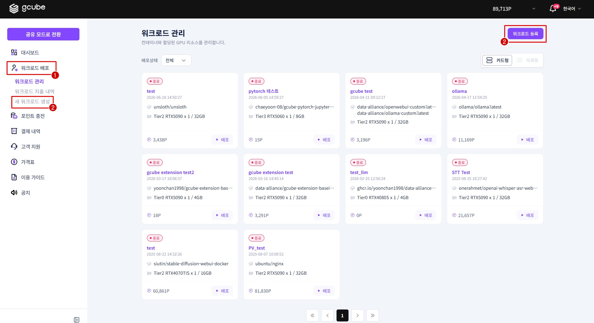

---

### **1-2. Enter Description**

Enter the **workload name**.

```
Example: ollama
```

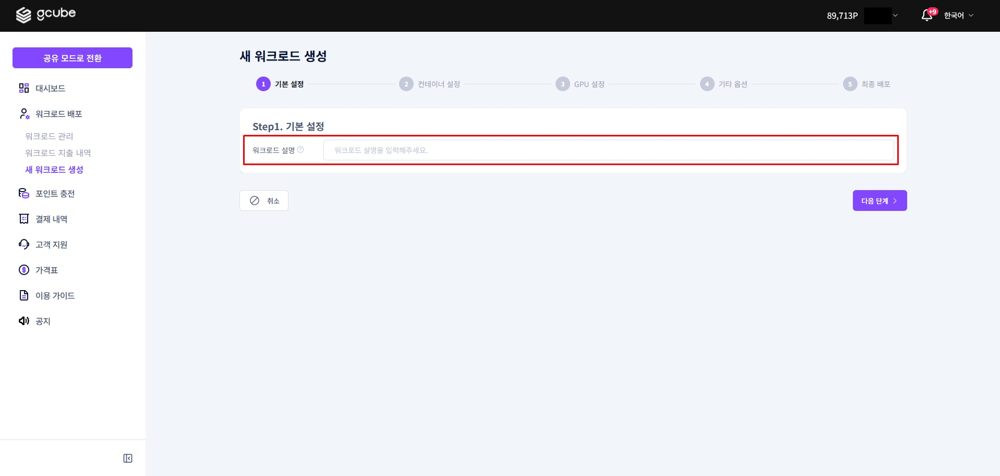

---

### **1-3. Container Settings**

Enter the following in order.

| Item | Value |
| --- | --- |
| Registry Type | Docker Hub |
| Container Image | `ollama/ollama:latest` |
| Container Port | `11434` (auto-filled after image validation) |

!!! tip
    After entering the container image, click **Validate Image** next to it.
    Once validation is complete, the container port (`11434`) will be filled in automatically.

    Official image reference: [https://hub.docker.com/r/ollama/ollama](https://hub.docker.com/r/ollama/ollama)

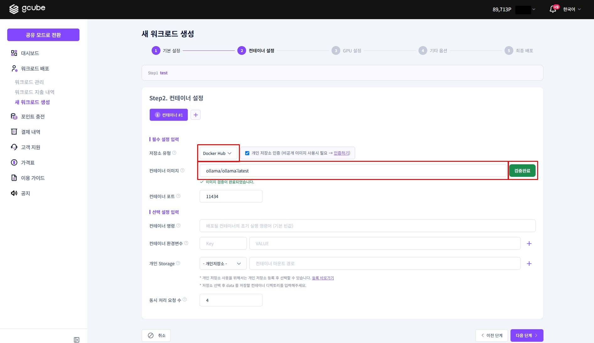

---

### **1-4. Options Settings**

No additional options need to be configured for this guide. Refer to the table below for descriptions of each option.

| Option | Description |
| --- | --- |
| Container Command | Command to run when the container starts (Dockerfile CMD) |
| Max Concurrent Connections | Maximum number of users that can connect simultaneously |
| Container Environment Variables | Environment variables used inside the container (Dockerfile ENV) |
| Personal Storage | Dedicated storage that persists data even if the container restarts or is deleted |
| Registry Authentication | Authentication settings for accessing private container image registries |

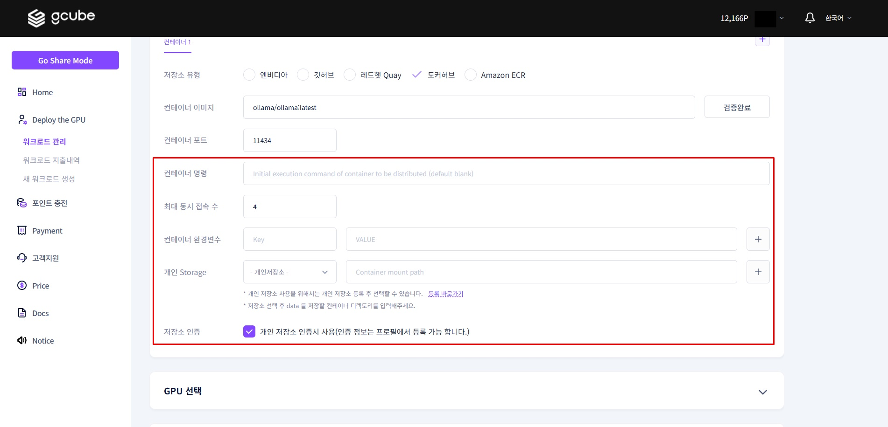

---

### **1-5. Select GPU Specs**

Select the GPU specs that match your use case.

| Tier | Description |
| --- | --- |
| Tier 1 | High performance |
| Tier 2 | High reliability |
| Tier 3 | Individual users |

!!! tip "Recommendation"
    If this is your first time, select **Tier 2 — RTX 5090**. This guide's examples are based on that spec.


---

### **1-6. Final Confirmation and Deploy**

Check the **estimated hourly cost** for the selected specs.

!!! info "Billing Information"
    The amount shown is the **maximum hourly rate**. You are billed proportionally to actual usage time, so always stop the workload after testing.

Select **'Deploy Immediately'** to complete registration and deployment.


---

## **Step 2 — Run Llama3 Model**

### **2-1. Check Created Workload**

Click the workload name on the workload page to enter the detail screen.

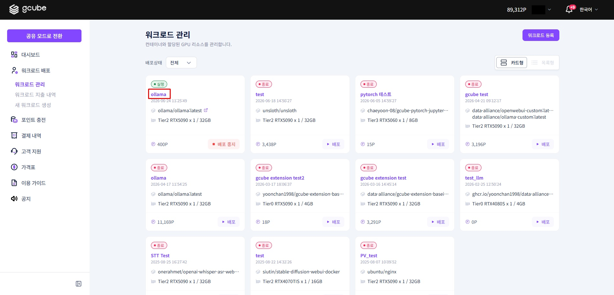

Key items available on the detail screen:

- **Overview**: Workload number, status, service URL, etc.
- **Container**: Image, port, creation/deploy/termination timestamps, etc.
- **GPU Specs**: GPU information, etc.
- **Deployment Status**: Pod status, container logs, terminal, SSH info, etc.

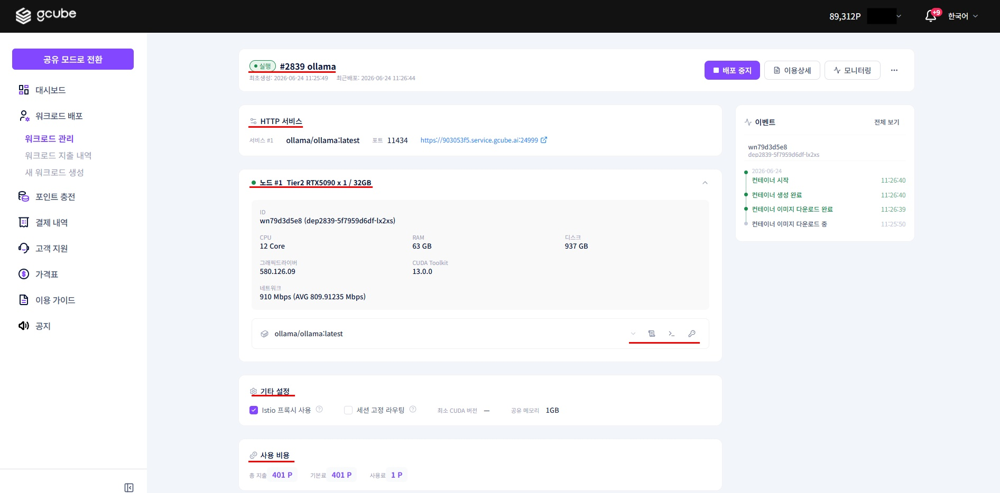

---

### **2-2. Check SSH Connection Info**

When the pod status shows ① **'Running'**, click ② **Container SSH**.

!!! tip
    Immediately after deployment, it may take a few minutes for the pod to be ready.
    Wait until the status shows 'Running' before proceeding.

Look up ③ the public IP and ④ register the connection info to see the SSH connection details:

- **IP Address**
- **Port**
- **Username**
- **Password**

Note this information down. You will enter it into the terminal program in the next step.

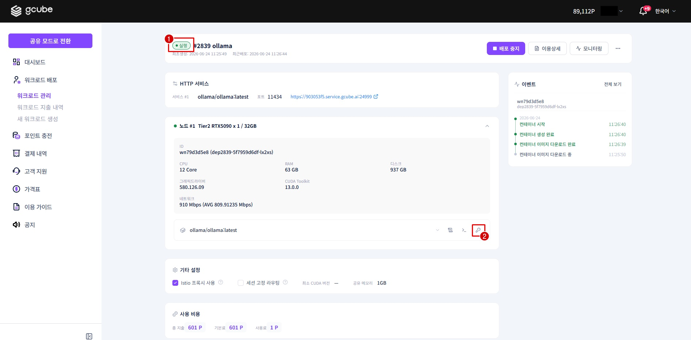

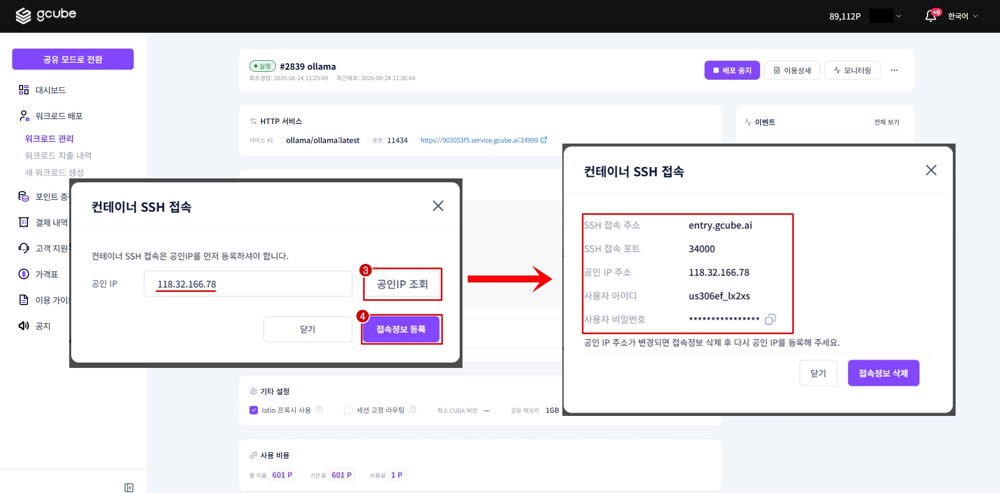

---

### **2-3. Connect via PuTTY**

Launch PuTTY and enter the SSH connection information you noted above.

| No. | PuTTY Field | Value |
| --- | --- | --- |
| 1 | Host Name | IP address from SSH connection info |
| 2 | Port | Port number from SSH connection info |

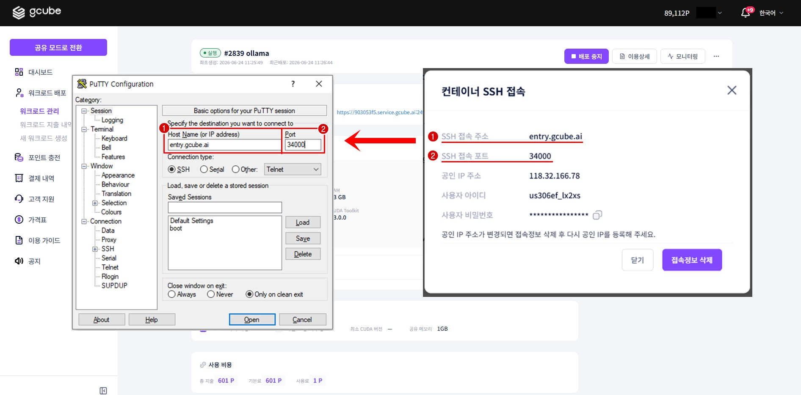

Click **Open** to launch the terminal window.
Enter ③ the username and ④ the password in order to connect to the container.

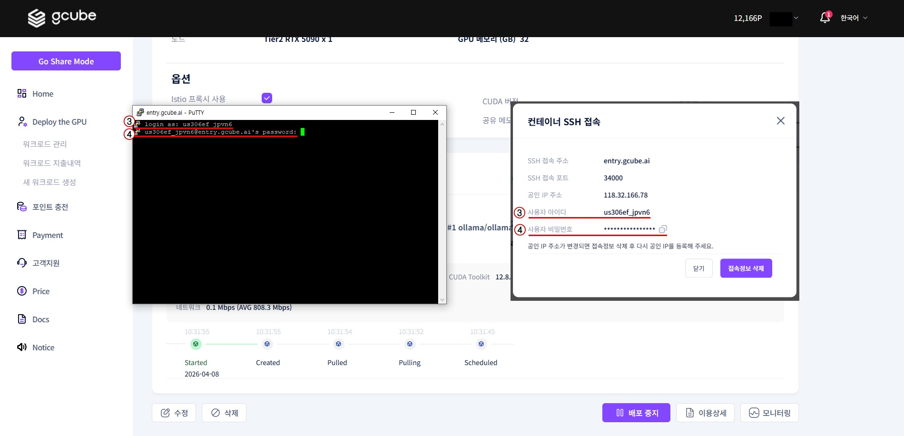

---

### **2-4. Download and Run Llama3 Model**

Enter the following command in the terminal. The model is approximately **4.7GB** and may take a few minutes to download.

```bash
ollama run llama3
```

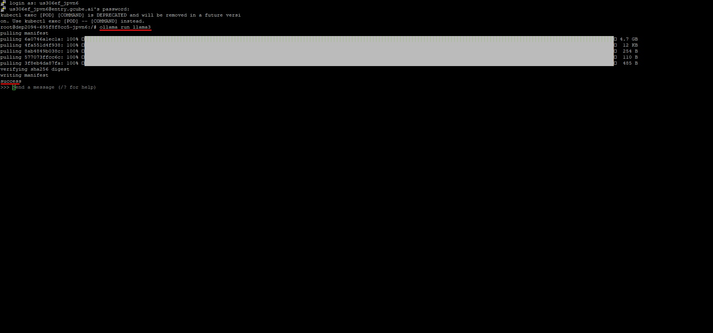

Once the download is complete, the model will start automatically and you can chat with the AI directly in the terminal.

---

## **Step 3 — Chat with Llama3**

After running the model, type your question in the terminal and Llama3 will respond. You can ask in natural language just like with ChatGPT.

**Usage Example**

```
Q: How to make pizza?
```

```
A:
Ingredients:
- 2 cups of warm water
- 1 tablespoon of sugar
...
```

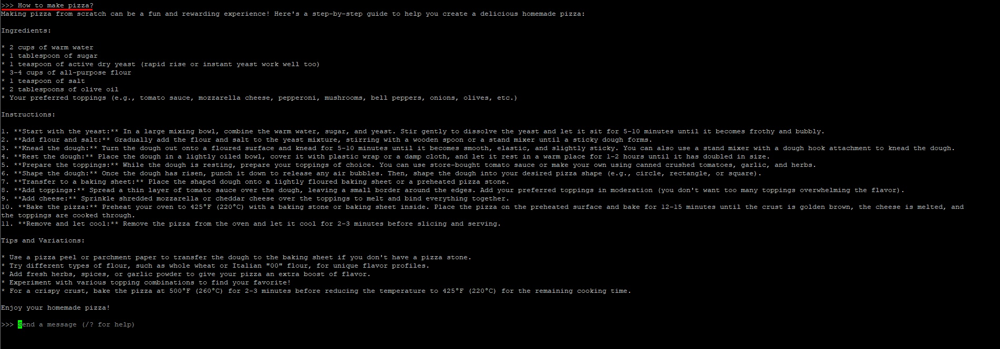

To end the conversation, enter the following command.

```bash
/bye
```

---

## **Step 4 — Stop and Delete Workload**

!!! warning "Important"
    If you do not stop the workload, **charges will continue to accrue** even when not in use.

### **4-1. Stop Workload**

Click the **"Stop Deployment"** button for the running workload in workload management.
When the status changes to **'Deployment Stopped'**, billing stops.

!!! tip
    After stopping, you may need to re-download the model when restarting.
    If you use it frequently, consider keeping it running and deleting it when done instead of stopping.


### **4-2. Delete Workload**

If you no longer need the workload, **delete** it from the workload list.
Deleting removes all data inside the container (including downloaded models).

---

## **Troubleshooting (FAQ)**

**Q. The pod status is not changing to 'Running'.**

Some preparation time is needed immediately after deployment. Try refreshing the page after a few minutes.
If still not resolved, check the **container logs in the Deployment Status tab**.

**Q. PuTTY connection is failing.**

Check the following in order:

1. Confirm the workload pod status is **'Running'**
2. Verify the IP address and Port number are entered correctly
3. Re-check the connection info on the SSH info screen and try again

**Q. Model download is too slow.**

The Llama3 model is approximately 4.7GB.
It may take time depending on network conditions. Do not close the terminal and wait until the download is complete.

**Q. Do I need to reinstall the model after stopping and restarting the workload?**

If you **Stop** the container and restart it, existing data may not be preserved.
If you **Delete** it, you must re-download the model.

---

<div style="text-align: center;" markdown>
[Next: Run ComfyUI + WebUI →](openwebui-comfyui.en.md){ .md-button .md-button--primary }
</div>
