# **Installing and Running OpenClaw on gcube**

This guide explains how to run the Ollama-based gemma4:e4b model and configure the OpenClaw Gateway and Control UI in the gcube workload environment.

## Before You Begin

This guide proceeds in the following order:

1. Create and deploy workload
2. SSH access
3. Download Ollama gemma4:e4b model
4. Install Node.js and npm
5. Install OpenClaw and onboard
6. Install plugin dependencies
7. Run OpenClaw Gateway
8. Approve Telegram Pairing
9. Stop and verify OpenClaw process
10. Access web dashboard
11. Review and edit configuration file
12. Configure and use web dashboard
13. Troubleshooting
14. Security notes

---

## Step 1 — Create and Deploy Workload

Register a workload with the following settings.

| Item | Value |
|---|---|
| Registry Type | Docker Hub |
| Container Image | `ollama/ollama:latest` |
| Container Port | `18789` |
| GPU Selection | RTX Series |
| Other Options | Shared Memory 4GB |

!!! note
    Port `18789` is used for **OpenClaw Gateway** and **Control UI** access.

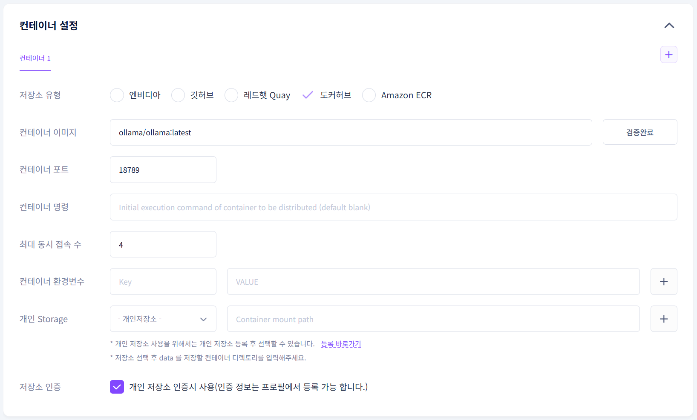

---

## Step 2 — SSH Access

Once the workload is running, check the SSH connection information.

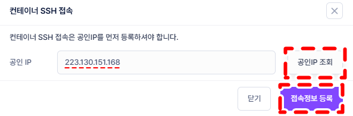

Look up and register your public IP, then connect to the container using the SSH address and port.

```bash
ssh <SSH connection command provided by gcube>
```

Once PuTTY terminal opens successfully, log in with your username and password.

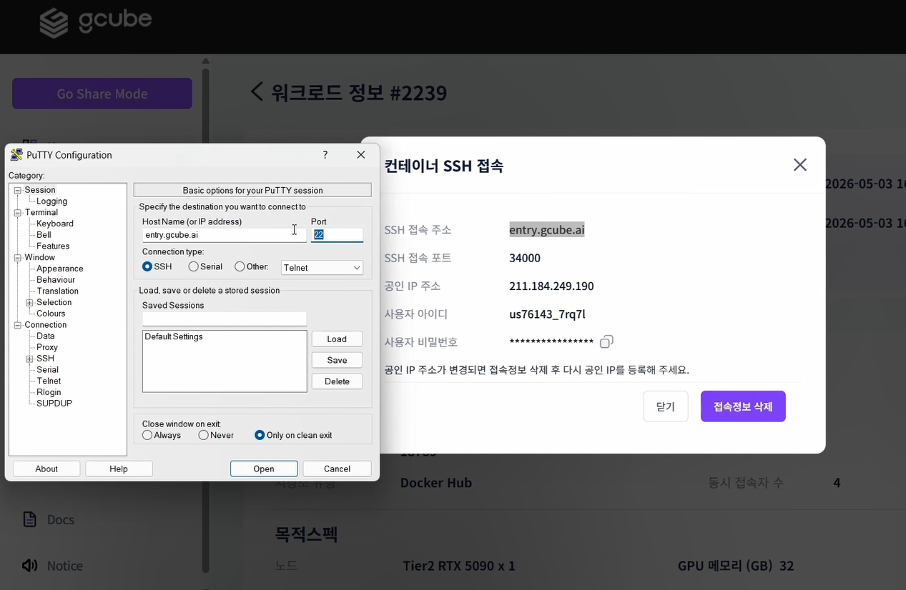

!!! tip
    In PuTTY, you can paste using **right-click**.

---

## Step 3 — Download Ollama Model

Enter the command below to download and run the `gemma4:e4b` model.

```bash
ollama run gemma4:e4b
```

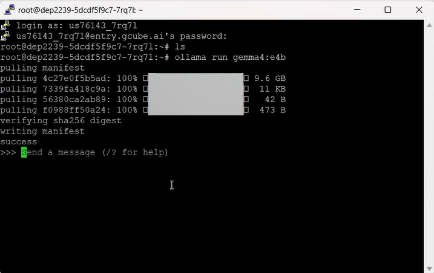

!!! tip
    In the Ollama chat screen, you can exit with the `/bye` command.

---

## Step 4 — Install Node.js and npm

Install **Node.js, npm, and git** for OpenClaw installation.

```bash
apt-get update && apt-get install -y curl git
curl -fsSL https://deb.nodesource.com/setup_lts.x | bash -
apt-get install -y nodejs
```

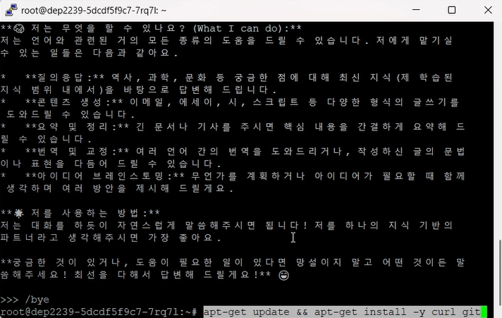

After installation, verify everything is installed correctly.

```bash
node -v
npm -v
git --version
```

---

## Step 5 — Install OpenClaw and Onboard

```bash
npm i -g openclaw
openclaw onboard
```

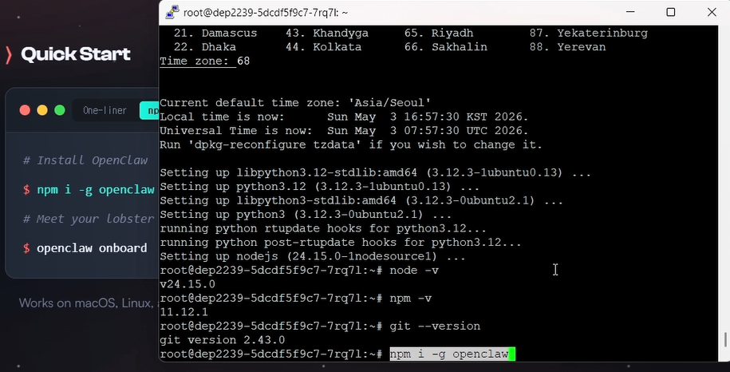

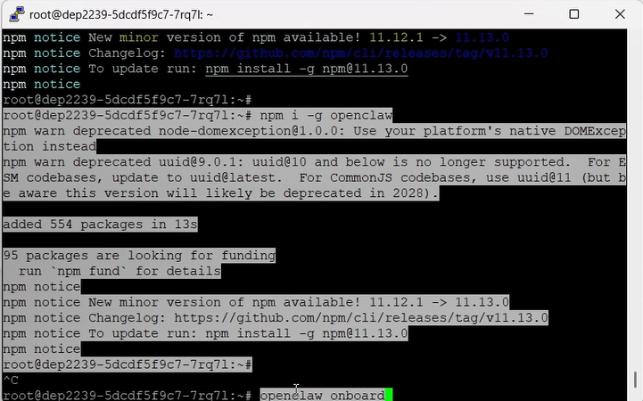

---

## Step 6 — Install Plugin Dependencies

If you see a plugin installation error during `openclaw onboard`, install the required dependencies with the commands below, then run onboard again.

```bash
npm i -g @larksuiteoapi/node-sdk nostr-tools
npm i -g @slack/web-api
npm i -g @whiskeysockets/baileys
```

```bash
openclaw onboard
```

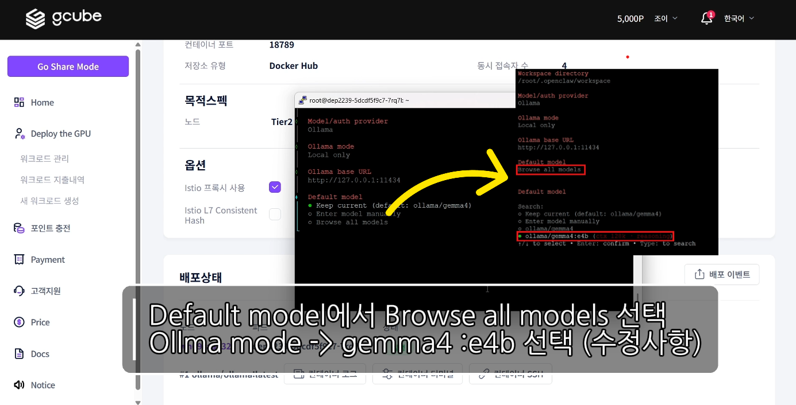

!!! warning
    During onboarding, make sure to select the exact **`gemma4:e4b`** model under `default model`.

---

## Step 7 — Run OpenClaw Gateway

Once onboarding is complete, run the Gateway.

```bash
openclaw gateway
```

---

## Step 8 — Approve Telegram Pairing

When OpenClaw Gateway is running, a Telegram connection request will appear. Use the Pairing Code from Telegram to run the approval command.

```bash
openclaw pairing approve telegram <PAIRING_CODE>
```

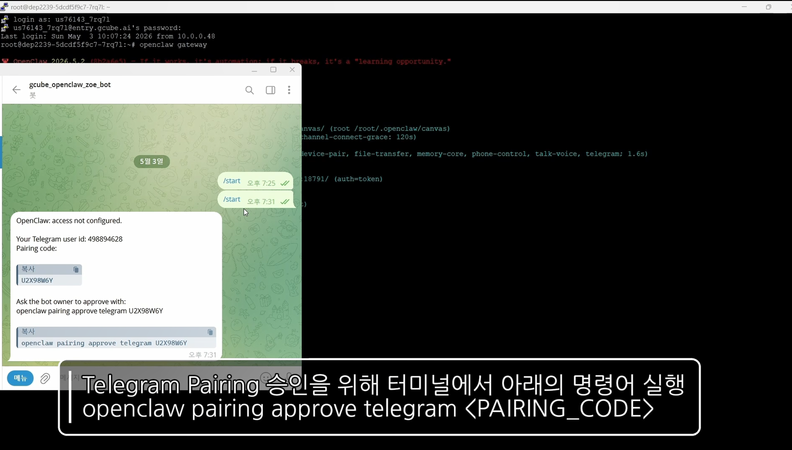

!!! warning
    Keep the Pairing Code confidential and do not expose it externally.

---

## Step 9 — Stop and Verify OpenClaw Process

If you need to restart the Gateway, stop the existing process first, then restart.

```bash
pkill -9 -f openclaw
ps -ef | grep openclaw
openclaw gateway
```

---

## Step 10 — Access Web Dashboard

Access the OpenClaw Control UI via the gcube workload's service URL or port access URL.

```
http://<SERVICE_URL>:18789
```

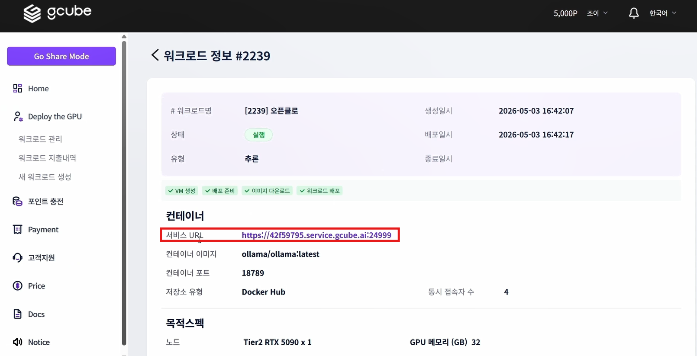

---

## Step 11 — Review and Edit Configuration File

Use the command below to write the `/root/.openclaw/openclaw.json` configuration file.

!!! warning
    Make sure to replace `<YOUR_GATEWAY_TOKEN>`, `<YOUR_TELEGRAM_BOT_TOKEN>`, and `<SERVICE_URL>` with your actual values.

```bash
cat > /root/.openclaw/openclaw.json <<'EOF'
EOF
```

```json
{
  "agents": {
    "defaults": {
      "workspace": "/root/.openclaw/workspace",
      "model": {
        "primary": "ollama/gemma4:e4b"
      },
      "models": {
        "ollama/gemma4:e4b": {}
      }
    }
  },
  "gateway": {
    "mode": "local",
    "auth": {
      "mode": "token",
      "token": "<YOUR_GATEWAY_TOKEN>"
    },
    "port": 18789,
    "bind": "lan",
    "controlUi": {
      "allowInsecureAuth": true,
      "allowedOrigins": [
        "http://<SERVICE_URL>:18789"
      ],
      "enabled": true,
      "dangerouslyDisableDeviceAuth": true
    },
    "tailscale": {
      "mode": "off",
      "resetOnExit": false
    },
    "nodes": {
      "denyCommands": [
        "camera.snap",
        "camera.clip",
        "screen.record",
        "contacts.add",
        "calendar.add",
        "reminders.add",
        "sms.send",
        "sms.search"
      ]
    },
    "tls": {
      "enabled": false,
      "autoGenerate": false
    }
  },
  "session": {
    "dmScope": "per-channel-peer"
  },
  "tools": {
    "profile": "coding",
    "web": {
      "search": {
        "provider": "ollama",
        "enabled": true
      }
    }
  },
  "plugins": {
    "entries": {
      "ollama": {
        "enabled": true
      },
      "telegram": {
        "enabled": true
      }
    }
  },
  "models": {
    "mode": "merge",
    "providers": {
      "ollama": {
        "baseUrl": "http://127.0.0.1:11434",
        "api": "ollama",
        "apiKey": "OLLAMA_API_KEY",
        "models": [
          {
            "id": "gemma4",
            "name": "gemma4",
            "reasoning": false,
            "input": ["text"],
            "cost": { "input": 0, "output": 0, "cacheRead": 0, "cacheWrite": 0 },
            "contextWindow": 128000,
            "maxTokens": 8192,
            "compat": { "supportsUsageInStreaming": true }
          },
          {
            "id": "gemma4:e4b",
            "name": "gemma4:e4b",
            "reasoning": true,
            "input": ["text", "image"],
            "cost": { "input": 0, "output": 0, "cacheRead": 0, "cacheWrite": 0 },
            "contextWindow": 131072,
            "maxTokens": 8192,
            "compat": {
              "supportsTools": true,
              "supportsUsageInStreaming": true
            }
          }
        ]
      }
    }
  },
  "auth": {
    "profiles": {
      "ollama:default": {
        "provider": "ollama",
        "mode": "api_key"
      }
    }
  },
  "channels": {
    "telegram": {
      "enabled": true,
      "groups": {
        "*": { "requireMention": true }
      },
      "botToken": "<YOUR_TELEGRAM_BOT_TOKEN>"
    }
  },
  "wizard": {
    "lastRunAt": "2026-05-03T15:32:24.907Z",
    "lastRunVersion": "2026.5.2",
    "lastRunCommand": "onboard",
    "lastRunMode": "local"
  },
  "meta": {
    "lastTouchedVersion": "2026.5.2",
    "lastTouchedAt": "2026-05-03T15:32:25.021Z"
  }
}
```

---

## Step 12 — Configure and Use Web Dashboard

Access the web dashboard via the gcube workload's service URL or port access URL.

```
http://<SERVICE_URL>:18789
```

From the OpenClaw web dashboard, you can review and update settings, and use OpenClaw directly through connected features.

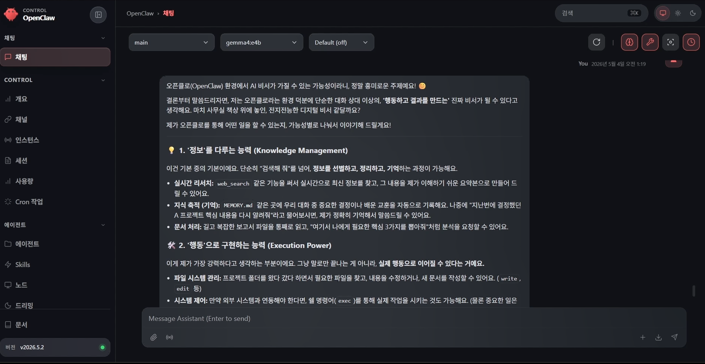

---

## Step 13 — Troubleshooting

| Issue | Cause | Solution |
|---|---|---|
| Cannot access web dashboard | Gateway `bind` setting not configured for external access | Set `bind` to `lan` and `port` to `18789` |
| Control UI access blocked | `controlUi.allowedOrigins` does not match service URL | Add `http://<SERVICE_URL>:18789` to `allowedOrigins` |
| OpenClaw command not working | npm global install path issue | Re-run `npm i -g openclaw` and check PATH |
| Plugin error | Required npm package missing | Install the relevant package globally |
| Model fails to run | Ollama model not downloaded | Run `ollama run gemma4:e4b` |
| Pairing fails | Request ID or code mismatch | Re-check the latest pairing request |

!!! note
    OpenClaw is frequently updated, so commands, configuration fields, and UI may change. If something differs from this guide, check the official OpenClaw documentation first.

---

## Step 14 — Security Notes

!!! warning
    - Do not expose the Gateway Token publicly.
    - Do not enter the Telegram Bot Token directly in documents.
    - Remove the Pairing Code and Request ID from documents after use.
    - Only enter `http://<SERVICE_URL>:18789` in `allowedOrigins`.
    - `allowInsecureAuth: true`, `dangerouslyDisableDeviceAuth: true`, and `tls.enabled: false` settings are recommended for test environments only.
