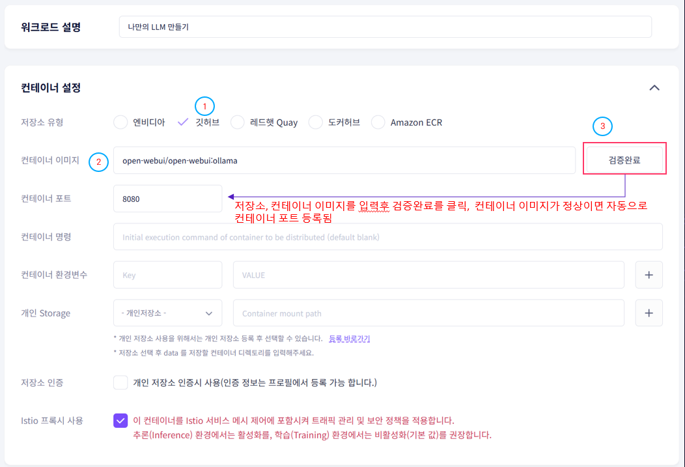
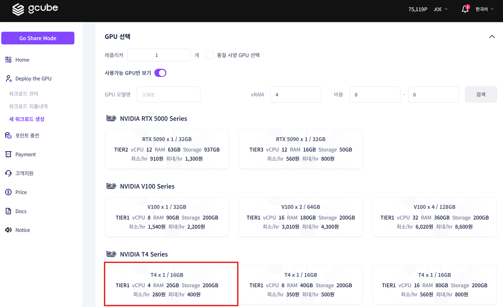
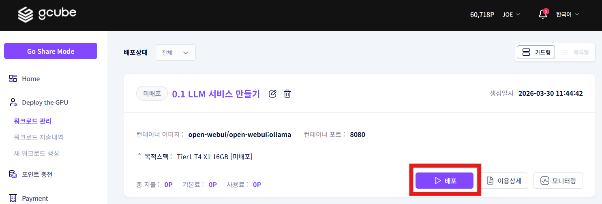
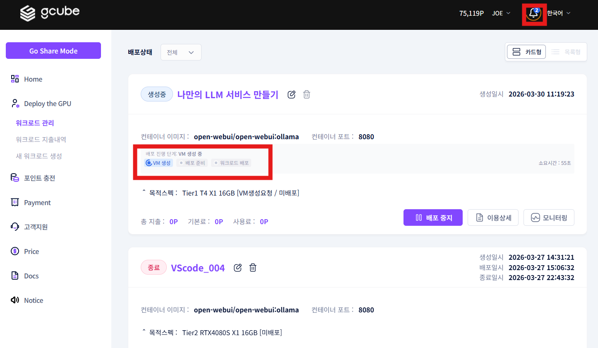
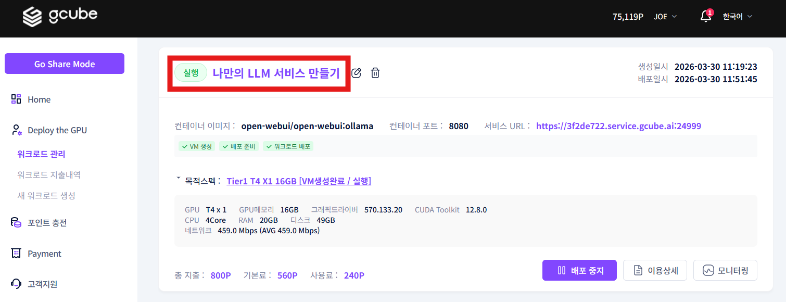
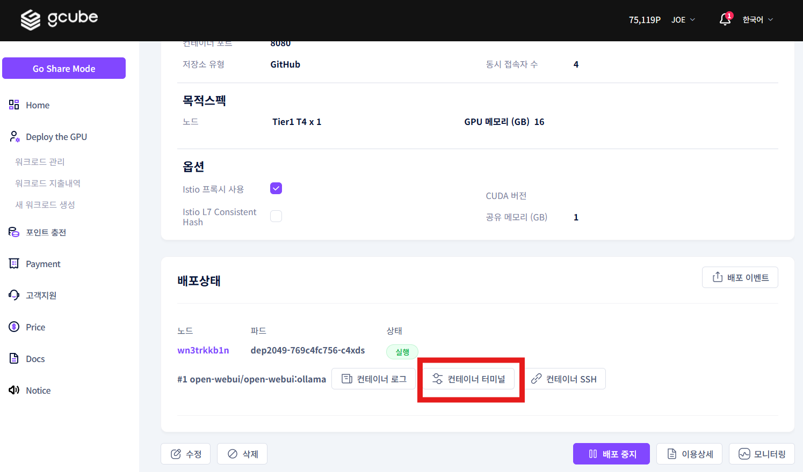
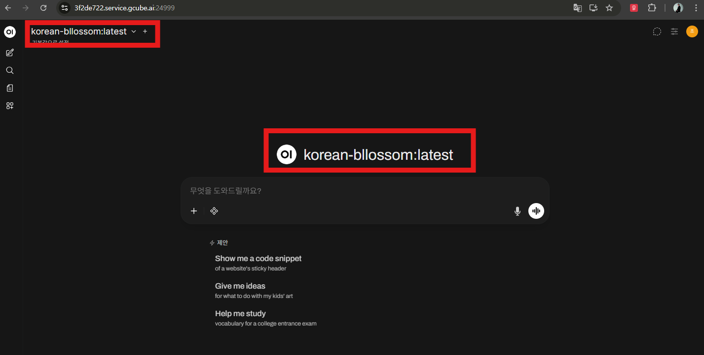
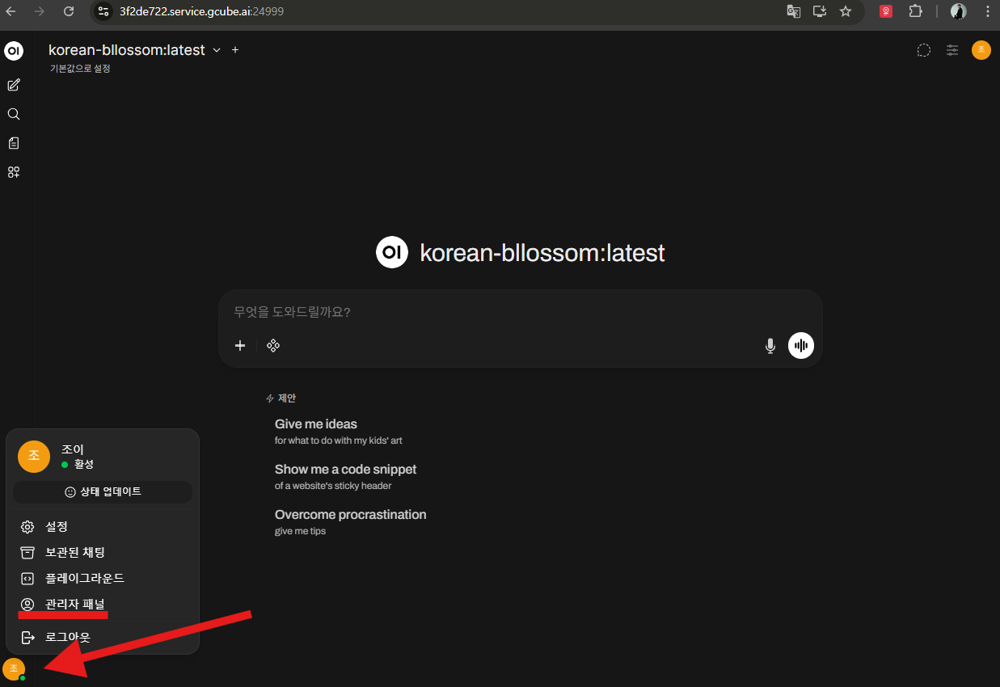
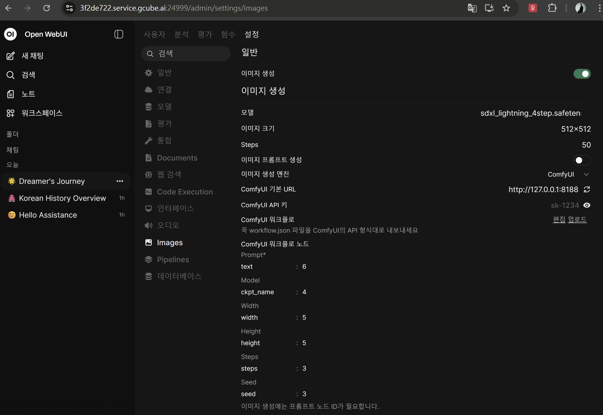
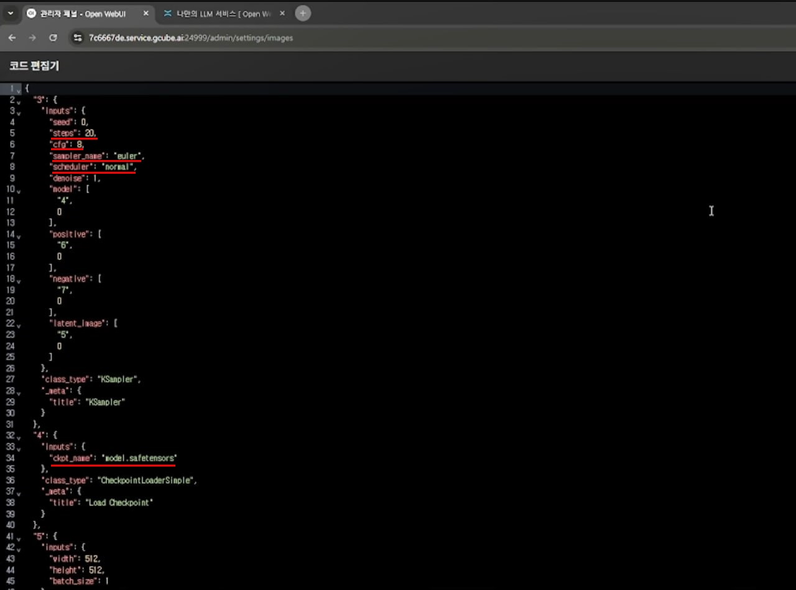

# **OpenWebUI + ComfyUI 실행하기**

Open WebUI + Ollama + ComfyUI를 하나의 GPU 워크로드에 묶어 한국어 채팅과 이미지 생성을 함께 <br>사용합니다.

## **시작 전 확인사항**

| 항목 | 설명 |
|---|---|
| gcube 계정 | [gcube.ai](https://gcube.ai/) 회원가입 필요 |
| 포인트 잔액 | GPU 사용 시간에 따라 시간 단위 과금 |

---

## **1단계 — 워크로드 등록**

### **1-1. 새 워크로드 등록**

[워크로드 페이지](https://gcube.ai/ko/demand/workload/list)에 접속 후 새 워크로드를 등록하거나 기존 워크로드를 수정합니다.


---

### **1-2. 컨테이너 설정**

아래 내용을 입력합니다.

| 항목 | 입력값 |
|---|---|
| 저장소 유형 | 깃허브 |
| 컨테이너 이미지 | `open-webui/open-webui:ollama` |
| 컨테이너 포트 | 이미지 검증 완료 시 자동 입력 |

!!! tip
    저장소 유형과 컨테이너 이미지를 입력 후 **검증완료** 버튼을 클릭하세요.<br> 이미지가 정상이면 컨테이너 포트가 자동으로 입력됩니다.



---

### **1-3. GPU 선택 및 등록**

GPU를 선택하고 **수동 배포**로 등록을 완료합니다.



---

### **1-4. 워크로드 배포**

워크로드 관리 화면에서 **배포** 버튼을 클릭합니다.



배포가 시작되면 서비스 URL 활성화 및 배포 진행 상황을 확인할 수 있습니다.



!!! warning
    컨테이너 이미지 다운로드 용량·네트워크 환경에 따라 배포까지 5~10분이 소요될 수 있습니다.<br> Tier 1 클라우드 GPU의 경우 최대 30분이 소요될 수 있습니다.

---

## **2단계 — Open WebUI 접속 및 관리자 계정 생성**

### **2-1. Open WebUI 접속**

서비스 URL을 클릭해 Open WebUI 웹페이지에 접속합니다.


### **2-2. 관리자 계정 생성**

처음 접속 시 관리자 계정을 생성합니다.


### **2-3. LLM 모델 확인**

Open WebUI에 접속하면 LLM 모델을 선택해 대화형 AI 서비스를 이용할 수 있습니다.<br> 단, 현재 상태에서는 LLM을 아직 다운로드하지 않아 사용이 불가합니다.

다음 단계에서 한국어 능력이 뛰어난 Llama-3 기반의 **Bllossom 모델**을 설치합니다.


---

## **3단계 — 한국어 LLM 설치 (Bllossom)**

### **3-1. 워크로드 터미널 접속**

실행 중인 워크로드 제목을 클릭해 워크로드 정보 화면으로 이동합니다.



**컨테이너 터미널** 버튼을 클릭해 터미널에 접속합니다.



---

### **3-2. Bllossom GGUF 모델 다운로드**

터미널에서 아래 명령어를 순서대로 입력합니다.

```bash
# Bllossom GGUF 다운로드 폴더 생성
mkdir -p /root/models/bllossom
cd /root/models/bllossom

# Hugging Face 다운로드 도구 설치
python3 -m pip install -U huggingface_hub

# GGUF 모델 다운로드
python3 -c "from huggingface_hub import snapshot_download; snapshot_download(repo_id='MLP-KTLim/llama-3-Korean-Bllossom-8B-gguf-Q4_K_M', local_dir='.', local_dir_use_symlinks=False)"
```


---

### **3-3. Modelfile 생성**

```bash
cat > /root/models/bllossom/Modelfile <<'EOF'
FROM ./llama-3-Korean-Bllossom-8B-Q4_K_M.gguf

SYSTEM """
당신은 유용한 AI 어시스턴트입니다.
사용자의 질의에 대해 친절하고 정확하게 답변해야 합니다.
기본 답변 언어는 한국어입니다.
"""
EOF
```

---

### **3-4. Ollama에 모델 등록 및 실행**

```bash
# Ollama에 모델 등록
cd /root/models/bllossom
ollama create korean-bllossom -f Modelfile

# 실행
ollama run korean-bllossom
```

등록이 완료되면 Open WebUI에서 Bllossom 모델로 한국어 대화형 AI 서비스를 이용할 수 있습니다.



---

## **4단계 — ComfyUI 설치 및 이미지 생성 모델 다운로드**

### **4-1. ComfyUI 설치**

gcube 워크로드 터미널에서 아래 명령어를 순서대로 입력합니다.

```bash
# 시스템 패키지 설치
apt update && apt install -y git python3-venv python3-pip

# ComfyUI 폴더 생성
mkdir -p /comfyui
cd /comfyui

# 소스 다운로드
git clone https://github.com/comfy-org/ComfyUI.git
cd /comfyui/ComfyUI

# 가상환경 생성 및 활성화
python3 -m venv .venv
. .venv/bin/activate

# pip 업그레이드
pip install -U pip

# NVIDIA용 PyTorch 설치 (cu118)
pip install torch torchvision torchaudio --index-url https://download.pytorch.org/whl/cu118

# ComfyUI 의존성 설치
pip install -r requirements.txt

# 백그라운드 실행
nohup python3 main.py --listen 0.0.0.0 > /comfyui/comfyui.log 2>&1 &

# 로그 확인
tail -f /comfyui/comfyui.log
```

---

### **4-2. ByteDance/SDXL-Lightning 모델 다운로드**

```bash
# ComfyUI 폴더 이동
cd /comfyui/ComfyUI

# 가상환경 활성화
[ -f .venv/bin/activate ] && . .venv/bin/activate

# checkpoints 폴더 생성
mkdir -p models/checkpoints

# 다운로드 도구 설치
python3 -m pip install -U pip huggingface_hub hf_xet

# SDXL-Lightning 4step 모델 다운로드
HF_XET_HIGH_PERFORMANCE=1 hf download ByteDance/SDXL-Lightning sdxl_lightning_4step.safetensors --local-dir ./models/checkpoints
```

---

## **5단계 — Open WebUI ↔ ComfyUI 연동 설정**

### **5-1. 관리자 패널 접속**

Open WebUI 관리자 패널에 접속합니다.



---

### **5-2. 이미지 생성 설정 입력**

**관리자 패널 → 설정 → 이미지** 에서 아래 내용을 입력합니다.

| 항목 | 설정값 |
|---|---|
| 이미지 생성 | 활성화 (체크) |
| 이미지 생성 엔진 | ComfyUI |
| ComfyUI 기본 URL | `http://127.0.0.1:8188` |
| 모델 | `sdxl_lightning_4step.safetensors` |
| 이미지 크기 | 1024 × 1024 |
| Steps | 4 |

**ComfyUI 워크플로 설정:**

| 항목 | 값 |
|---|---|
| Steps | 4 |
| CFG | 1 |
| Sampler | euler |
| Scheduler | sgm_uniform |
| ckpt_name | sdxl_lightning_4step.safetensors |

**ComfyUI 워크플로 노드:**

| 노드 | 값 |
|---|---|
| text | 6 |
| ckpt_name | 4 |
| width | 5 |
| height | 5 |
| steps | 3 |
| seed | 3 |





---

### **5-3. 텍스트 질문 및 이미지 생성**

설정 완료 후 Open WebUI 채팅창에서 텍스트 질문과 이미지 생성을 함께 사용할 수 있습니다.


---

<div style="text-align: center;" markdown>
[다음: OpenClaw 실행하기 →](openclaw-user-guide.ko.md){ .md-button .md-button--primary }
</div>