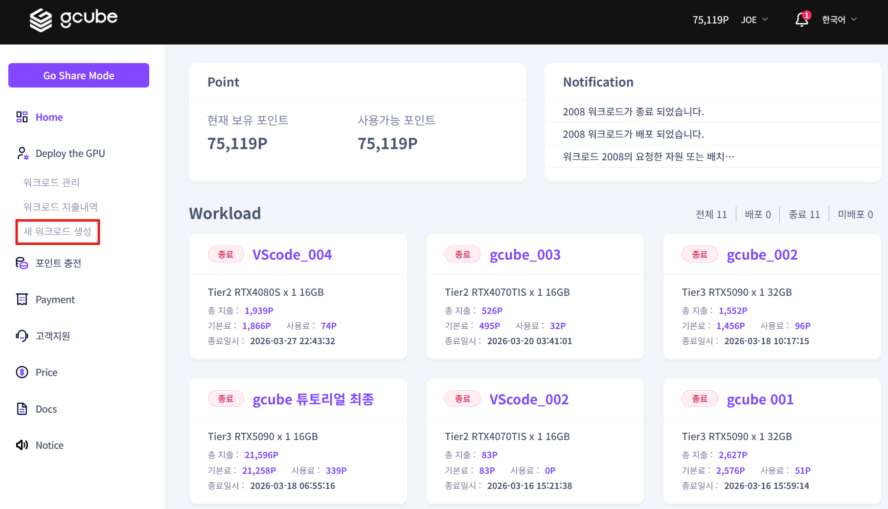
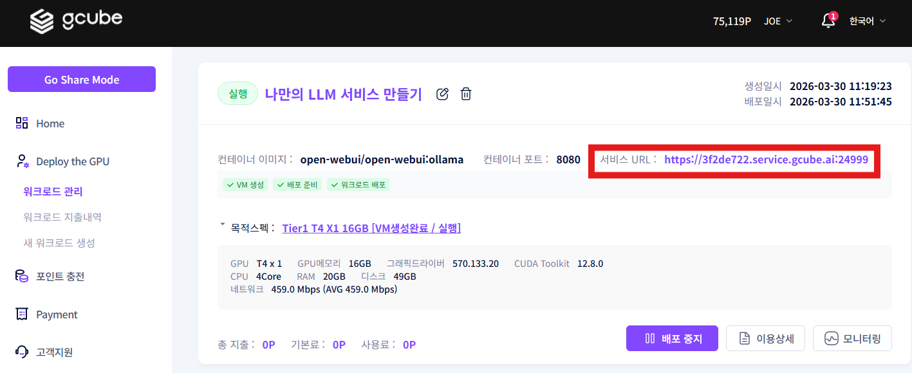
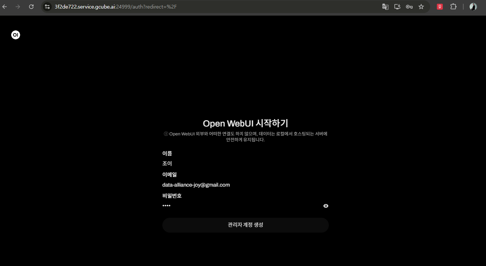
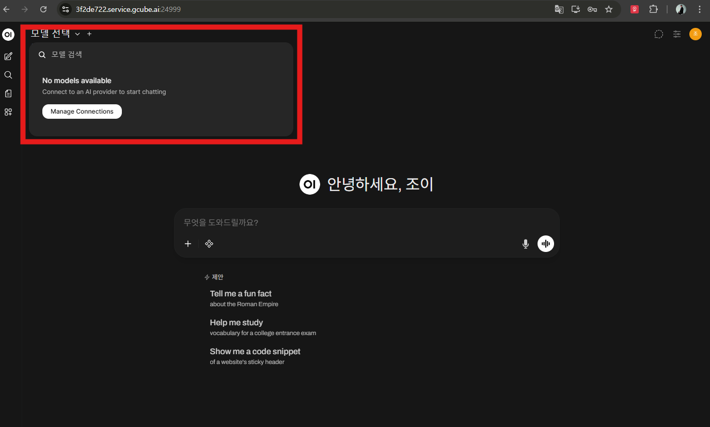
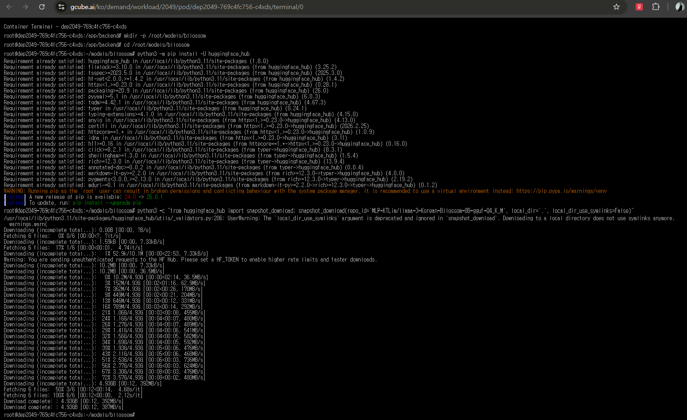
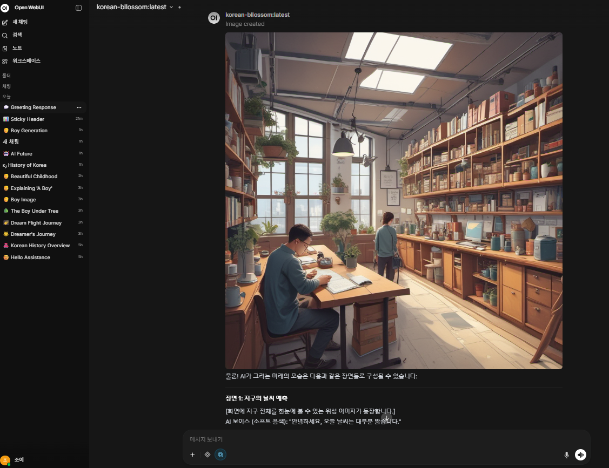

# **Open WebUI와 ComfyUI를 이용한 한국어 채팅 및 이미지 생성 가이드**

Open WebUI + Ollama + ComfyUI를 하나의 GPU 워크로드에 묶어 한국어 채팅과 이미지 생성을 함께 제공하는 사용 가이드 입니다.<br><br>

## **1. gcube 플랫폼 워크로드 서비스 생성**
1\. 워크로드 생성 및 배포 <br>
• gcube.ai 접속 및 워크로드 페이지 이동 ( https://gcube.ai/ko/demand/workload/list  )<br>
• 해당 페이지에서 새 워크로드를 등록하거나 기존에 등록된 워크로드를 수정하여 정보 입력
<br>

2\. 컨테이너 설정<br>
• 저장소 유형 **①( 깃허브 )** 택 및 컨테이너 이미지 입력 **②( 깃허브 컨테이너 이미지 )**<br>
• open-webui 컨테이너 이미지 : **open-webui/open-webui:ollama**<br>
• 저장소, 컨테이너 이미지를 입력 후 **③검증완료**를 클릭, 이미지가 정상이면 자동으로 컨테이너 포트 등록됨
<br>

3\. GPU 선택 및  워크로드 등록<br>
• GPU를 선택 후 수동배포로 등록 완료
<br>

4\. 워크로드 배포 클릭<br>
• 워크로드 관리를 들어가 워크로드 배포를 클릭하여 진행
<br>

5\. 워크로드 배포 클릭<br>
• 워크로드 배포에 따른 VM생성 및 배포 상태로 진행되며, 서비스 URL 활성화 및 배포 진행사항을 확인할 수 있음.<br>
• 컨테이너 이미지 다운로드 용량, 네트워크 환경에 따라서 배포까지는 5~10분이 소요될 수 있음. <br>
&emsp;(Tier1의 경우는 클라우드 서비스 GPU이기에 30분이 소요될 수 있음 )
<br>

## **2.Open-WebUI 실행 및 관리자 계정 생성**
1\. 서비스 URL을 클릭하여 Open-WebUI 웹페이지 접속
<br>


2\. 서비스 URL을 클릭하여 Open-WebUI 웹페이지 접속하여 관리자 계정 생성
<br>


3\. Open-WebUI LLM모델 검색<br>
• Open-WebUI 접속하여 LLM모델을 선택하여 대화형 AI 서비스를 이용할 수 있으나,<br>
&emsp;현재는 LLM을 다운로드 받지 않아서 사용이 불가. <br>
• 한국어 능력이 뛰어난 Llama-3 기반의 Bllossom 모델을 다운로드 받아 대화 환경 구축
<br>


## **3. gcube  워크로드 터미널 접속 → 한국어 LLM 설치**
1\. 실행중인 워크로드 제목을 클릭하여 워크로드 정보를 확인
<br>


2\. 컨테이너 터미널을 클릭하여 터미널 접속
<br>


3\. 허깅페이스 다운로드 설치 및 Bllossom GGUF 언어모델 다운로드 <br>
• 아래의 내용을 터미널 환경에서 순서대로 입력<br>

```python
# Bllossom GGUF 다운로드 폴더
mkdir -p /root/models/bllossom
cd /root/models/bllossom

# Hugging Face 다운로드 도구 설치
python3 -m pip install -U huggingface_hub

# GGUF 모델 다운로드
python3 -c "from huggingface_hub import snapshot_download; snapshot_download(repo_id='MLP-KTLim/llama-3-Korean-Bllossom-8B-gguf-Q4_K_M', local_dir='.', local_dir_use_symlinks=False)"
```
<br>


4\. Modelfile 생성<br>
• 아래의 내용을 터미널 환경에서 순서대로 입력<br>

```python
# Modelfile 생성
cat > /root/models/bllossom/Modelfile <<'EOF'
FROM ./llama-3-Korean-Bllossom-8B-Q4_K_M.gguf

SYSTEM """
당신은 유용한 AI 어시스턴트입니다.
사용자의 질의에 대해 친절하고 정확하게 답변해야 합니다.
기본 답변 언어는 한국어입니다.
"""
EOF
```

5\. Ollama에 모델 등록 및 실행<br>
• 아래의 내용을 터미널 환경에서 순서대로 입력<br>

```python
# Ollama에 모델 등록
cd /root/models/bllossom
ollama create korean-bllossom -f Modelfile

# 실행
ollama run korean-bllossom
```

6\. Blossom 모델을 이용하여서 한국어 기반의 대화형 AI 서비스 이용
<br>


## **4.ComfyUI  설치 및  ByteDance/SDXL-Lightning 모델 다운로드**

1\. gcube 워크로드 터미널을 접속하여 ComfyUI 설치<br>
• 아래의 내용을 터미널 환경에서 순서대로 입력<br>

```python
# 시스템 패키지
apt update && apt install -y git python3-venv python3-pip

# ComfyUI 폴더
mkdir -p /comfyui
cd /comfyui

# 소스 다운로드
git clone https://github.com/comfy-org/ComfyUI.git
cd /comfyui/ComfyUI

# 가상환경 생성
python3 -m venv .venv
. .venv/bin/activate

# pip 업그레이드
pip install -U pip

# NVIDIA용 PyTorch 설치 (안정화 버전 cu118 설치)
pip install torch torchvision torchaudio --index-url https://download.pytorch.org/whl/cu118

# ComfyUI 의존성 설치
pip install -r requirements.txt

# 실행
nohup python3 main.py --listen 0.0.0.0 > /comfyui/comfyui.log 2>&1 &

# 로그 확인
tail -f /comfyui/comfyui.log
```

2\.  ByteDance/SDXL-Lightning 다운로드 받아 설치<br>
• 아래의 내용을 터미널 환경에서 순서대로 입력<br>

```python
# ComfyUI 폴더 이동
cd /comfyui/ComfyUI

# 가상환경 활성화
[ -f .venv/bin/activate ] && . .venv/bin/activate

# checkpoints 폴더 준비
mkdir -p models/checkpoints

# 다운로드 도구 설치
python3 -m pip install -U pip huggingface_hub hf_xet

# SDXL-Lightning 4step full checkpoint 다운로드
HF_XET_HIGH_PERFORMANCE=1 hf download ByteDance/SDXL-Lightning sdxl_lightning_4step.safetensors --local-dir ./models/checkpoints
```

## **5. Open-WebUI ↔ ComfyUI 연동 설정**
1\. Open-WebUI 관리자 패널 접속
<br>


2\. Open-WebUI 관리자 패널/설정/이미지의 내용 입력<br>
• 이미지생성 : check<br>
• 모델 : sdxl_lightning_4step.safetensors<br>
• 이미지크기 : 1024*1024<br>
• Steps : 4<br>
• 이미지생성엔진 : ComfyUI 선택<br>
• ComfyUI 기본 URL : http://127.0.0.1:8188<br>
• ComfyUI 워크플로 편집 ( Steps: 4 , CFG: 1 , Sampler: euler, Scheduler: sgm_uniform, ckpt_name: sdxl_lightning_4step.safetensors )<br>
• ComfyUI 워크플로 노드 ( text : 6, ckpt-name : 4, width : 5, height : 5, steps : 3, seed : 3 )<br>
<br>
<br>


3\. Open-WebUI 를 통해 텍스트 질문 및 이미지 생성
