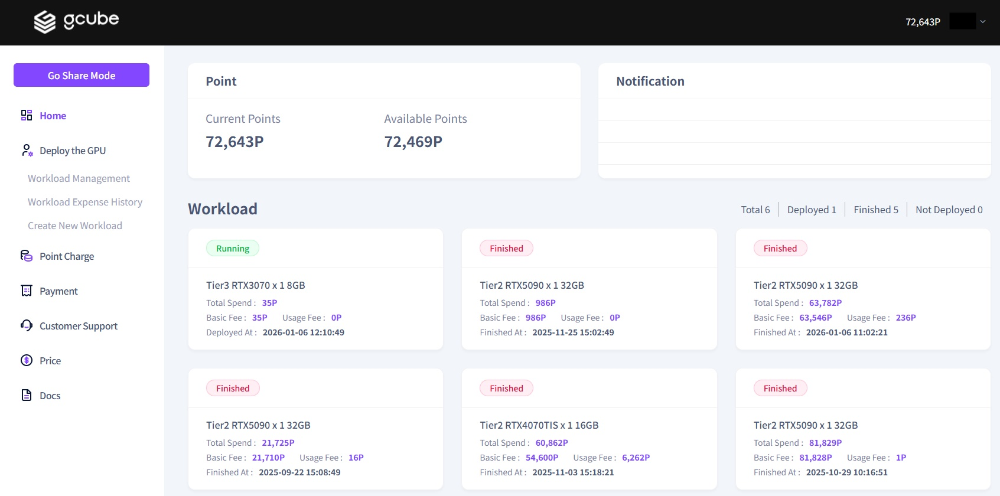
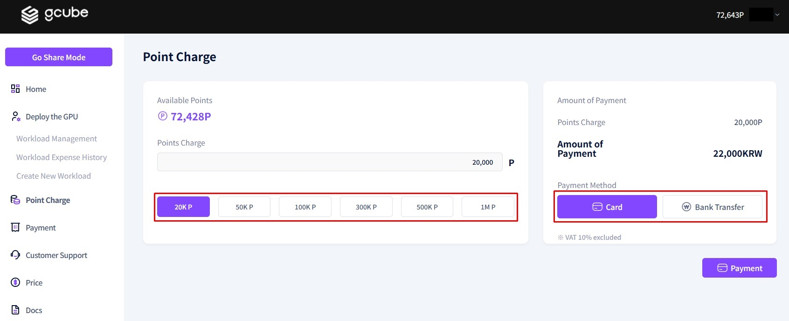
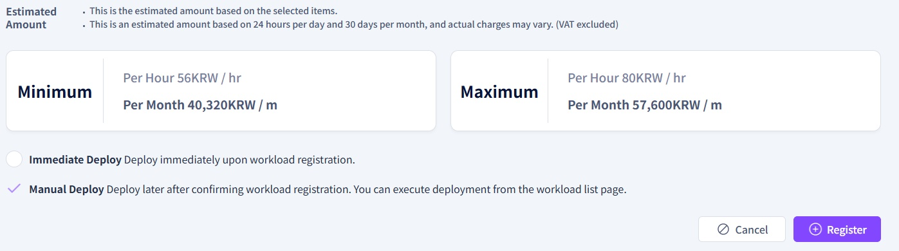
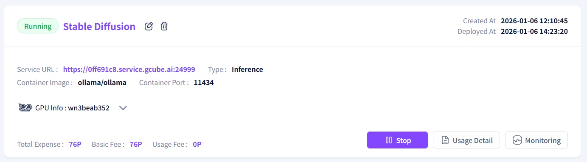
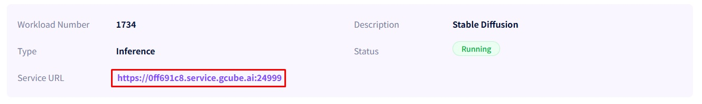

# **Stable Diffusion User Guide**
## **0. Prerequisites**

- What is Stable Diffusion?
    - An open-source generative AI model for Text-to-Image and Image-to-Image tasks
    - Designed to run on personal computers equipped with GPUs by significantly reducing computing resource requirements
    - Can be installed and executed in a **'local environment'** on a private PC, independent of an online connection   

- Gcube Sign-up and Point Purchase
    - Sign up on the Gcube official website([http://gcube.ai](http://gcube.ai/))
    
    
    
    
    
    - Log in and access User Mode
    
    
    
    - Click the **“Point Charge"** menu on the left sidebar
    
    
    
    - Select the desired amount of points to refill, and Choose a payment method and click the **“Payment”** button to complete the transaction.
    
    
    

## **1. gcube Platform Stable Diffusion Workload Preparation**

- Register a New Workload
    - After logging in, click the **“Create New Workload”** menu on the left sidebar
    
    
    

- - **Workload Information: Stable Diffusion Setup**
    - **Description:** Enter [ **Stable Diffusion** ] in the workload description field
    
    
    
    - **Container**: Configure the Container Image for Stable Diffusion
        - Storage Type: **Docker Hub**
        - Container Image : [ **universonic/stable-diffusion-webui** ]
            - Click the "Verify Image" button next to the input field. Most of the time, the container port will be automatically populated
        - Container Port: **8080** (Automatically configured)
    
    
    
    - GPU Selection : Configure the Execution Environment
        - Target Tier: **Tier 3** (Tier for individual users)
        - GPU Memory: **8GB**
        - GPU : **RTX 3070 X 1 10GB**
    
    
    
    - Options (Optional): Detailed Container Settings
        - **Replicas**: Set the number of identical container instances to run in parallel
        - **Minimum CUDA Version**: Specify the minimum CUDA version required by the container
        - **Shared Memory**: Specify the size of the shared memory available to the container
        - **※ Note : For this guide, we will proceed without configuring any optional settings**
    
    
    
    - Estimated Cost: Calculate the Expected Usage Fee
        - Click the checkbox next to **“Immediate Deploy”** to deploy immediately upon registration
        - Click the checkbox next to **“Manual Deploy”** to deploy manually after registration
        - Click the **“Register”** button to complete the workload registration
    
    
    

## **2. Running the Stable Diffusion Workload on Gcube Platform**

- Post-Registration Screen

- Verify the information of the created workload
    - Click on **“Stable Diffusion”** to view details
    
    
    
    - Scroll to the bottom of the Workload Details screen to check the **“Deploy Status”**
    
    
    
    - Ensure the Pod status in the Deployment Status section is **“Running”**
    - Click the **“Container Log”** button
    
    
    
    - Installation is complete when you see the message shown in the image within the logs
    - **※ Note: Installation time may vary depending on container settings and hardware specifications**
    
    
    
    - Return to the Workload Details screen and click the **“Service URL Link”**
    - **※ Note: If you click the link before confirming the container logs, the interface may not display correctly**
    
    
    
    - If the screen below appears, Stable Diffusion has been successfully launched
    
    
    

## **3. Stable Diffusion Execution Example on gcube Platform**

- Stable Diffusion Execution Example
    - Enter the prompt **"A cat in a Hat"** in the txt2img input field and click the **"Generate"** button
    
    
    
    - Confirm that an image similar to the one below is generated
    - **※ Note: Generated images may vary**
    
    