# **Stable Diffusion 사용 가이드**

## **0. 사전준비**

- Stable Diffusion란?
    - Text-to-Image, Image-to Image 오픈소스 생성형 인공지능 모델
    - 컴퓨팅 리소스를 대폭 줄여 GPU가 장착된 개인 컴퓨터에서도 실행 가능
    - 온라인 환경이 아닌 개인의 PC에서 ‘로컬 환경’으로 설치 및 실행 가능

- gcube 회원 가입 및 포인트 구매
    - gcube 홈페이지([http://gcube.ai](http://gcube.ai/))에서 회원 가입 진행
    
    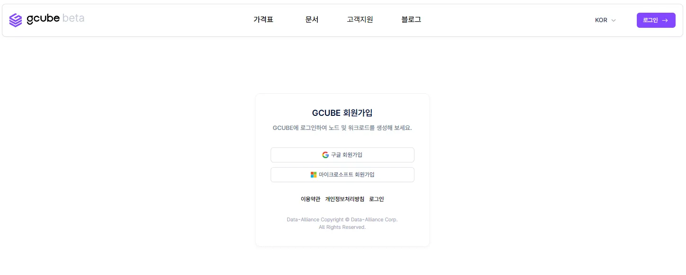
    
    - 로그인 후 “**새 워크로드 등록**” 버튼 클릭   
    
    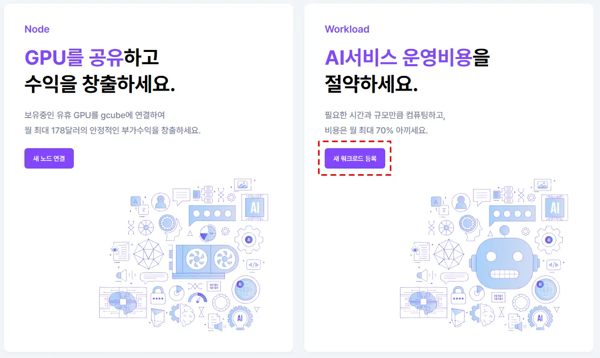
    
    - 상단의 “**포인트 충전**” 탭을 클릭   
    
    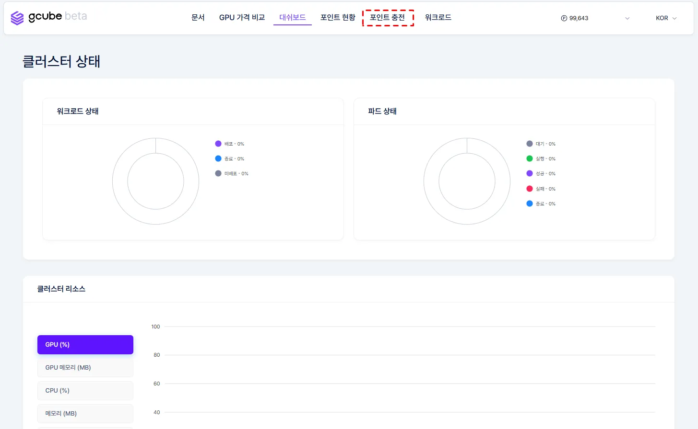
    
    - 원하는 만큼의 충전 포인트를 클릭 후 결제 방법을 선택, “**결제**” 버튼으로 결제 진행   
    
    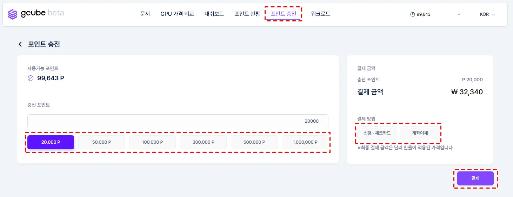
    

## **1. gcube 플랫폼 stable diffusion 워크로드 준비**

- 새 워크로드 등록
    - 상단의 “**워크로드**” 탭을 클릭
        
    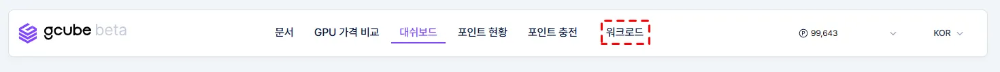  
    
    - 화면 중앙의 “**새 워크로드 등록**” 버튼을 클릭
    
    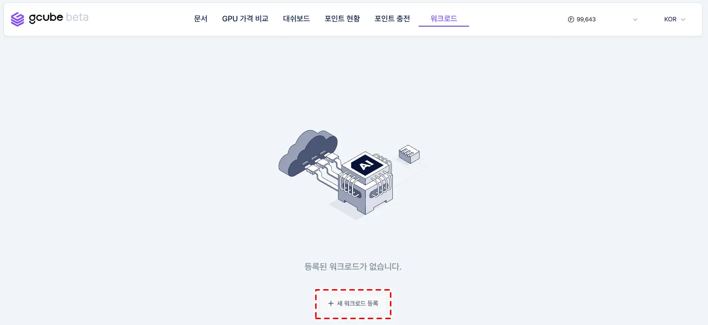
    
     

- 워크로드 정보 stable diffusion 세팅
    - 설명 : 워크로드 설명에 [ **Stable Diffusion** ]을 입력
    
    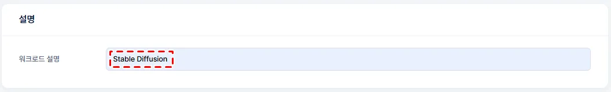

     
    
    - 컨테이너 : stable diffusion을 사용할 컨테이너 이미지 설정
        - 저장소 유형 : **도커허브**
        - 컨테이너 이미지 : [ **universonic/stable-diffusion-webui** ]
            - 입력란 옆 체크 표시가 초록색이 되면 컨테이너 포트가 자동으로 입력
        - 컨테이너 포트 : **8080** (자동으로 포트 설정)
    
    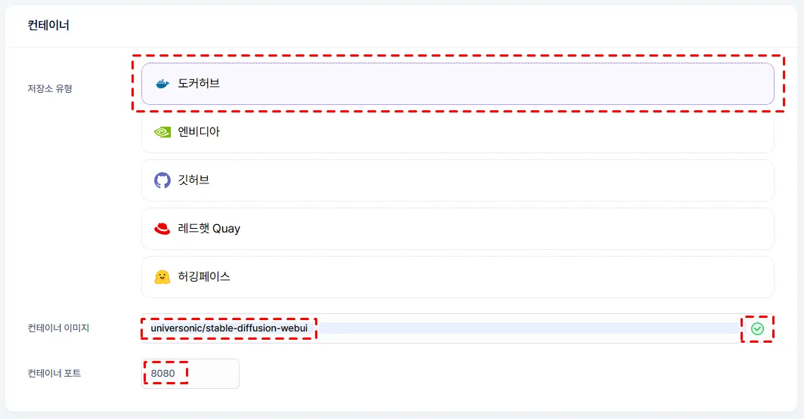

     
    
    - 목적 스펙 : stable diffusion이 구동 될 환경을 설정
        - 목적노드 : **Tier 3** (개인 사용자들을 위한 티어)
        - GPU 메모리 : **8GB**
        - GPU : **RTX 3080 X 1 10GB**
    
    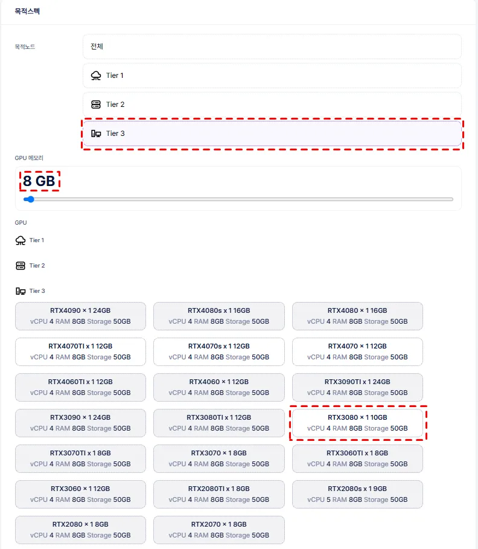

     
    
    - 옵션 (선택 사항) : 컨테이너 세부 설정
        - 컨테이너 명령 : 컨테이너 시작 명령어를 설정. 공란일 때 기본 명령어 실행
        - 컨테이너 환경변수 : 컨테이너 내부에서 사용할 환경 변수를 설정
        - 레플리카 : 동일한 컨테이너의 병렬 실행 개수를 설정
        - 최소 CUDA 버전 : 컨테이너가 요구하는 최소 CUDA 버전을 지정
        - 공유 메모리 : 컨테이너가 공유 가능한 메모리 크기를 지정
        - **※ 이번 가이드에서는 옵션 설정을 하지 않고 진행**
    
    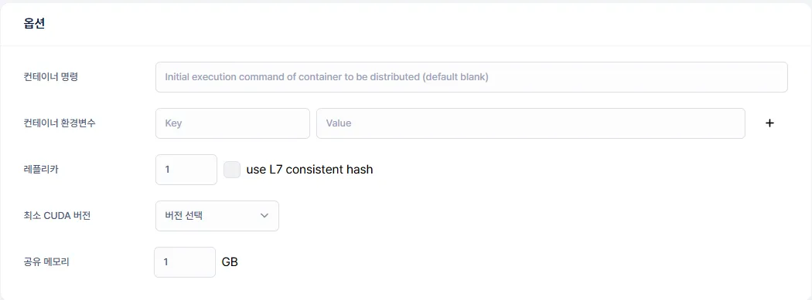

     
    
    - 총 예상 금액 : 선택한 서비스에 대한 예상 사용 요금을 산정
        - **즉시 배포** 옆 체크박스를 클릭하여 등록과 동시에 배포
        - “**등록**” 버튼으로 워크로드 등록
    
    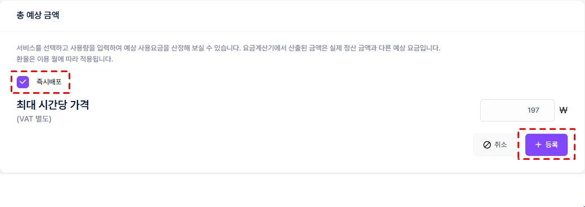
    

## **2. gcube 플랫폼 stable diffusion 워크로드 실행**

- 워크로드 등록 후 화면

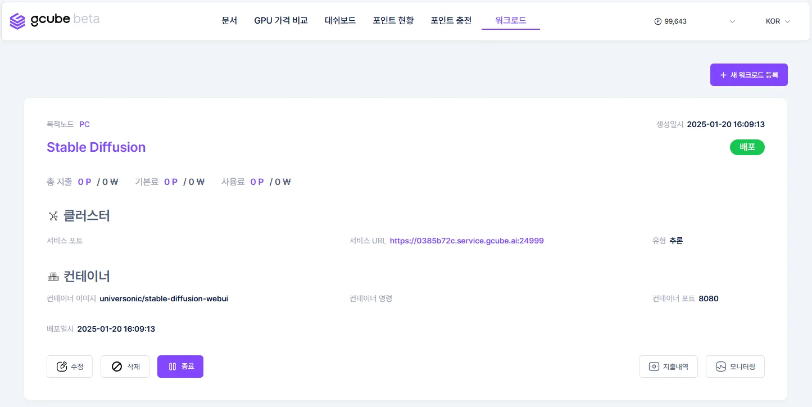

 

- 생성된 워크로드 정보 확인
    - “**Stable Diffusion**”을 클릭
    
    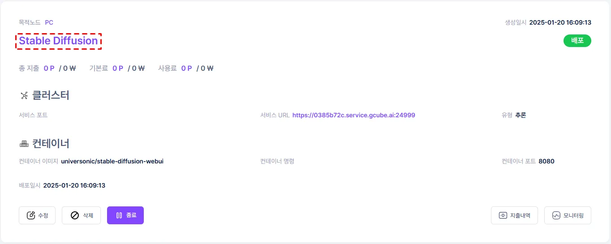

     
    
    - 워크로드 정보 화면 가장 하단의 “**배포 상태**”를 확인
    
    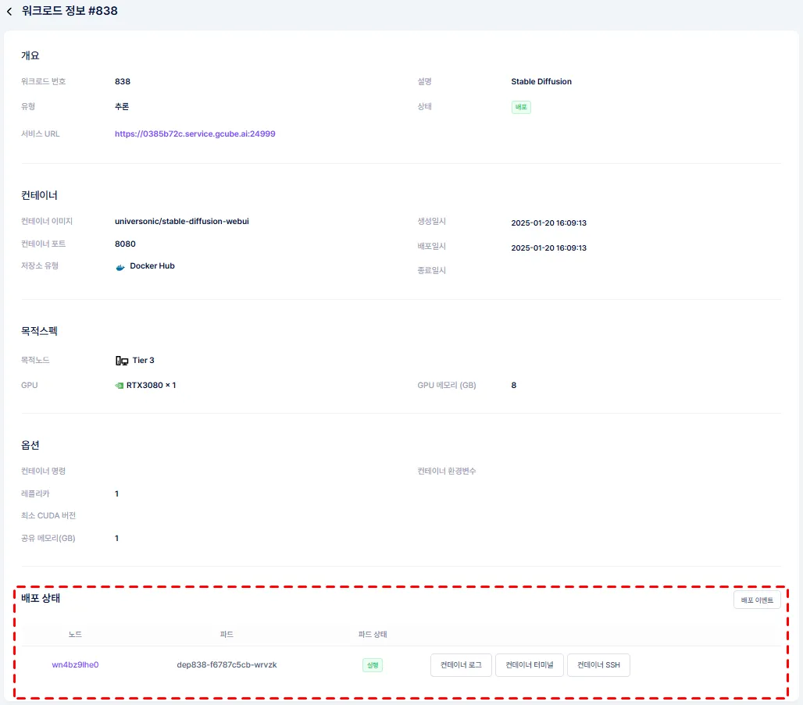

     
    
    - 배포 상태의 피드 상태가 “**실행**”인지 확인
    - “**컨테이너 로그**” 버튼 클릭
    
    
    
    - 컨테이너 로그에서 이미지와 같은 문구가 나오면 설치 완료
    - **※ 컨테이너 설정과 실행하는 기기에 따라서 시간이 다소 걸릴 수 있습니다.**
    
    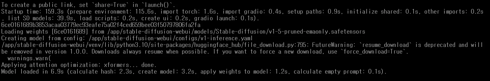

     
    
    - 워크로드 정보 화면으로 돌아와 “**서비스 URL 링크**”을 클릭
    - **※ 컨테이너 로그 확인 없이 링크를 클릭 시 작동 화면이 표시되지 않을 수 있습니다.**
    
    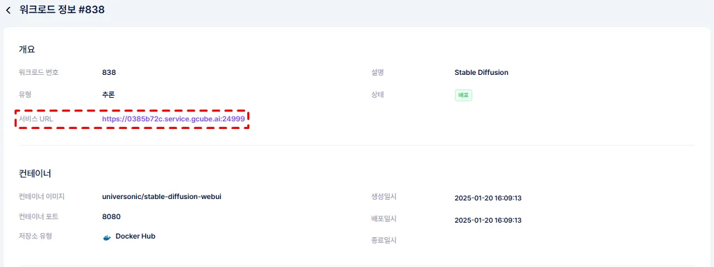
    
    - 아래와 같은 화면이 나온다면 **Stable Diffusion 작동 성공**
    
    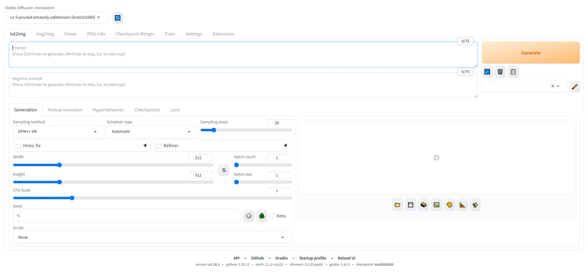
    

## **3. gcube 플랫폼 stable diffusion 실행 예시**

- Stable Diffusion 실행 예시
    - txtimg칸에 “**A cat in a Hat**” 문구를 입력 후 “**Generate**” 버튼 클릭
    
    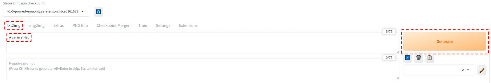
    
    - 아래와 같은 이미지가 생성되는 것을 확인
    - **※ 표시되는 이미지는 상이할 수 있습니다.**

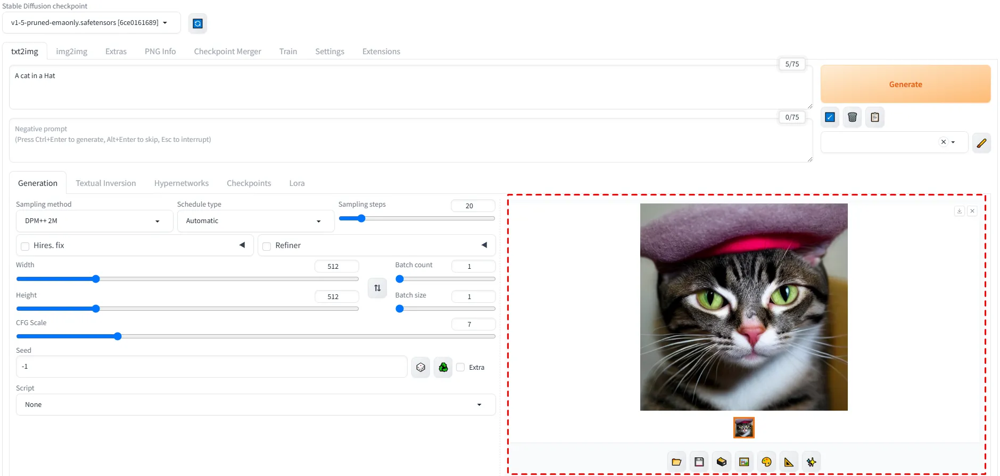
