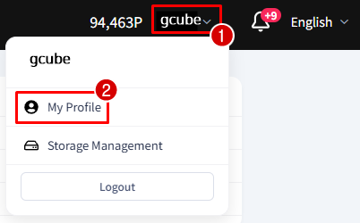
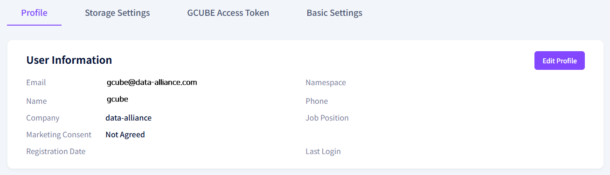
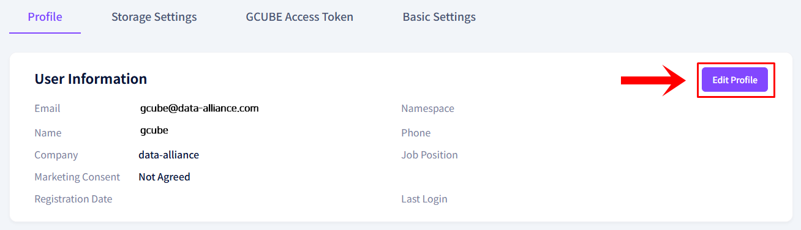
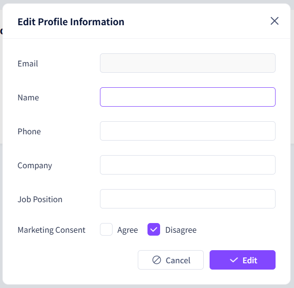

# **Profile Settings**

Set up basic account information such as your name and contact details.

!!! tip
    You can update your profile settings at any time from the My Profile menu.

## **How to Update Profile Settings**

1. Click the arrow next to your name in the upper right corner, then click My Profile.

2. Check your current account information on the user info screen.

3. Click the Edit Profile button.

4. Update the desired information in the edit popup, then click the Save button to complete.

---

[Next: Storage Management →](storage-management.en.md){ .md-button .md-button--primary }

